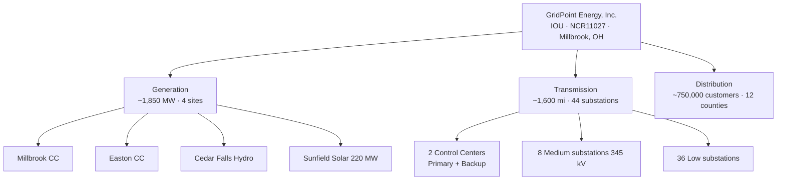

# 01.01 — Utility & Business Profile

| Field | Value |
|---|---|
| Document ID | 01.01-utility-and-business-profile |
| Version | 1.0 |
| Date | 2026-03-02 |
| Classification | BES Cyber System Information (BCSI) // Illustrative Portfolio Sample |
| Owner | CIP Senior Manager (Daniel Reyes) |
| Author | Advisory Team |
| Status | Approved |

## Purpose

This document establishes the foundational profile of **GridPoint Energy, Inc.** ("GridPoint", "the Company", "the Registered Entity") for the NERC CIP Compliance Program Portfolio. It describes the Company's business, its position in the North American Bulk Electric System (BES), and the physical and cyber asset footprint that brings GridPoint within the scope of the NERC Critical Infrastructure Protection (CIP) Reliability Standards. It serves as the anchoring reference for asset counts, organizational scale, and business drivers used throughout Phases 01–09 of the program.

## Company Overview

GridPoint Energy, Inc. is a mid-size, **investor-owned utility (IOU)** headquartered in **Millbrook, Ohio**, operating within the **Eastern Interconnection** and under the oversight of the Regional Entity **ReliabilityFirst (RF)**. GridPoint is a **vertically integrated** electric utility, meaning it owns and operates assets across all three segments of the electricity value chain — generation, transmission, and distribution — and is therefore accountable for reliability obligations that a purely wires-only or generation-only entity would not carry.

| Attribute | Value |
|---|---|
| Legal name | GridPoint Energy, Inc. |
| Utility type | Investor-owned utility (IOU), vertically integrated |
| Headquarters | Millbrook, Ohio |
| Interconnection | Eastern Interconnection |
| Regional Entity | ReliabilityFirst (RF) |
| NERC Compliance Registry ID | NCR11027 |
| Employees | ~1,400 |
| Retail customers served | ~750,000 metered accounts |
| Service territory | 12-county footprint |

GridPoint's mission is to deliver safe, reliable, and increasingly clean electricity to approximately **750,000 metered customers** across a **12-county territory**. As a regulated IOU, the Company is subject to state public-utility-commission oversight for rate and service matters, and — separately and mandatorily — to **federal reliability regulation** administered through the FERC → NERC → ReliabilityFirst chain. The two regimes are distinct; this portfolio addresses only the mandatory reliability (NERC CIP) obligations.

## Business Context — Why NERC CIP Applies

Section 215 of the U.S. Federal Power Act authorizes the Federal Energy Regulatory Commission (FERC) to certify an Electric Reliability Organization (ERO) — the North American Electric Reliability Corporation (NERC) — to develop and enforce mandatory Reliability Standards for the Bulk Electric System. Any entity that **owns, operates, or uses** BES facilities and performs one or more registered functions must register in the NERC Compliance Registry and comply with the applicable standards.

GridPoint owns and operates BES generation (≥ 20 MVA aggregated at a common bus / individual units meeting BES inclusion criteria), transmission facilities operated at **100 kV and above** (138 kV and 345 kV), and control-center systems that perform real-time reliability functions. These facilities meet the NERC BES definition and its inclusion thresholds. Consequently, GridPoint is a **Registered Entity (NCR11027)** and its **BES Cyber Systems** are subject to the CIP-002 through CIP-014 Reliability Standards. The presence of Medium-impact BES Cyber Systems (two Control Centers plus eight 345 kV substations) is what elevates GridPoint above a Low-impact-only compliance posture and drives the full breadth of applicable requirement parts.

## Generation Portfolio

GridPoint operates approximately **1,850 MW** of nameplate generating capacity across four sites, a mix of dispatchable gas, flexible hydro, and newly added renewable capacity.

| Generating asset | Type | Nameplate capacity | Notes |
|---|---|---|---|
| Millbrook CC | Combined-cycle natural gas | (part of ~1,850 MW fleet) | Co-located with Primary Control Center campus |
| Easton CC | Combined-cycle natural gas | (part of ~1,850 MW fleet) | Co-located with Backup Control Center |
| Cedar Falls Hydro | Hydroelectric station | (part of ~1,850 MW fleet) | Dispatchable, black-start relevant |
| Sunfield Solar | Utility-scale photovoltaic | 220 MW | Newly commissioned; changed the asset baseline |
| **Total fleet** | Mixed | **~1,850 MW** | Four generating sites |

The **Sunfield Solar** site (220 MW), newly commissioned, is one of the principal drivers for the current CIP-002 recategorization effort, because a material change to the generation baseline requires re-evaluation of BES Cyber System impact ratings.

## Transmission & Substation Footprint

| Attribute | Value |
|---|---|
| Transmission circuit-miles | ~1,600 circuit-miles |
| Operating voltages | 138 kV and 345 kV |
| Substations (total) | 44 |
| Substations — Medium-impact criteria | 8 (345 kV / CIP-002 Attachment 1) |
| Substations — Low-impact | 36 (remaining) |

## Control Centers

GridPoint operates two control centers that perform Transmission Operator (TOP) and Generator Operator (GOP) real-time functions:

| Control Center | Role | Location | Impact rating |
|---|---|---|---|
| Primary Control Center | Real-time TOP/GOP operations | Millbrook | Medium |
| Backup Control Center | Failover TOP/GOP operations | Easton | Medium |

## Consolidated Asset Summary

| Asset class | Count / capacity |
|---|---|
| Generation nameplate | ~1,850 MW (4 sites) |
| Transmission | ~1,600 circuit-miles (138 kV / 345 kV) |
| Substations | 44 (8 Medium / 36 Low) |
| Control Centers | 2 (Primary Millbrook, Backup Easton) |
| Employees | ~1,400 |
| Customers | ~750,000 metered |

## Materiality to the CIP Program

The scale and diversity of GridPoint's footprint — vertically integrated across five NERC functions, spanning Medium- and Low-impact BES Cyber Systems, with IT/OT convergence at two control centers and vendor remote access into operational technology — is precisely what makes a **mature, documented, and audit-ready** CIP program necessary rather than optional. The remaining Phase 01 documents translate this profile into functional registrations (01.02), regulatory context (01.03), the applicable standards register (01.04), and the program charter and governance that follow.

## Cross-References

- `01.02-nerc-functional-registration.md` — how each owned/operated asset class maps to a NERC functional registration.
- `01.04-applicable-reliability-standards-register.md` — the CIP standards this footprint triggers.
- `01.05-cip-program-charter-and-objectives.md` — program mission and drivers built on this profile.
- Phase 02 (CIP-002 categorization) — applies the asset counts here to impact ratings.

---
[⬅ Previous](01.00-README.md) · [🏠 Phase README](01.00-README.md) · [Next ➡](01.02-nerc-functional-registration.md)
