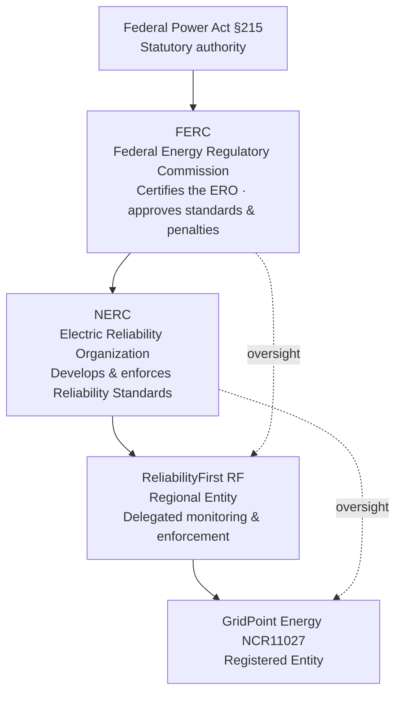
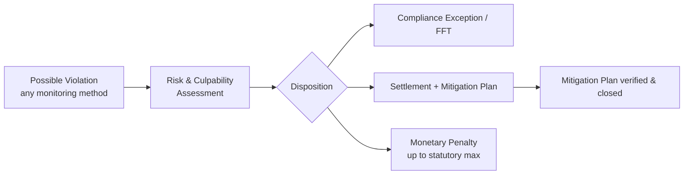

# 01.03 — Regulatory Context: FERC, NERC, ReliabilityFirst & the CMEP

| Field | Value |
|---|---|
| Document ID | 01.03-regulatory-context-nerc-ferc-rf-cmep |
| Version | 1.0 |
| Date | 2026-03-02 |
| Classification | BES Cyber System Information (BCSI) // Illustrative Portfolio Sample |
| Owner | NERC Compliance Manager (Karen Whitfield) |
| Author | Advisory Team |
| Status | Approved |

## Purpose

This document explains the regulatory hierarchy that governs GridPoint Energy's mandatory reliability obligations, the **Compliance Monitoring and Enforcement Program (CMEP)** through which those obligations are monitored and enforced, the enforcement and penalty regime, and the audit cycle GridPoint should expect as a Medium-impact Registered Entity. It provides the compliance team with a shared understanding of "who can ask us for what, and what happens if we fall short."

## The Regulatory Hierarchy

Mandatory reliability regulation in the United States flows from federal statute down to the Registered Entity through a three-tier structure. Each tier delegates authority to the next while retaining oversight.

| Tier | Body | Role |
|---|---|---|
| Statute | Federal Power Act §215 | Establishes federal authority over BES reliability |
| Regulator | **FERC** | Certifies NERC as the ERO; approves Reliability Standards and penalties; reviews enforcement |
| ERO | **NERC** | Drafts, interprets, and enforces mandatory Reliability Standards continent-wide |
| Regional Entity | **ReliabilityFirst (RF)** | Delegated authority to register entities, monitor compliance, and enforce within its footprint |
| Registered Entity | **GridPoint (NCR11027)** | Must comply with all applicable Reliability Standards |

GridPoint's direct regulatory counterpart is **ReliabilityFirst**. Day-to-day compliance interactions — audits, self-reports, data submittals, mitigation plans — occur with RF, which acts under authority delegated by NERC and ultimately FERC.

## The Compliance Monitoring and Enforcement Program (CMEP)

The **CMEP** is the NERC program, implemented by each Regional Entity, that defines how compliance is monitored and how violations are processed and penalized. It is codified in the NERC Rules of Procedure (Appendix 4C). Under the CMEP, a Registered Entity's compliance is assessed through **seven monitoring methods**.

### The Seven CMEP Monitoring Methods

| # | Method | Description | Trigger / cadence |
|---|---|---|---|
| 1 | **Compliance Audit** | Comprehensive on-site or remote review of evidence against RSAWs | Scheduled (~3-yr cycle for Medium) |
| 2 | **Self-Certification** | Entity attests to its own compliance for selected standards | Periodic, RF-directed |
| 3 | **Spot Check** | Targeted review of specific requirements/evidence | Risk-based, ad hoc |
| 4 | **Compliance Investigation** | Focused review triggered by events or suspected non-compliance | Event-driven |
| 5 | **Self-Report** | Entity discloses its own possible non-compliance | Entity-initiated, any time |
| 6 | **Periodic Data Submittal** | Recurring submission of required data/reports | Scheduled per standard |
| 7 | **Complaint** | Third-party allegation of non-compliance | Complaint-driven |

GridPoint's internal controls program is designed to make the **Self-Report** method a strength rather than a liability: the prior self-logged CIP-007 R2 patch-evaluation lapse (see program drivers) demonstrates that proactive self-reporting, paired with a credible Mitigation Plan, is viewed favorably by RF and typically reduces penalty exposure.

### Key CMEP Artifacts

| Artifact | Purpose |
|---|---|
| **RSAW** (Reliability Standard Audit Worksheet) | The standardized worksheet auditors use to evaluate each requirement; drives evidence expectations |
| **Mitigation Plan** | Formal, RF-accepted plan to correct a violation and prevent recurrence |
| **TFE** (Technical Feasibility Exception) | Documented, approved exception where a technical control is not feasible |
| **Self-Report** | Entity's disclosure of a possible violation |

## Enforcement & Penalties

When a possible violation is identified (through any monitoring method), it enters the enforcement process. RF assesses the **risk** the violation posed to the BES (minimal, moderate, or serious) and the entity's **culpability**, then determines a disposition. Dispositions range from informal (compliance exception, Find-Fix-Track) to formal settlement with monetary penalties.

- Statutory maximum penalties have historically reached **up to $1,000,000 per violation, per day**. While most dispositions are far lower, the ceiling underscores why a mature internal controls program is a business-critical investment.
- Penalty determination considers aggravating and mitigating factors, including the presence of an internal compliance program, timely self-reporting, and the quality of the Mitigation Plan.
- A strong internal controls program can move findings toward lower-consequence dispositions and reduce or eliminate monetary penalties.

## Audit Cycle

As an entity with **Medium-impact** BES Cyber Systems, GridPoint is subject to a Compliance Audit by ReliabilityFirst on an approximately **three-year cycle**. RF may also apply additional monitoring (spot checks, self-certifications, data submittals) between audits based on its risk assessment of GridPoint. GridPoint's program timeline anchors to the **ReliabilityFirst Compliance Audit scheduled for 2027-Q2**; all Phase 01–09 activities are sequenced to be audit-ready ahead of that date.

| Milestone | Target |
|---|---|
| Program kickoff | 2026-03-02 |
| CIP-002 categorization baselined | 2026-04 |
| Control implementation complete | 2026-Q3 |
| Internal (mock) assessment | 2026-Q4 |
| **RF Compliance Audit** | **2027-Q2** |
| Ongoing internal controls | Continuous after audit |

## Cross-References

- `01.02-nerc-functional-registration.md` — the registered functions RF monitors.
- `01.04-applicable-reliability-standards-register.md` — the standards audited against RSAWs.
- `01.05-cip-program-charter-and-objectives.md` — the "pass the RF audit with no violations" success criterion.
- Phase 08/09 — evidence management and audit readiness that operationalize this regulatory context.

---
[⬅ Previous](01.02-nerc-functional-registration.md) · [🏠 Phase README](01.00-README.md) · [Next ➡](01.04-applicable-reliability-standards-register.md)
