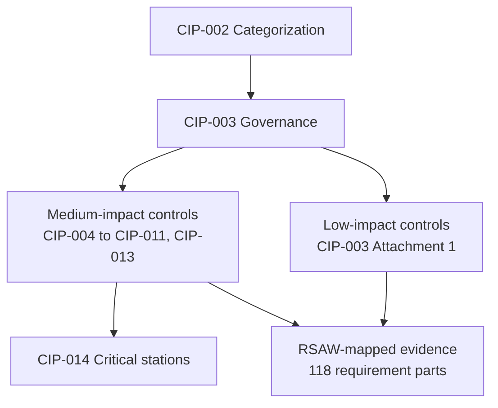

# 01.04 — Applicable Reliability Standards Register

| Field | Value |
|---|---|
| Document ID | 01.04-applicable-reliability-standards-register |
| Version | 1.0 |
| Date | 2026-03-02 |
| Classification | BES Cyber System Information (BCSI) // Illustrative Portfolio Sample |
| Owner | NERC Compliance Manager (Karen Whitfield) |
| Author | Advisory Team |
| Status | Approved |

## Purpose

This document is the authoritative register of the **NERC CIP Reliability Standards applicable to GridPoint Energy (NCR11027)**, capturing the enforceable version of each standard, its title, and its applicability to GridPoint's **Medium-** and **Low-impact** BES Cyber Systems. Because GridPoint's CIP-002 categorization yields **Medium and Low impact only (no High)**, the register reflects the requirement scope appropriate to that posture. It is the master index against which gap analysis (Phase 02) and evidence collection (Phase 08) are performed.

## Scope of Applicability

GridPoint has **no High-impact** BES Cyber Systems. Applicability is therefore driven by two categories:

- **Medium impact:** the two Control Centers (Primary Millbrook, Backup Easton) and eight 345 kV substations meeting CIP-002 Attachment 1 criteria.
- **Low impact:** the four generation plants and the remaining 34 substations.

Low-impact obligations are principally satisfied through **CIP-003-8 Attachment 1** (the Low-impact security plan), whereas Medium-impact assets are subject to the full breadth of CIP-004 through CIP-011, plus CIP-013 and, where applicable, CIP-014.

## Applicable Standards Register

| Standard | Version | Title | Medium | Low |
|---|---|---|:---:|:---:|
| CIP-002 | 5.1a | BES Cyber System Categorization | ✔ | ✔ |
| CIP-003 | 8 | Security Management Controls (incl. Low-impact Attachment 1) | ✔ | ✔ |
| CIP-004 | 7 | Personnel & Training | ✔ | — |
| CIP-005 | 7 | Electronic Security Perimeter(s) & Remote Access | ✔ | ○ |
| CIP-006 | 6 | Physical Security of BES Cyber Systems | ✔ | ○ |
| CIP-007 | 6 | System Security Management | ✔ | — |
| CIP-008 | 6 | Incident Reporting & Response Planning | ✔ | ○ |
| CIP-009 | 6 | Recovery Plans for BES Cyber Systems | ✔ | — |
| CIP-010 | 4 | Configuration Change Management & Vulnerability Assessments | ✔ | — |
| CIP-011 | 3 | Information Protection (BCSI) | ✔ | — |
| CIP-013 | 2 | Supply Chain Risk Management | ✔ | — |
| CIP-014 | 3 | Physical Security (critical transmission stations) | ✔* | — |

Legend: **✔** applicable to that impact category · **○** obligation met via CIP-003-8 Attachment 1 sections (electronic access controls, physical security controls, incident response, transient cyber assets) rather than the parent standard · **—** not applicable · **✔\*** applicable to transmission stations identified as critical through the CIP-014 R1 risk assessment.

## Standard-by-Standard Applicability Notes

### CIP-002-5.1a — BES Cyber System Categorization
The gateway standard. Requires GridPoint to identify and categorize BES Cyber Systems as High, Medium, or Low impact per Attachment 1 criteria. Applies to both categories and drives every other standard's scope. Baselined 2026-04.

### CIP-003-8 — Security Management Controls
Requires cyber security policies and the designation of the **CIP Senior Manager (Daniel Reyes, per R1)**. **Attachment 1** carries the Low-impact obligations: cyber security awareness, physical security controls, electronic access controls, Cyber Security Incident response, and Transient Cyber Asset / Removable Media protections. Applies to Medium and Low.

### CIP-004-7 — Personnel & Training
Security awareness, cyber security training, **Personnel Risk Assessments (PRAs)**, and access management/revocation. Applies to Medium-impact BES Cyber Systems and associated EACMS/PACS/PCAs.

### CIP-005-7 — Electronic Security Perimeter(s) & Remote Access
Defines the **Electronic Security Perimeter (ESP)**, Electronic Access Points, and **Interactive Remote Access (IRA)** controls including Intermediate Systems and multi-factor authentication; the -7 revision adds vendor remote-access controls. Full applicability at Medium; Low satisfies electronic access controls via CIP-003 Attachment 1.

### CIP-006-6 — Physical Security of BES Cyber Systems
Physical Security Plan and the **Physical Security Perimeter (PSP)**, access controls, monitoring, and logging for Medium-impact assets. Low satisfies physical security controls via CIP-003 Attachment 1.

### CIP-007-6 — System Security Management
Ports and services, **security patch management (R2)**, malicious-code prevention, security event monitoring, and system access controls. The prior self-logged lapse concerned the CIP-007 R2 patch-evaluation cycle. Medium only.

### CIP-008-6 — Incident Reporting & Response Planning
Cyber Security Incident response plan, testing, and mandatory reporting (including reportable Cyber Security Incidents and attempts to compromise) to E-ISAC and, as applicable, CISA. Medium at full scope; Low via CIP-003 Attachment 1 incident-response provisions.

### CIP-009-6 — Recovery Plans for BES Cyber Systems
Recovery plan specification, implementation, testing, and backup/restore verification for Medium-impact BES Cyber Systems.

### CIP-010-4 — Configuration Change Management & Vulnerability Assessments
Baseline configurations, change authorization and monitoring, vulnerability assessments, and Transient Cyber Asset / Removable Media controls. Medium only.

### CIP-011-3 — Information Protection (BCSI)
Protection and secure handling/reuse/disposal of **BES Cyber System Information (BCSI)** — the classification applied to this very portfolio. Medium only.

### CIP-013-2 — Supply Chain Risk Management
Supply chain cyber security risk management plan(s) covering procurement, vendor remote access, and vendor-originated software integrity/authenticity. A key driver given GridPoint's IT/OT convergence and vendor remote access. Medium only.

### CIP-014-3 — Physical Security
Requires a **risk assessment** of transmission stations/substations that, if rendered inoperable, could cause instability, uncontrolled separation, or Cascading; identified critical stations require a physical security plan and third-party review. Applies to the TO/TOP function where critical stations are identified.

## Requirement-Part Scope Summary

Across the applicable standards, GridPoint has identified **118** applicable requirement parts in scope for its Medium- and Low-impact posture. These parts form the population against which the Phase 02 gap analysis and the Phase 08 evidence collection are performed. The distribution by standard family is summarized below (indicative allocation for planning; finalized in Phase 02):

| Standard family | Focus | Relative scope |
|---|---|---|
| CIP-002 / CIP-003 | Categorization & governance (incl. Low Attachment 1) | Foundational |
| CIP-004 / CIP-011 | Personnel and information protection | Moderate |
| CIP-005 / CIP-006 | Electronic & physical perimeters | High |
| CIP-007 / CIP-010 | System security & change management | High |
| CIP-008 / CIP-009 | Incident response & recovery | Moderate |
| CIP-013 / CIP-014 | Supply chain & critical-station physical security | Targeted |

## Associated Asset Types in Scope

The applicable standards protect not only BES Cyber Systems but their associated asset types, each of which inherits requirements from the standards above:

| Asset type | Count | Primary standards |
|---|---|---|
| BES Cyber Assets (BCAs) | ~420 | CIP-005/006/007/010/011 |
| EACMS (Electronic Access Control/Monitoring Systems) | 26 | CIP-004/005/006/007/010 |
| PACS (Physical Access Control Systems) | 18 | CIP-006 |
| PCAs (Protected Cyber Assets) | 60 | CIP-005/007/010 |

## Version Control & Enforcement Dates

The versions in the register are the **enforceable** versions as scoped for this program. The NERC Compliance Manager (Karen Whitfield) monitors the NERC Standards under development and FERC orders for new or revised versions (for example, future CIP-003, CIP-005, and cloud/virtualization-related revisions) and updates this register with a version increment when a superseding version reaches its enforcement date.

## Cross-References

- `01.02-nerc-functional-registration.md` — functions that trigger each standard.
- `01.03-regulatory-context-nerc-ferc-rf-cmep.md` — how RF audits against these standards via RSAWs.
- `01.06-cip-senior-manager-designation-and-delegations.md` — CIP-003 R1 designation.
- Phase 02 — CIP-002 categorization and requirement-part gap analysis (118 parts in scope).

---
[⬅ Previous](01.03-regulatory-context-nerc-ferc-rf-cmep.md) · [🏠 Phase README](01.00-README.md) · [Next ➡](01.05-cip-program-charter-and-objectives.md)
