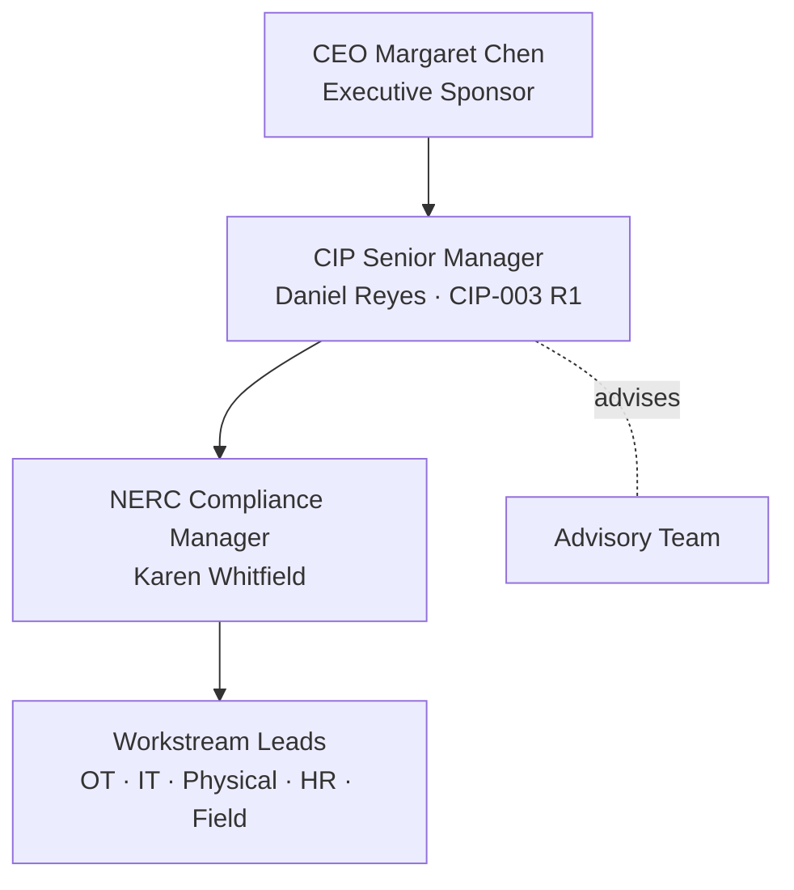

# 01.05 — CIP Program Charter & Objectives

| Field | Value |
|---|---|
| Document ID | 01.05-cip-program-charter-and-objectives |
| Version | 1.0 |
| Date | 2026-03-02 |
| Classification | BES Cyber System Information (BCSI) // Illustrative Portfolio Sample |
| Owner | CIP Senior Manager (Daniel Reyes) |
| Author | Advisory Team |
| Status | Approved |

## Purpose

This document is the formal **charter** for GridPoint Energy's NERC CIP Compliance Program. It states the program mission, objectives, scope, governance sponsorship, and success criteria, and records the business drivers that justify the investment. The charter is the authorizing instrument that empowers the CIP Senior Manager and the program team to plan, resource, and execute the work described across Phases 01–09.

## Program Mission

> To build and mature GridPoint Energy's complete NERC CIP compliance program end-to-end — categorizing BES Cyber Systems, implementing and documenting all applicable Medium- and Low-impact controls, producing audit-ready evidence, remediating gaps, and passing the ReliabilityFirst Compliance Audit with no violations — while measurably reducing operational-technology (OT) cyber risk to the Bulk Electric System.

## Program Objectives

| # | Objective | Aligned standard(s) | Target |
|---|---|---|---|
| O-1 | Categorize all BES Cyber Systems and baseline the asset inventory | CIP-002-5.1a | Baselined 2026-04 |
| O-2 | Implement and document all applicable Medium & Low controls | CIP-003 – CIP-011, CIP-013, CIP-014 | Complete 2026-Q3 |
| O-3 | Produce audit-ready, RSAW-mapped evidence for all 118 in-scope requirement parts | All applicable CIP | Ongoing → 2027-Q2 |
| O-4 | Remediate identified gaps via accepted Mitigation Plans | CMEP | Closed before audit |
| O-5 | Pass the ReliabilityFirst Compliance Audit with no violations | CMEP audit | 2027-Q2 |
| O-6 | Stand up a sustainable internal controls program | Program governance | Continuous post-audit |
| O-7 | Reduce OT cyber risk (IT/OT convergence, vendor remote access) | CIP-005, CIP-013 | Measurable reduction |

## Program Scope

**In scope**

- All BES Cyber Systems categorized **Medium** (2 Control Centers + 8 substations) and **Low** (4 generation plants + 34 substations) under CIP-002.
- Associated **EACMS (26)**, **PACS (18)**, **PCAs (60)**, and **BCAs (~420)**.
- All **118** applicable CIP requirement parts across the registered functions (GO, GOP, TO, TOP, DP).
- Policies, procedures, technical and physical controls, personnel controls, evidence management, and audit preparation.

**Out of scope**

- Non-BES corporate IT systems except where they are EACMS/PACS or otherwise in scope by association.
- State-PUC rate/service compliance, environmental, and NERC O&P (Operations & Planning) standards outside the CIP family (tracked separately by the compliance function).
- High-impact controls (GridPoint has no High-impact BES Cyber Systems).

## Business Drivers

The program is justified by four converging drivers:

1. **Changed asset baseline.** Commissioning of **Sunfield Solar (220 MW)**, two new substations, and control-center modernization altered the BES footprint, requiring **CIP-002 recategorization**.
2. **IT/OT convergence and vendor remote access.** Increasing interconnection between corporate IT and operational technology, plus third-party remote access into OT, raises **CIP-005 and CIP-013** exposure.
3. **Scheduled RF Compliance Audit (2027-Q2).** GridPoint must be **audit-ready with defensible, RSAW-mapped evidence** by the audit date.
4. **Prior self-logged issue.** A lapsed **CIP-007 R2 patch-evaluation cycle** demonstrated the need for a mature internal controls program to prevent recurrence and reduce penalty exposure.

## Success Criteria

| Criterion | Definition of success |
|---|---|
| Audit-ready | Every applicable requirement part has current, RSAW-mapped evidence retrievable on demand |
| No violations | RF Compliance Audit (2027-Q2) closes with zero Possible Violations, or any finding resolved to a non-penalty disposition |
| OT risk reduction | Demonstrable reduction in OT attack surface (segmentation, remote-access hardening, supply-chain controls) |
| Sustainable controls | Internal controls program operating continuously with owners, cadences, and metrics after the audit |
| Timely categorization | CIP-002 baseline completed 2026-04 and maintained under change management |

## Governance & Sponsorship

| Role | Individual | Charter responsibility |
|---|---|---|
| Executive Sponsor | CEO **Margaret Chen** | Authorizes the program and its resourcing |
| Operational Sponsor | VP Grid Operations **Robert Tan** | Aligns operations with compliance requirements |
| **CIP Senior Manager** | **Daniel Reyes** (VP Security & Compliance) | Single accountable authority per CIP-003 R1 |
| NERC Compliance Manager | **Karen Whitfield** | Day-to-day program management and RF liaison |
| Advisory Team | OT-GRC / NERC CIP advisory | Program design, documentation, and audit-readiness support |

The **CIP Senior Manager, Daniel Reyes**, holds single-point accountability for the program as required by CIP-003 R1, with authority delegated to workstream leads as documented in `01.06`.

## Program Phasing

The charter is executed across nine phases. Phase 01 (this phase) establishes the foundation; subsequent phases deliver categorization, control implementation, evidence, and audit readiness.

| Phase | Focus | Anchoring milestone |
|---|---|---|
| 01 | Program Foundation & Registration Scoping | Kickoff 2026-03-02 |
| 02 | CIP-002 categorization & gap analysis | Baseline 2026-04 |
| 03–06 | Control implementation & documentation | Complete 2026-Q3 |
| 07 | Evidence & RSAW mapping | Ongoing → audit |
| 08 | Internal (mock) assessment | 2026-Q4 |
| 09 | RF audit readiness & ongoing controls | RF audit 2027-Q2 → continuous |

## Key Program Risks

| Risk | Impact | Response |
|---|---|---|
| Incomplete or late CIP-002 categorization | Wrong control scope; audit finding | Baseline early (2026-04); change-manage thereafter |
| Evidence gaps at audit | Possible Violation | RSAW-mapped evidence with owners and cadences |
| Recurrence of CIP-007 R2 patch lapse | Penalty exposure | Mature internal controls with monitoring and alerts |
| Vendor remote-access exposure | CIP-005/013 finding | Supply-chain plan; IRA hardening; MFA |
| Resource contention | Slipped milestones | Steering-Committee resourcing; Advisory Team support |

## Assumptions & Constraints (Summary)

The charter assumes executive sponsorship and funding remain in place, that workstream leads are available at the cadence in `01.07`, and that ReliabilityFirst's audit remains scheduled for 2027-Q2. Detailed assumptions and constraints are maintained in `01.09`. Any material change to these assumptions is escalated to the CIP Steering Committee.

## Authorization

This charter is authorized by the Executive Sponsor and the CIP Senior Manager as of **2026-03-02**, program kickoff. It remains in force through the ongoing internal controls phase and is reviewed at least annually or upon material change to the BES footprint or applicable standards.

## Cross-References

- `01.01-utility-and-business-profile.md` — the profile the charter is built on.
- `01.06-cip-senior-manager-designation-and-delegations.md` — formal CIP-003 R1 designation and delegations.
- `01.07-governance-structure-and-raci.md` — governance bodies and RACI.
- `01.09-program-scope-assumptions-constraints.md` — detailed scope, assumptions, and constraints.

---
[⬅ Previous](01.04-applicable-reliability-standards-register.md) · [🏠 Phase README](01.00-README.md) · [Next ➡](01.06-cip-senior-manager-designation-and-delegations.md)
