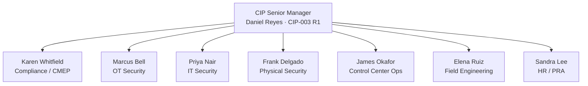

# 01.06 — CIP Senior Manager Designation & Delegations

| Field | Value |
|---|---|
| Document ID | 01.06-cip-senior-manager-designation-and-delegations |
| Version | 1.0 |
| Date | 2026-03-02 |
| Classification | BES Cyber System Information (BCSI) // Illustrative Portfolio Sample |
| Owner | CIP Senior Manager (Daniel Reyes) |
| Author | Advisory Team |
| Status | Approved |

## Purpose

This document formally designates GridPoint Energy's **CIP Senior Manager** as required by **CIP-003-8 Requirement R1**, defines the scope of that authority, and records the **delegation instrument** by which the CIP Senior Manager assigns specific authorities to qualified delegates. It also states the documentation and change-control requirements that keep the designation and its delegations current and audit-defensible.

## Regulatory Basis

CIP-003-8 R1 requires each Responsible Entity to identify a **CIP Senior Manager** by name and to review and approve the Company's cyber security policies. The CIP Senior Manager is the **single accountable authority** for the CIP program. CIP-003-8 R4 permits the CIP Senior Manager to **delegate** authority for specific actions to a delegate or delegates, provided each delegation is documented, dated, and includes the name or title of the delegate, the specific action delegated, and the approving CIP Senior Manager. Delegations do not transfer the CIP Senior Manager's overall accountability.

## Designation

| Field | Value |
|---|---|
| Designated CIP Senior Manager | **Daniel Reyes** |
| Title | VP Security & Compliance |
| Authority basis | CIP-003-8 R1 |
| Effective date | 2026-03-02 |
| Appointed by | CEO **Margaret Chen** (Executive Sponsor) |
| Registered Entity | GridPoint Energy, Inc. (NCR11027) |

**Daniel Reyes** is hereby designated the CIP Senior Manager for GridPoint Energy, Inc., with single-point accountability for the NERC CIP compliance program across all registered functions (GO, GOP, TO, TOP, DP) and all Medium- and Low-impact BES Cyber Systems.

## Scope of Authority

The CIP Senior Manager holds authority to:

- Review and **approve the cyber security policies** required by CIP-003-8 R1 and R2 (Low-impact plan).
- **Approve exceptions** to policy where permitted by the standards.
- Own the **identification and categorization** of BES Cyber Systems (CIP-002) at the program level.
- Approve **Mitigation Plans**, **Technical Feasibility Exceptions (TFEs)**, and **Self-Reports** submitted to ReliabilityFirst.
- Allocate program resources and **delegate** specific authorities per CIP-003-8 R4.
- Serve as the accountable authority in the ReliabilityFirst Compliance Audit.

## Delegation Instrument

By this instrument, the CIP Senior Manager delegates the specific authorities below, effective **2026-03-02**. Each delegation is documented with delegate name/title, the specific delegated action, the effective date, and the approving CIP Senior Manager. Delegates must be qualified and are accountable to the CIP Senior Manager, who retains overall program accountability.

| Delegate | Title | Delegated authority | Standard(s) | Effective |
|---|---|---|---|---|
| **Karen Whitfield** | NERC Compliance Manager | Manage compliance program, approve/submit Self-Reports and Periodic Data Submittals, RF liaison | CMEP, CIP-003 | 2026-03-02 |
| **Marcus Bell** | OT / ICS Security Lead | Approve OT technical baselines, ESP/access designs, and CIP-005/007/010 control decisions | CIP-005, CIP-007, CIP-010 | 2026-03-02 |
| **Priya Nair** | IT Security Manager | Approve IT-side controls for EACMS and IT/OT boundary; IRA/MFA implementation | CIP-004, CIP-005 | 2026-03-02 |
| **Frank Delgado** | Physical Security Manager | Approve Physical Security Plans, PSP configurations, and PACS controls | CIP-006, CIP-014 | 2026-03-02 |
| **James Okafor** | Control Center Operations Mgr | Approve operational procedures at Medium-impact Control Centers | CIP-006, CIP-008, CIP-009 | 2026-03-02 |
| **Elena Ruiz** | Substation & Field Engineering Lead | Approve substation cyber/physical implementations at Medium substations | CIP-006, CIP-010 | 2026-03-02 |
| **Sandra Lee** | HR / PRA Coordinator | Administer Personnel Risk Assessments and training records | CIP-004 | 2026-03-02 |

## Documentation & Change-Control Requirements

- The designation and every delegation must be **dated** and retained as CIP-003-8 R1/R4 evidence.
- Any **change** to the CIP Senior Manager designation must be documented **within 30 calendar days** of the change (per CIP-003-8 R1).
- Any change to a delegation must be documented **within 30 calendar days** of the change (per CIP-003-8 R4).
- The NERC Compliance Manager maintains the register of current designations and delegations and produces it on request during monitoring activities.
- Delegations are reviewed at least annually and upon any personnel or organizational change.

## Delegate Qualifications & Accountability

Each delegate is selected on the basis of role, technical competence, and organizational authority sufficient to exercise the delegated action. The following principles govern all delegations:

- **Accountability is retained.** Delegation transfers the authority to *act*, not the CIP Senior Manager's overall *accountability* for the CIP program.
- **Named or titled.** Each delegation identifies the delegate by name and title so evidence remains unambiguous during monitoring.
- **Specific and bounded.** Delegated authority is limited to the specific actions listed; delegates may not sub-delegate without the CIP Senior Manager's documented approval.
- **Revocable.** The CIP Senior Manager may revoke or amend any delegation at any time, with the change documented within 30 calendar days.

## Interaction with Governance

The delegations recorded here are operationalized through the governance structure and RACI in `01.07`. In that matrix, the CIP Senior Manager is **Accountable (A)** for every workstream, while delegates hold **Responsible (R)** roles for the actions delegated to them here. This one-to-one correspondence between the delegation instrument and the RACI ensures that authority and responsibility are traceable end-to-end — a point auditors frequently test.

| Delegation domain | RACI workstream | Responsible delegate |
|---|---|---|
| Compliance / CMEP | Audit & CMEP; Policies | Karen Whitfield |
| OT technical controls | Technical Controls | Marcus Bell |
| IT / boundary controls | Technical Controls | Priya Nair |
| Physical security | Physical Security | Frank Delgado |
| Control Center operations | Physical / IR / Recovery | James Okafor |
| Field / substation | Categorization; Technical | Elena Ruiz |
| Personnel risk & training | Personnel | Sandra Lee |

## Signature Block

| Role | Name | Signature | Date |
|---|---|---|---|
| CIP Senior Manager (designee) | Daniel Reyes, VP Security & Compliance | ______________________ | 2026-03-02 |
| Appointing Executive | Margaret Chen, CEO | ______________________ | 2026-03-02 |
| Acknowledged — Compliance | Karen Whitfield, NERC Compliance Manager | ______________________ | 2026-03-02 |

*This is an illustrative portfolio sample; signatures are represented for format completeness.*

## Cross-References

- `01.04-applicable-reliability-standards-register.md` — CIP-003-8 in the standards register.
- `01.05-cip-program-charter-and-objectives.md` — governance sponsorship.
- `01.07-governance-structure-and-raci.md` — how delegates map to workstream RACI.
- `01.08-stakeholder-register.md` — the delegates as internal stakeholders.

---
[⬅ Previous](01.05-cip-program-charter-and-objectives.md) · [🏠 Phase README](01.00-README.md) · [Next ➡](01.07-governance-structure-and-raci.md)
