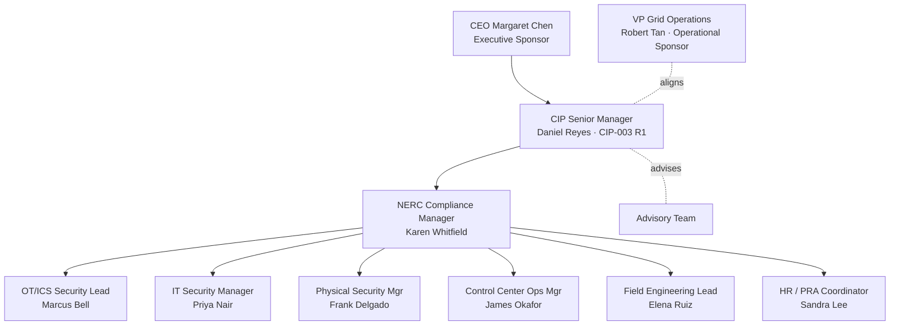

# 01.07 — Governance Structure & RACI

| Field | Value |
|---|---|
| Document ID | 01.07-governance-structure-and-raci |
| Version | 1.0 |
| Date | 2026-03-02 |
| Classification | BES Cyber System Information (BCSI) // Illustrative Portfolio Sample |
| Owner | CIP Senior Manager (Daniel Reyes) |
| Author | Advisory Team |
| Status | Approved |

## Purpose

This document defines the governance structure for GridPoint Energy's NERC CIP compliance program — the organizational reporting lines, the standing committees that steer and review the program, and a **RACI** (Responsible, Accountable, Consulted, Informed) matrix that assigns clear ownership across the program's principal workstreams. Clear governance and unambiguous accountability are themselves a compliance control: they support CIP-003 policy governance and demonstrate management engagement to ReliabilityFirst.

## Program Organization

The program is accountable to the CIP Senior Manager (Daniel Reyes) and sponsored at the executive level by the CEO. Day-to-day management runs through the NERC Compliance Manager, with subject-matter workstream leads owning technical, physical, personnel, and evidence domains.

## Governance Committees

| Committee | Chair | Members | Cadence | Purpose |
|---|---|---|---|---|
| **CIP Steering Committee** | Daniel Reyes (CSM) | CEO delegate, VP Grid Ops, Compliance Mgr, Advisory Team | Quarterly | Strategic direction, resourcing, risk acceptance, audit readiness sign-off |
| **CIP Program Working Group** | Karen Whitfield | All workstream leads, Advisory Team | Bi-weekly | Execution coordination, gap remediation, evidence status |
| **Change Advisory (OT)** | Marcus Bell | IT Security, Field Engineering, Ops | As needed | CIP-010 configuration change authorization for BES Cyber Systems |
| **Incident Response Team** | James Okafor | OT, IT, Physical Security, Compliance | On activation + annual test | CIP-008 Cyber Security Incident response |

## Workstreams

The program is organized into seven workstreams that collectively cover the applicable CIP requirement scope:

1. **Categorization** — CIP-002 identification and impact rating of BES Cyber Systems.
2. **Policies & Governance** — CIP-003 cyber security policies and Low-impact plan.
3. **Technical Controls** — CIP-005/007/009/010 electronic and system security.
4. **Physical Security** — CIP-006/014 PSPs and critical-station protection.
5. **Personnel** — CIP-004 training, PRAs, and access management.
6. **Evidence & Records** — CIP-011 BCSI protection and RSAW-mapped evidence.
7. **Audit & CMEP** — RF liaison, Self-Reports, Mitigation Plans, audit response.

## RACI Matrix

Legend: **R** = Responsible (does the work) · **A** = Accountable (single owner, answerable) · **C** = Consulted · **I** = Informed.

| Workstream | Daniel Reyes (CSM) | Karen Whitfield (Compliance) | Marcus Bell (OT) | Priya Nair (IT) | Frank Delgado (Physical) | James Okafor (Ops) | Elena Ruiz (Field) | Sandra Lee (HR) | Advisory Team |
|---|:--:|:--:|:--:|:--:|:--:|:--:|:--:|:--:|:--:|
| Categorization (CIP-002) | A | R | C | C | I | C | R | I | C |
| Policies & Governance (CIP-003) | A | R | C | C | C | I | I | C | C |
| Technical Controls (CIP-005/007/009/010) | A | C | R | R | I | C | R | I | C |
| Physical Security (CIP-006/014) | A | C | C | I | R | C | C | I | C |
| Personnel (CIP-004) | A | C | I | C | I | I | I | R | C |
| Evidence & Records (CIP-011) | A | R | C | C | C | C | C | C | R |
| Audit & CMEP | A | R | C | C | C | C | C | I | C |

### Reading the Matrix

- The **CIP Senior Manager (Daniel Reyes)** is **Accountable** for every workstream — consistent with CIP-003 R1 single-point accountability — even where authority is delegated per `01.06`.
- The **NERC Compliance Manager (Karen Whitfield)** is **Responsible** for the governance, evidence, and CMEP workstreams that drive audit readiness.
- **Technical Controls** carry shared Responsibility across OT (Marcus Bell), IT (Priya Nair), and Field Engineering (Elena Ruiz), reflecting IT/OT convergence.
- The **Advisory Team** is Responsible for evidence structuring and Consulted across all other workstreams, but is never Accountable — accountability stays with GridPoint.

## Escalation Path

| Level | Trigger | Escalate to |
|---|---|---|
| 1 | Routine execution issue | Workstream lead |
| 2 | Cross-workstream or schedule risk | NERC Compliance Manager |
| 3 | Possible violation, resourcing, risk acceptance | CIP Senior Manager |
| 4 | Material program or audit risk | CIP Steering Committee / Executive Sponsor |

## Decision Rights

To keep execution moving without diluting accountability, the program defines explicit decision rights aligned to the RACI:

| Decision type | Decision owner | Consulted before |
|---|---|---|
| Cyber security policy approval | CIP Senior Manager | Compliance Mgr, Advisory Team |
| BES Cyber System impact rating | CIP Senior Manager (A) / Compliance (R) | OT, Field Engineering |
| OT configuration change (CIP-010) | OT/ICS Security Lead | Change Advisory (OT) |
| Mitigation Plan / TFE submission | CIP Senior Manager | Compliance Mgr, affected lead |
| Self-Report to RF | CIP Senior Manager | Compliance Mgr, Legal |
| Risk acceptance | CIP Steering Committee | CIP Senior Manager |

## Governance Cadence & Reporting

Program health is reported upward on a fixed cadence so that the Steering Committee and Executive Sponsor always have a current view of audit readiness:

- **Bi-weekly** — Working Group status: gap closure, evidence completeness, risks/issues.
- **Monthly** — Rolled-up dashboard to the CIP Senior Manager (percent of requirement parts evidenced, open Mitigation Plans, overdue actions).
- **Quarterly** — Steering Committee review: milestone status against the 2027-Q2 audit, resourcing, and risk-acceptance decisions.
- **Event-driven** — Incident Response Team and escalation reporting per the escalation path.

Meeting minutes, decisions, and action registers are retained as governance evidence supporting CIP-003 policy management and demonstrating active management engagement to ReliabilityFirst.

## Cross-References

- `01.06-cip-senior-manager-designation-and-delegations.md` — delegated authorities behind the RACI.
- `01.05-cip-program-charter-and-objectives.md` — sponsorship and objectives.
- `01.08-stakeholder-register.md` — internal and external stakeholders.
- `01.11-communications-and-escalation-plan.md` — detailed communications and escalation procedures.

---
[⬅ Previous](01.06-cip-senior-manager-designation-and-delegations.md) · [🏠 Phase README](01.00-README.md) · [Next ➡](01.08-stakeholder-register.md)
