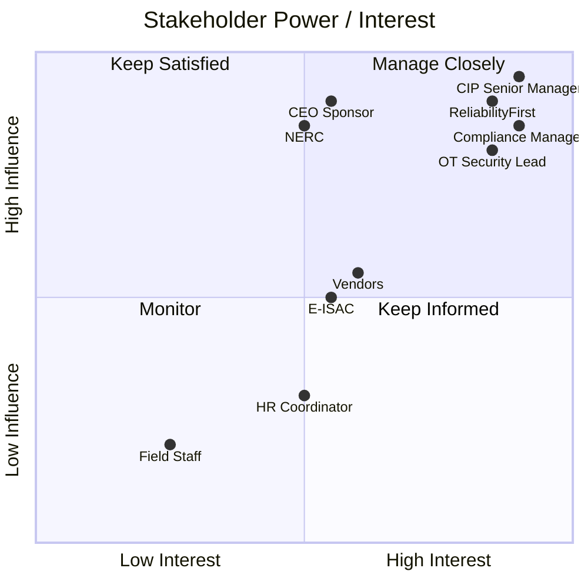

# 01.08 — Stakeholder Register

| Field | Value |
|---|---|
| Document ID | 01.08-stakeholder-register |
| Version | 1.0 |
| Date | 2026-03-02 |
| Classification | BES Cyber System Information (BCSI) // Illustrative Portfolio Sample |
| Owner | NERC Compliance Manager (Karen Whitfield) |
| Author | Advisory Team |
| Status | Approved |

## Purpose

This document is the **stakeholder register** for GridPoint Energy's NERC CIP compliance program. It identifies the internal and external parties who influence, or are affected by, the program; assesses each stakeholder's **interest** and **influence**; and defines the **engagement approach** for each. Deliberate stakeholder management keeps the program aligned with executive expectations, workstream owners, and — critically — the Regional Entity, ensuring there are no surprises as GridPoint approaches the 2027-Q2 ReliabilityFirst Compliance Audit.

## Interest / Influence Model

Each stakeholder is rated on interest (how much program outcomes matter to them) and influence (how much they can affect the program), then assigned a management strategy:

- **High influence / High interest → Manage Closely.**
- **High influence / Low interest → Keep Satisfied.**
- **Low influence / High interest → Keep Informed.**
- **Low influence / Low interest → Monitor.**

## Internal Stakeholders

| Stakeholder | Role | Interest | Influence | Strategy | Engagement approach |
|---|---|:--:|:--:|---|---|
| **Daniel Reyes** | CIP Senior Manager (VP Security & Compliance) | High | High | Manage Closely | Accountable authority; chairs Steering Committee; approves policies, Mitigation Plans, TFEs |
| **Karen Whitfield** | NERC Compliance Manager | High | High | Manage Closely | Runs the program; owns evidence and RF liaison; bi-weekly Working Group |
| **Margaret Chen** | CEO / Executive Sponsor | Med | High | Keep Satisfied | Quarterly Steering updates; escalation of material risk and resourcing |
| **Robert Tan** | VP Grid Operations / Operational Sponsor | Med | High | Keep Satisfied | Aligns operations with compliance; consulted on operational impacts |
| **Marcus Bell** | OT / ICS Security Lead | High | High | Manage Closely | Owns OT technical controls (CIP-005/007/010); Change Advisory chair |
| **Priya Nair** | IT Security Manager | High | Med | Manage Closely | Owns IT-side and IT/OT boundary controls; IRA/MFA |
| **Frank Delgado** | Physical Security Manager | High | Med | Manage Closely | Owns CIP-006/014 physical security and PACS |
| **James Okafor** | Control Center Operations Mgr | High | Med | Keep Informed | Operational procedures at Medium Control Centers; IR Team chair |
| **Elena Ruiz** | Substation & Field Engineering Lead | Med | Med | Keep Informed | Substation implementations at Medium substations |
| **Sandra Lee** | HR / PRA Coordinator | Med | Low | Keep Informed | Administers CIP-004 PRAs and training records |
| **Legal / Regulatory Counsel** | In-house counsel | Med | Med | Keep Satisfied | Reviews RF submissions, settlements, and disclosure obligations |
| **Field / Operations Staff** | Substation & plant personnel | Low | Low | Monitor | Recipients of training, awareness, and access controls |

## External Stakeholders

| Stakeholder | Role | Interest | Influence | Strategy | Engagement approach |
|---|---|:--:|:--:|---|---|
| **ReliabilityFirst (RF)** | Regional Entity / regulator | High | High | Manage Closely | Primary regulatory counterpart; audits, Self-Reports, data submittals; Compliance Manager is designated contact |
| **NERC** | Electric Reliability Organization | Med | High | Keep Satisfied | Sets and interprets standards; alerts, guidance, and standards changes monitored |
| **FERC** | Federal regulator | Low | High | Keep Satisfied | Approves standards/penalties; indirect engagement via NERC/RF |
| **E-ISAC** | Electricity Information Sharing & Analysis Center | Med | Med | Keep Informed | Threat intelligence sharing; CIP-008 incident coordination/reporting |
| **OT/ICS vendors** | Equipment & software suppliers | Med | Med | Manage Closely | CIP-013 supply-chain risk controls; vendor remote-access and software-integrity obligations |
| **Independent engineering firm** | CIP-014 third-party reviewer | Med | Low | Keep Informed | Independent review of CIP-014 physical security assessments and plans |
| **Third-party assessor** | Mock-audit / independent reviewer | Med | Low | Keep Informed | Conducts 2026-Q4 internal mock assessment |
| **CISA** | Federal cyber agency | Low | Med | Monitor | Coordinated incident reporting where applicable (alongside E-ISAC) |
| **Peer utilities / trade groups** | Industry peers | Low | Low | Monitor | Practice sharing; benchmarking |

## Engagement Cadence Summary

| Stakeholder group | Primary channel | Cadence |
|---|---|---|
| Steering Committee | Formal meeting + report | Quarterly |
| Working Group | Status meeting | Bi-weekly |
| ReliabilityFirst | Formal submittals + audit correspondence | Per CMEP schedule / event-driven |
| E-ISAC | Portal / alerts | Continuous + on incident |
| Vendors | Contract & security reviews | Per procurement + annually |
| Executive Sponsor | Executive briefing | Quarterly + on escalation |

## Stakeholder Power / Interest Map

## Stakeholder Risks & Mitigations

| Risk | Affected stakeholder(s) | Mitigation |
|---|---|---|
| Inconsistent regulatory messaging | ReliabilityFirst | Single point of contact (Compliance Mgr); CSM escalation |
| Executive disengagement | CEO / Sponsor | Quarterly Steering briefings tied to audit risk |
| Vendor non-cooperation on CIP-013 | OT/ICS vendors | Contract clauses; procurement gating; annual reviews |
| Workstream lead overload | OT / IT / Physical leads | Advisory Team support; RACI clarity; realistic cadence |
| Late CIP-014 third-party review | Independent engineering firm | Early scheduling ahead of 2027-Q2 audit |

## Special Engagement Notes

- **ReliabilityFirst** engagement is managed exclusively through the NERC Compliance Manager (Karen Whitfield) as the single point of contact, with the CIP Senior Manager as escalation, to ensure consistent, controlled regulatory communication ahead of the **2027-Q2** audit.
- **Vendor** engagement is elevated to *Manage Closely* despite moderate influence because CIP-013 supply-chain risk and vendor remote access are top program drivers.
- **E-ISAC** engagement supports CIP-008 reporting obligations and situational awareness for the OT environment.

## Cross-References

- `01.07-governance-structure-and-raci.md` — committees and RACI ownership.
- `01.06-cip-senior-manager-designation-and-delegations.md` — internal stakeholders as delegates.
- `01.03-regulatory-context-nerc-ferc-rf-cmep.md` — external regulatory stakeholders and the CMEP.
- `01.11-communications-and-escalation-plan.md` — detailed communications plan built on this register.

---
[⬅ Previous](01.07-governance-structure-and-raci.md) · [🏠 Phase README](01.00-README.md) · [Next ➡](01.09-program-scope-assumptions-constraints.md)
