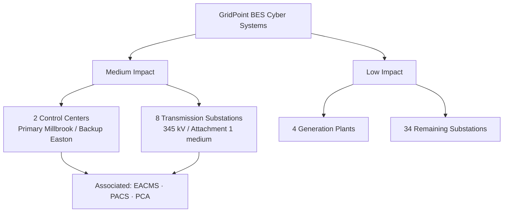

# 01.09 — CIP Program Scope, Assumptions & Constraints

| Field | Value |
|---|---|
| Document ID | CIP-01.09 |
| Version | 1.0 |
| Date | 2026-03-02 |
| Classification | BES Cyber System Information (BCSI) // Illustrative Portfolio Sample |
| Owner | Karen Whitfield (NERC Compliance Manager) |
| Author | Advisory Team |
| Status | Approved |

## Purpose

This document establishes the authoritative scope boundary for GridPoint Energy, Inc.'s ("GridPoint") NERC CIP compliance program. It defines what is **in scope** and **out of scope** for the engagement, records the **assumptions** on which the program plan depends, enumerates the **constraints** that shape delivery, and identifies the external **dependencies** that must hold for the program to reach an audit-ready state ahead of the ReliabilityFirst (RF) Compliance Audit in 2027-Q2. Scope is anchored to GridPoint's CIP-002-5.1a impact categorization: **Medium- and Low-impact BES Cyber Systems only — no High-impact assets exist in the registered footprint.**

## 1. Scope Framing

GridPoint is a mid-size, vertically integrated, investor-owned utility (NCR11027) registered as **GO, GOP, TO, TOP, and DP** within the Eastern Interconnection, monitored by ReliabilityFirst. The program covers all applicable CIP Reliability Standards for the Medium- and Low-impact rating categories, together with the associated cyber asset types that inherit applicability — EACMS, PACS, and PCA.

## 2. In-Scope BES Cyber Systems and Assets

| Scope element | Description | Impact rating | Illustrative count |
|---|---|---|---|
| Control Centers | Primary (Millbrook) and Backup (Easton) performing TOP/GOP functions | Medium | 2 sites |
| Transmission substations (Medium) | 345 kV / stations meeting CIP-002 Attachment 1 medium criteria | Medium | 8 substations |
| Generation plants | Millbrook CC, Easton CC, Cedar Falls Hydro, Sunfield Solar (220 MW) | Low | 4 plants |
| Transmission substations (Low) | Remaining substations not meeting medium criteria | Low | 34 substations |
| BES Cyber Systems (grouped) | Logical groupings of BES Cyber Assets | Medium / Low | 14 Medium / 38 Low |
| BES Cyber Assets (BCAs) | Programmable devices comprising the BCS | Medium / Low | ~420 |
| EACMS | Electronic Access Control or Monitoring Systems | Associated | 26 |
| PACS | Physical Access Control Systems | Associated | 18 |
| PCA | Protected Cyber Assets within an ESP | Associated | 60 |

### 2.1 In-Scope Standards

All CIP standards applicable to Medium and Low ratings are in scope: **CIP-002-5.1a, CIP-003-8, CIP-004-7, CIP-005-7, CIP-006-6, CIP-007-6, CIP-008-6, CIP-009-6, CIP-010-4, CIP-011-3, CIP-013-2, and CIP-014-3** (the latter for critical transmission stations identified through the CIP-014 risk assessment). A total of **118** applicable CIP requirement parts (Medium + Low) frame the Phase 02 gap analysis.

## 3. Out-of-Scope Items

| Out-of-scope item | Rationale |
|---|---|
| High-impact BES Cyber Systems | None exist in GridPoint's footprint; no Control Center meets High criteria |
| Distribution-only cyber assets below BES thresholds | Not BES; not subject to CIP applicability |
| Corporate/enterprise IT (email, ERP, billing) | Not BES Cyber Assets and not EACMS/PACS/PCA within an ESP |
| Non-CIP NERC standards (e.g., PRC, TOP, IRO, MOD, PER) | Governed under separate O&P compliance program; cross-referenced only |
| Sibling regulatory portfolios (FedRAMP, HIPAA, Banking) | Separate frameworks; shared Advisory Team and visual identity only |
| Physical/NERC-014 engineering hardening design | CIP-014 procedural compliance in scope; civil/structural design excluded |
| Metering & AMI customer systems | Not BES Cyber Assets |

## 4. Assumptions

| # | Assumption | Impact if invalid |
|---|---|---|
| A1 | The CIP-002 impact ratings (Medium/Low, no High) are confirmed during Phase 02 categorization | Rework of applicability scope and 118 requirement-part baseline |
| A2 | GridPoint's asset inventory and network topology diagrams are reasonably current | Extended discovery effort; schedule slip |
| A3 | Daniel Reyes remains the designated CIP Senior Manager with delegated authority intact | Governance re-baselining under CIP-003 R1 |
| A4 | Subject-matter experts (Bell, Nair, Delgado, Okafor, Ruiz) are available per RACI | Evidence-collection delays |
| A5 | No material acquisition, divestiture, or new commissioning occurs mid-program | Registration/scope change, CIP-002 re-review triggered |
| A6 | Existing OT vendor contracts can be reviewed for CIP-013 supply-chain terms | CIP-013 R1 evidence gaps |
| A7 | The RF audit window holds at 2027-Q2 | Roadmap compression or re-sequencing |

## 5. Constraints

| # | Constraint | Type | Management approach |
|---|---|---|---|
| C1 | RF Compliance Audit fixed at 2027-Q2 | Schedule | Backward-planned roadmap with buffer before mock assessment |
| C2 | OT change windows limited by grid reliability and maintenance outages | Operational | Coordinate CIP-010 changes with James Okafor / Elena Ruiz outage calendars |
| C3 | BCSI must be protected per CIP-011-3 throughout the engagement | Regulatory | Controlled evidence repository, need-to-know access |
| C4 | ~1,400-employee organization with lean OT security staff | Resource | Advisory Team augmentation; prioritized by impact rating |
| C5 | Legacy relays/RTUs may not support required patching or logging | Technical | Candidate CIP-007/CIP-010 Technical Feasibility Exceptions (TFEs) |
| C6 | Prior self-logged CIP-007 R2 patch-cycle lapse under remediation | Compliance history | Mitigation Plan tracked to closure; internal controls maturation |
| C7 | Multi-site geography across a 12-county territory | Logistical | Site visit batching; remote evidence collection where defensible |

## 6. Dependencies

| # | Dependency | Provider | Needed by |
|---|---|---|---|
| D1 | Confirmed asset inventory and ESP/PSP boundaries | Marcus Bell / Elena Ruiz | Phase 02 kickoff |
| D2 | Access to firewall, IDS, and authentication logs (EACMS) | Priya Nair | CIP-005 / CIP-007 evidence |
| D3 | Physical access system exports (PACS) | Frank Delgado | CIP-006 evidence |
| D4 | Personnel risk assessment and training records | Sandra Lee | CIP-004 evidence |
| D5 | Vendor contract corpus for supply-chain review | Procurement / Legal | CIP-013 assessment |
| D6 | CIP Senior Manager approvals and delegations | Daniel Reyes | Program governance gates |
| D7 | RF audit notice, scope letter, and RSAW package | ReliabilityFirst | Mock assessment alignment |

## 7. Scope Change Control

Any change to registration, asset commissioning, or impact rating triggers a CIP-002-5.1a re-review and a formal scope-change record approved by the CIP Senior Manager. Scope changes are logged, version-controlled per the evidence management plan (01.13), and reflected in the roadmap (01.10) and obligations calendar (01.12).

## Cross-References

- `01.04-applicable-reliability-standards-register.md` — full standard/version applicability
- `01.05-cip-program-charter-and-objectives.md` — program mandate and objectives
- `01.07-governance-structure-and-raci.md` — role assignments referenced in assumptions
- `01.10-engagement-roadmap-and-milestones.md` — schedule constraint C1 detail
- `../02-bes-cyber-system-categorization/02.00-README.md` — CIP-002 categorization that confirms scope

---
[⬅ Previous](01.08-stakeholder-register.md) · [🏠 Phase README](01.00-README.md) · [Next ➡](01.10-engagement-roadmap-and-milestones.md)
