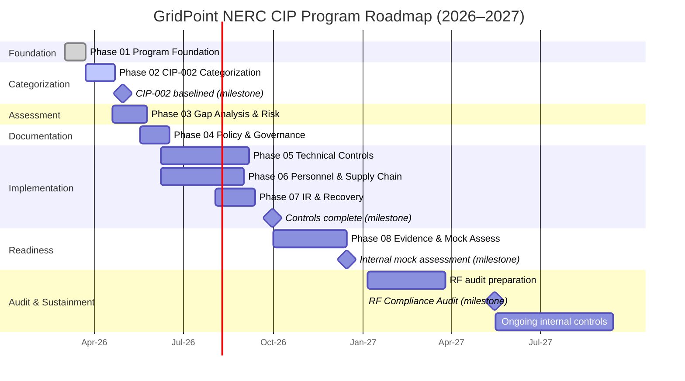
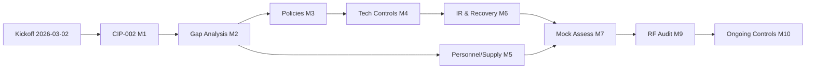

# 01.10 — Engagement Roadmap & Milestones

| Field | Value |
|---|---|
| Document ID | CIP-01.10 |
| Version | 1.0 |
| Date | 2026-03-02 |
| Classification | BES Cyber System Information (BCSI) // Illustrative Portfolio Sample |
| Owner | Karen Whitfield (NERC Compliance Manager) |
| Author | Advisory Team |
| Status | Approved |

## Purpose

This document sequences GridPoint Energy's NERC CIP compliance program from **kickoff (2026-03-02)** through the **ReliabilityFirst Compliance Audit (2027-Q2)** and into the **ongoing internal controls program**. It presents the nine-phase delivery structure, a Gantt schedule, and a milestone register with accountable owners and objective exit criteria. The roadmap is backward-planned from the fixed RF audit window and reflects the drivers behind the engagement: CIP-002 recategorization following new generation and substation commissioning, growing IT/OT convergence, and remediation of a prior self-logged CIP-007 R2 patch-cycle lapse.

## 1. Nine-Phase Delivery Structure

| Phase | Title | Primary CIP focus | Target window |
|---|---|---|---|
| 01 | Program Foundation & Registration Scoping | Governance, CIP-003 R1, scope | 2026-03 → 2026-03 |
| 02 | BES Cyber System Categorization | CIP-002-5.1a | 2026-03 → 2026-04 |
| 03 | Gap Analysis & Risk Assessment | All applicable (118 parts) | 2026-04 → 2026-05 |
| 04 | Policy & Governance Documentation | CIP-003-8, CIP-011-3 | 2026-05 → 2026-06 |
| 05 | Technical Control Implementation | CIP-005/006/007/010 | 2026-06 → 2026-Q3 |
| 06 | Personnel, Training & Supply Chain | CIP-004-7, CIP-013-2 | 2026-06 → 2026-Q3 |
| 07 | Incident Response & Recovery | CIP-008-6, CIP-009-6 | 2026-Q3 | 
| 08 | Evidence Assembly & Mock Assessment | RSAW packaging | 2026-Q4 |
| 09 | RF Audit & Ongoing Internal Controls | CMEP audit, sustainment | 2027-Q2 → continuous |

## 2. Roadmap Gantt

## 3. Milestone Register

| ID | Milestone | Target date | Owner | Exit criteria |
|---|---|---|---|---|
| M0 | Program kickoff | 2026-03-02 | Daniel Reyes (CIP Senior Manager) | Charter approved; RACI and scope baselined; Phase 01 documents issued |
| M1 | CIP-002 categorization baselined | 2026-04-30 | Marcus Bell | Impact ratings confirmed (14 Medium / 38 Low BCS); asset list and BCA inventory signed off by CIP Senior Manager |
| M2 | Gap analysis complete | 2026-05-30 | Karen Whitfield | All 118 applicable requirement parts assessed; gaps risk-ranked; Mitigation Plans drafted |
| M3 | Policies & governance approved | 2026-06-30 | Daniel Reyes | CIP-003-8 policy suite and CIP-011-3 BCSI program approved and published |
| M4 | Technical controls implemented | 2026-09-30 | Priya Nair / Marcus Bell | ESP (CIP-005), PSP (CIP-006), CIP-007 baselines, CIP-010 change management operational; TFEs filed where required |
| M5 | Personnel & supply-chain controls operational | 2026-09-30 | Sandra Lee / Karen Whitfield | CIP-004-7 PRA and training current; CIP-013-2 supply-chain plan implemented |
| M6 | IR & recovery plans tested | 2026-09-30 | Marcus Bell | CIP-008-6 incident response and CIP-009-6 recovery plans documented and exercised |
| M7 | Internal mock assessment complete | 2026-12-15 | Advisory Team | RSAW-based mock audit executed; findings logged; remediation tracked |
| M8 | RF audit readiness confirmed | 2027-04-30 | Daniel Reyes | Evidence packages assembled; RSAWs pre-populated; data request response process rehearsed |
| M9 | ReliabilityFirst Compliance Audit | 2027-Q2 (target 2027-05) | Daniel Reyes | Audit conducted; zero-violation objective; any findings entered to Mitigation Plans |
| M10 | Ongoing internal controls stood up | 2027-Q3 | Karen Whitfield | Continuous monitoring, obligations calendar, and internal controls program operating |

## 4. Critical Path and Dependencies

The critical path runs **Phase 01 → CIP-002 (M1) → Gap Analysis (M2) → Technical Implementation (M4) → Mock Assessment (M7) → RF Audit (M9)**. CIP-002 categorization (M1) gates all downstream applicability; a slip in M1 compresses implementation. Technical control implementation (Phase 05) is the longest-duration workstream and is scheduled in parallel with personnel/supply-chain work (Phase 06) to preserve the pre-audit buffer.

## 5. Schedule Risk Buffers

A deliberate buffer separates M7 (mock assessment, 2026-12-15) from M9 (RF audit, 2027-Q2) so that mock findings can be remediated and re-evidenced before the regional entity's on-site window. OT change activity under CIP-010 is constrained to approved maintenance outages, coordinated with Control Center Operations (James Okafor) and Field Engineering (Elena Ruiz).

## 6. Phase Exit Governance

Each phase closes only when its exit criteria are met and the CIP Senior Manager (Daniel Reyes) signs the phase-transition record. Exit reviews test three questions: (1) are the phase deliverables baselined in the evidence repository, (2) is the associated evidence contemporaneous and RSAW-mappable, and (3) are residual risks logged with owners and target dates. A phase may exit with open items only when those items are risk-accepted and tracked.

| Gate | Precedes | Approver | Evidence checked |
|---|---|---|---|
| G1 | Phase 02 entry | CIP Senior Manager | Foundation baselined (Phase 01 set) |
| G2 | Phase 03 entry | Marcus Bell / CIP Senior Manager | CIP-002 categorization signed (M1) |
| G3 | Phase 05 entry | Karen Whitfield | Gap analysis + Mitigation Plans (M2) |
| G4 | Phase 08 entry | Priya Nair / Marcus Bell | Controls implemented and evidenced (M4–M6) |
| G5 | RF audit | CIP Senior Manager | Mock findings remediated; audit package complete (M7–M8) |

## 7. Assumptions Underpinning the Schedule

- The RF audit window holds at 2027-Q2; a shift compresses or re-sequences downstream phases.
- SME availability aligns with the RACI so evidence collection is not the binding constraint.
- No mid-program acquisition, divestiture, or major commissioning triggers a CIP-002 re-review that resets M1.
- Change windows for CIP-010 work are granted within planned maintenance outages.

Deviations from these assumptions are raised through the escalation matrix (01.11) and, where they affect regulatory deadlines, evaluated by the CIP Senior Manager for CMEP disposition.

## Cross-References

- `01.09-program-scope-assumptions-constraints.md` — schedule constraint C1 and dependencies
- `01.11-communications-and-escalation-plan.md` — cadence supporting milestone gates
- `01.12-compliance-obligations-calendar.md` — recurring obligations feeding the sustainment phase
- `01.15-phase-summary-and-transition.md` — Phase 01 exit and handoff to Phase 02
- `../02-bes-cyber-system-categorization/02.00-README.md` — the M1 categorization work

---
[⬅ Previous](01.09-program-scope-assumptions-constraints.md) · [🏠 Phase README](01.00-README.md) · [Next ➡](01.11-communications-and-escalation-plan.md)
