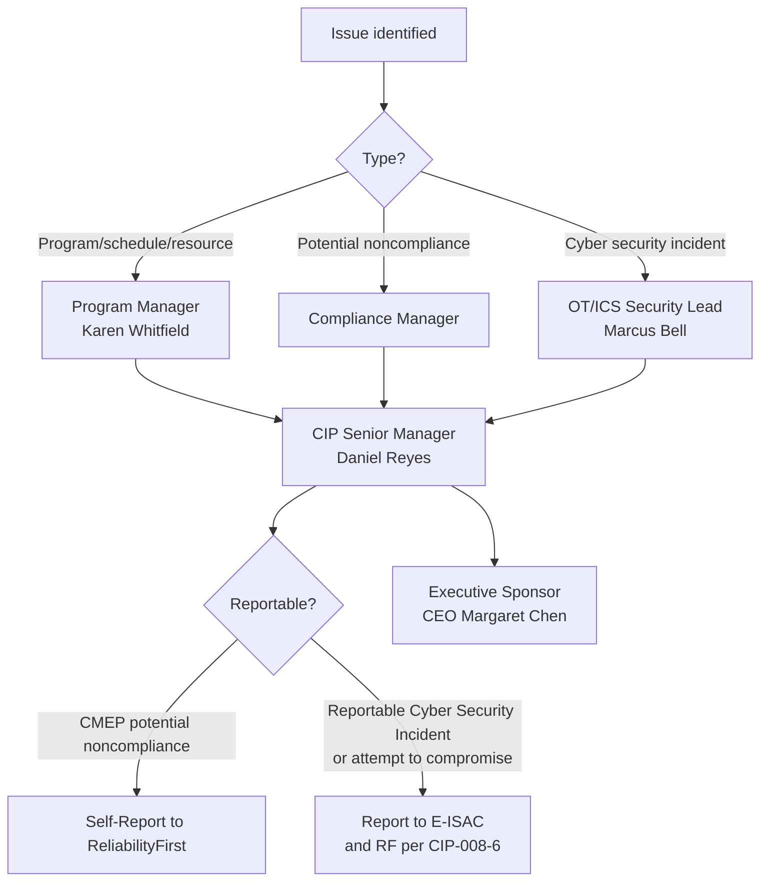

# 01.11 — Communications & Escalation Plan

| Field | Value |
|---|---|
| Document ID | CIP-01.11 |
| Version | 1.0 |
| Date | 2026-03-02 |
| Classification | BES Cyber System Information (BCSI) // Illustrative Portfolio Sample |
| Owner | Karen Whitfield (NERC Compliance Manager) |
| Author | Advisory Team |
| Status | Approved |

## Purpose

This plan defines how GridPoint Energy's NERC CIP program communicates — who talks to whom, how often, and through which channels — and how issues escalate. It covers routine program communications, **compliance-issue escalation** (including potential-noncompliance and Self-Report decisions under the CMEP), and **cyber-incident escalation** to the CIP Senior Manager, ReliabilityFirst (RF), and the Electricity Information Sharing and Analysis Center (E-ISAC) consistent with CIP-008-6 reporting obligations. Clear escalation preserves the mandatory reporting timelines and the single-point accountability of the CIP Senior Manager (Daniel Reyes) under CIP-003 R1.

## 1. Communication Principles

- All BES Cyber System Information (BCSI) is handled per CIP-011-3 regardless of channel.
- The CIP Senior Manager is the single accountable authority for CIP compliance communications with the Regional Entity.
- Reportable Cyber Security Incidents and attempts to compromise follow CIP-008-6 timelines; nothing in routine cadence overrides mandatory reporting.
- One version of the truth: status, risks, and evidence flow through the controlled repository (01.13), not ad-hoc copies.

## 2. Communications Matrix

| Audience | Purpose | Cadence | Channel | Owner |
|---|---|---|---|---|
| Executive Sponsor (CEO Margaret Chen) | Program health, funding, strategic risk | Monthly | Executive steering briefing | Daniel Reyes |
| CIP Senior Manager (Daniel Reyes) | Decisions, approvals, escalations | Weekly + on-demand | Program review; secure email | Karen Whitfield |
| VP Grid Operations (Robert Tan) | Operational impact, outage coordination | Bi-weekly | Operations sync | James Okafor |
| Core program team (Bell, Nair, Delgado, Okafor, Ruiz, Lee) | Task status, blockers, evidence | Weekly | Program standup / tracker | Karen Whitfield |
| Advisory Team | Workstream delivery, deliverable review | Weekly | Working sessions | Advisory Team lead |
| Site/field personnel | Site visits, evidence collection, changes | As scheduled | Field coordination briefings | Elena Ruiz |
| All CIP-covered staff | Awareness, CIP-004 security training | Quarterly + annual | Training platform / bulletins | Sandra Lee |
| ReliabilityFirst (RF) | Registration, data submittals, audit logistics | Per CMEP schedule / on notice | Formal correspondence via CIP Senior Manager | Daniel Reyes |
| E-ISAC | Incident reporting, threat sharing | Event-driven / voluntary sharing | E-ISAC portal / CRISP | Marcus Bell |

## 3. Reporting Artifacts

| Artifact | Frequency | Audience | Source of record |
|---|---|---|---|
| Executive dashboard | Monthly | CEO, CIP Senior Manager | Program tracker |
| Program status report | Weekly | Core team, Advisory Team | Program tracker |
| Risk & issue log | Continuous | CIP Senior Manager, Compliance Manager | Repository (01.13) |
| Milestone/exit-criteria report | Per milestone | Steering | Roadmap (01.10) |
| Compliance obligations status | Per obligation | Compliance Manager | Obligations calendar (01.12) |
| Incident report / Self-Report draft | Event-driven | CIP Senior Manager, RF | Repository (01.13) |

## 4. Escalation Model

## 5. Escalation Matrix

| Level | Trigger | Owner / decision authority | Timeframe | Onward notification |
|---|---|---|---|---|
| L1 — Program | Task slip, resource gap, minor blocker | Karen Whitfield (Program/Compliance Manager) | Same business day | CIP Senior Manager at weekly review |
| L2 — Compliance issue | Suspected potential noncompliance with a CIP requirement part | Compliance Manager → CIP Senior Manager | Within 1 business day of identification | CIP Senior Manager evaluates CMEP disposition |
| L3 — Self-Report decision | Confirmed potential/actual noncompliance | Daniel Reyes (CIP Senior Manager) | Promptly upon determination | Self-Report filed with ReliabilityFirst; Mitigation Plan initiated |
| L4 — Cyber incident (suspected) | Suspicious activity on BCS/EACMS/PACS/PCA | Marcus Bell (OT/ICS Security Lead) | Immediate triage | CIP Senior Manager; activate CIP-008-6 IR plan |
| L5 — Reportable Cyber Security Incident | Incident compromising or disrupting BES Cyber System, or attempt to compromise | CIP Senior Manager + IR team | Per CIP-008-6 mandated reporting timeline | **E-ISAC and ReliabilityFirst** notified per CIP-008-6 |
| L6 — Executive / crisis | Material reliability, safety, legal, or reputational impact | CIP Senior Manager → CEO Margaret Chen | Immediate | Executive leadership; external counsel as needed |

## 6. Incident Reporting Path (CIP-008-6)

Upon determination that a Cyber Security Incident is a **Reportable Cyber Security Incident** — or that an **attempt to compromise** an applicable system has occurred — GridPoint's incident responders notify the CIP Senior Manager and issue reports to **E-ISAC** and the appropriate authority within the CIP-008-6 mandated timelines. Marcus Bell coordinates the technical report; Daniel Reyes retains accountability for the regulatory notification. Reports and their timestamps are retained as evidence per the document and evidence management plan (01.13).

## 7. Regional Entity Communications Protocol

All formal communications with ReliabilityFirst — registration changes, Periodic Data Submittals, Self-Certifications, audit logistics, Self-Reports, and Mitigation Plans — route through the CIP Senior Manager or his express delegate. This preserves a controlled, consistent, and defensible record and prevents inadvertent BCSI disclosure.

| Communication type | Authorized sender | Recipient | Record location |
|---|---|---|---|
| Self-Certification response | Karen Whitfield (delegate) | ReliabilityFirst | Evidence repository (01.13) |
| Periodic Data Submittal | Karen Whitfield (delegate) | ReliabilityFirst | Evidence repository |
| Self-Report / Mitigation Plan | Daniel Reyes (CIP Senior Manager) | ReliabilityFirst | Evidence repository |
| Audit data request response | Daniel Reyes / delegate | RF audit team | Audit package |
| Reportable incident notification | Daniel Reyes / IR team | E-ISAC and RF | Incident record |

## 8. Meeting Governance

| Forum | Chair | Participants | Outputs |
|---|---|---|---|
| Executive steering | Daniel Reyes | CEO, VP Grid Ops, Compliance Manager | Decisions, funding, risk acceptance |
| Weekly program review | Karen Whitfield | Core team, Advisory Team | Status, actions, escalations |
| OT security sync | Marcus Bell | Nair, Ruiz, Okafor | Technical control progress, incidents |
| Field coordination | Elena Ruiz | Site leads | Site visit and evidence scheduling |

Decisions, actions, and risk acceptances from each forum are minuted and stored in the controlled repository so that governance itself is evidenced for the audit.

## 9. Confidentiality of Communications

Because program communications routinely contain BES Cyber System Information, all channels used for status, evidence, and incident content apply CIP-011-3 protections: encrypted transport, need-to-know distribution, and BCSI labeling. Presentations and dashboards shared with executives are sanitized of unnecessary technical detail while preserving decision-relevant risk information.

## Cross-References

- `01.06-cip-senior-manager-designation-and-delegations.md` — accountable authority and delegations
- `01.07-governance-structure-and-raci.md` — role assignments used in escalation
- `01.12-compliance-obligations-calendar.md` — reporting deadlines and submittals
- `01.13-document-and-evidence-management-plan.md` — evidence handling for reports
- `../08-*/` and `../07-*/` — CIP-008-6 incident response artifacts (later phases)

---
[⬅ Previous](01.10-engagement-roadmap-and-milestones.md) · [🏠 Phase README](01.00-README.md) · [Next ➡](01.12-compliance-obligations-calendar.md)
