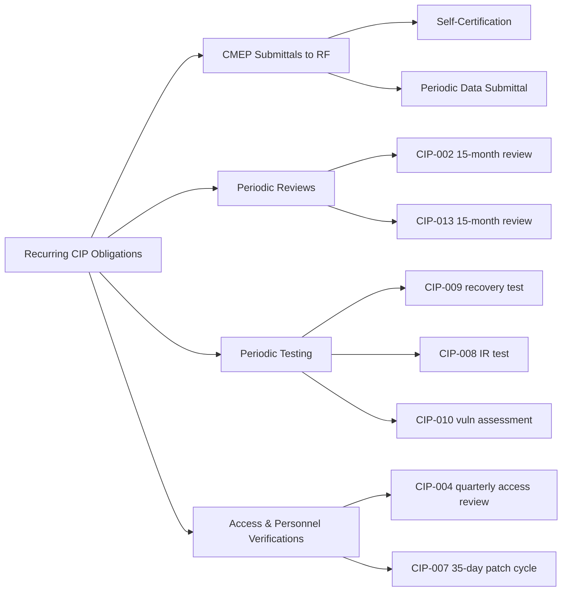

# 01.12 — Compliance Obligations Calendar

| Field | Value |
|---|---|
| Document ID | CIP-01.12 |
| Version | 1.0 |
| Date | 2026-03-02 |
| Classification | BES Cyber System Information (BCSI) // Illustrative Portfolio Sample |
| Owner | Karen Whitfield (NERC Compliance Manager) |
| Author | Advisory Team |
| Status | Approved |

## Purpose

This document consolidates GridPoint Energy's recurring NERC CIP compliance obligations into a single controlled calendar so that no periodic requirement lapses — the failure mode behind the prior self-logged CIP-007 R2 patch-evaluation gap. It lists each recurring obligation with its **frequency**, **accountable owner**, and **standard/requirement reference**, spanning CMEP-driven submittals to the Regional Entity (Self-Certifications, Periodic Data Submittals) and the internal periodic controls embedded in the CIP standards themselves (reviews, assessments, testing, and access verifications). This calendar becomes a core input to the ongoing internal controls program after the 2027-Q2 ReliabilityFirst audit.

## 1. Obligation Categories

## 2. Recurring Obligations Calendar

| # | Obligation | Standard / Requirement | Frequency | Accountable owner |
|---|---|---|---|---|
| 1 | RF Self-Certification response | CMEP (per RF schedule) | Annual / as scheduled by RF | Karen Whitfield |
| 2 | Periodic Data Submittal to RF | CMEP | Per RF schedule | Karen Whitfield |
| 3 | BES Cyber System categorization review & CIP Senior Manager approval | CIP-002-5.1a R2 | At least once every 15 calendar months | Marcus Bell |
| 4 | Security policy review & approval by CIP Senior Manager | CIP-003-8 R1 | At least once every 15 calendar months | Daniel Reyes |
| 5 | Low-impact plan review (Attachment 1) | CIP-003-8 R2 | At least once every 15 calendar months | Karen Whitfield |
| 6 | Quarterly access privilege review (authorization verification) | CIP-004-7 R4 | At least once each calendar quarter (≤15 months not applicable — quarterly) | Priya Nair |
| 7 | Annual verification of access privileges vs. authorization records | CIP-004-7 R4 | At least once every 15 calendar months | Priya Nair |
| 8 | Personnel Risk Assessment (PRA) — 7-year criminal history refresh | CIP-004-7 R3 | At least once every 7 years per individual | Sandra Lee |
| 9 | Security awareness reinforcement | CIP-004-7 R1 | At least once each calendar quarter | Sandra Lee |
| 10 | Cyber security training before access & refresher | CIP-004-7 R2 | At least once every 15 calendar months | Sandra Lee |
| 11 | Electronic access point / ESP configuration review | CIP-005-7 R1 | Ongoing; validated at CIP-010 baseline reviews | Marcus Bell |
| 12 | Physical Security Plan / PACS review | CIP-006-6 R1 | Ongoing; verified with access reviews | Frank Delgado |
| 13 | Security patch evaluation cycle | CIP-007-6 R2 | Evaluate applicable patches at least once every **35 calendar days** | Priya Nair |
| 14 | Patch remediation / mitigation plan action | CIP-007-6 R2 | Within 35 days of evaluation (install or dated mitigation plan) | Priya Nair |
| 15 | Malicious code prevention signature updates & log review | CIP-007-6 R3 / R4 | Ongoing / per baseline | Marcus Bell |
| 16 | Incident Response Plan test (CIP-008) | CIP-008-6 R2 | At least once every 15 calendar months | Marcus Bell |
| 17 | Incident Response Plan review & update after use/test | CIP-008-6 R3 | Within 90 days of test or actual incident | Marcus Bell |
| 18 | Recovery Plan test (operational exercise or paper drill) | CIP-009-6 R2 | At least once every 15 calendar months | Marcus Bell |
| 19 | Recovery Plan review & update after activation/test | CIP-009-6 R3 | Within specified days of test/activation | Marcus Bell |
| 20 | Baseline configuration change management verification | CIP-010-4 R1 / R2 | Per change; monitoring at least every 35 days (Medium at Control Centers) | Marcus Bell |
| 21 | Active vulnerability assessment (paper or active) | CIP-010-4 R3 | At least once every 15 calendar months | Marcus Bell |
| 22 | Active vulnerability assessment before new applicable Cyber Asset commissioning | CIP-010-4 R3 | Prior to commissioning | Marcus Bell |
| 23 | Supply chain risk management plan review & approval | CIP-013-2 R3 | At least once every 15 calendar months | Karen Whitfield |
| 24 | BCSI information protection program review | CIP-011-3 R1 | Ongoing; verified with policy review | Priya Nair |
| 25 | CIP-014 periodic threat/vulnerability & security plan review (applicable stations) | CIP-014-3 R4 / R5 | Per standard cycle (typically every 30/60 months) | Frank Delgado |

## 3. Calendar Cadence Summary

| Cadence | Obligations |
|---|---|
| Every 35 calendar days | Patch evaluation & remediation (CIP-007 R2); config monitoring (CIP-010 R2) |
| Quarterly | Security awareness (CIP-004 R1); access privilege reviews (CIP-004 R4) |
| Every 15 calendar months | CIP-002 R2; CIP-003 R1/R2; CIP-004 R2/R4; CIP-008 R2; CIP-009 R2; CIP-010 R3; CIP-013 R3 |
| Every 7 years | Personnel Risk Assessment refresh (CIP-004 R3) |
| Per RF schedule | Self-Certification; Periodic Data Submittal |
| Per event | IR/recovery plan updates; new-asset vulnerability assessment; Self-Reports |

## 4. Governance and Tolerance

Each obligation is tracked in the compliance calendar tool with an internal **early-warning tolerance** — GridPoint targets completion well inside the regulatory deadline (e.g., patch evaluation at ~30 days against the 35-day requirement) to preserve margin. Missed or at-risk obligations escalate per the escalation matrix (01.11) to the CIP Senior Manager, who determines whether a Self-Report and Mitigation Plan are warranted under the CMEP. Completion evidence for every obligation is filed to the evidence repository (01.13) and mapped to the relevant RSAW.

## 5. Illustrative First-Year Timeline

| Period | Key recurring obligations landing |
|---|---|
| 2026-Q2 | First quarterly CIP-004 access review and awareness reinforcement; begin 35-day patch cycles |
| 2026-Q3 | Second quarterly CIP-004 cycle; CIP-009 recovery test and CIP-008 IR test during implementation |
| 2026-Q4 | Third quarterly CIP-004 cycle; CIP-010 annual vulnerability assessment ahead of mock assessment |
| 2027-Q1 | Fourth quarterly CIP-004 cycle; 15-month CIP-002/CIP-003/CIP-013 reviews confirmed current |
| 2027-Q2 | RF Compliance Audit; all recurring obligations demonstrably in-cycle with evidence |

The 35-day CIP-007 R2 patch-evaluation cycle and the quarterly CIP-004 R4 access reviews are the highest-frequency obligations and therefore the highest lapse risk; both are given automated reminders and dual-owner sign-off.

## 6. Ownership Rollup

| Owner | Obligations owned |
|---|---|
| Karen Whitfield | Self-Certification, Periodic Data Submittal, CIP-003 R2, CIP-013 R3 |
| Marcus Bell | CIP-002 R2, CIP-005, CIP-007 R3/R4, CIP-008, CIP-009, CIP-010 |
| Priya Nair | CIP-004 R4, CIP-007 R2, CIP-011 R1 |
| Sandra Lee | CIP-004 R1/R2/R3 (PRA & training) |
| Frank Delgado | CIP-006 R1, CIP-014 R4/R5 |
| Daniel Reyes | CIP-003 R1 policy approval; CMEP disposition decisions |

## Cross-References

- `01.10-engagement-roadmap-and-milestones.md` — sustainment phase that operationalizes this calendar
- `01.11-communications-and-escalation-plan.md` — escalation for at-risk obligations
- `01.13-document-and-evidence-management-plan.md` — evidence retention and RSAW mapping
- `01.14-cip-roles-and-responsibilities-glossary.md` — terminology (CMEP, RSAW, PRA, Self-Report)

---
[⬅ Previous](01.11-communications-and-escalation-plan.md) · [🏠 Phase README](01.00-README.md) · [Next ➡](01.13-document-and-evidence-management-plan.md)
