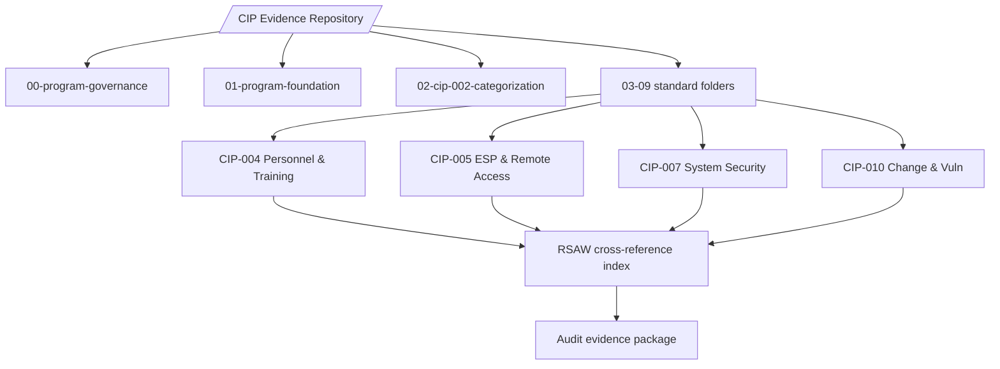
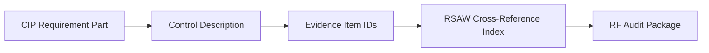

# 01.13 — Document & Evidence Management Plan

| Field | Value |
|---|---|
| Document ID | CIP-01.13 |
| Version | 1.0 |
| Date | 2026-03-02 |
| Classification | BES Cyber System Information (BCSI) // Illustrative Portfolio Sample |
| Owner | Priya Nair (IT Security Manager) |
| Author | Advisory Team |
| Status | Approved |

## Purpose

This plan governs how GridPoint Energy creates, protects, retains, and produces compliance documentation and audit evidence for its NERC CIP program. It defines **BCSI handling** under CIP-011-3, the **evidence repository structure**, **retention** rules, **version control**, **chain of custody**, and the mapping of evidence to **Reliability Standard Audit Worksheets (RSAWs)** for the 2027-Q2 ReliabilityFirst Compliance Audit. A defensible, complete, and well-organized evidence base is the difference between demonstrating compliance and receiving a finding for otherwise-compliant practice.

## 1. Guiding Principles

- **Evidence exists or the control does not.** Every applicable requirement part must have retrievable, dated, attributable evidence.
- **Protect BCSI throughout its lifecycle** per CIP-011-3 — at rest, in transit, in use, and in disposal.
- **Contemporaneous is credible.** Evidence generated at the time of the activity outweighs reconstructed evidence.
- **One controlled source of record** — no shadow copies outside the repository.

## 2. BCSI Handling (CIP-011-3)

| Control | Requirement |
|---|---|
| Identification | Documents containing BES Cyber System Information are labeled `BCSI` and classified accordingly |
| Access | Need-to-know; access authorized and reviewed per CIP-004-7 R4; provisioned/revoked with personnel changes |
| Storage | Encrypted repository with logical access controls; designated BCSI storage locations only |
| Transmission | Encrypted channels; secure email or portal; no BCSI over uncontrolled channels |
| Use | Screen/print controls; watermarking on exports; clean-desk for hardcopy |
| Disposal / reuse | Sanitization or destruction per CIP-011-3 R2 before disposal, redeployment, or return |
| Third-party | Advisory Team and vendors bound by confidentiality; access logged |

## 3. Evidence Repository Structure

| Folder tier | Contents | Naming convention |
|---|---|---|
| Standard folder | One per CIP standard (CIP-002 … CIP-014) | `CIP-0NN-<short-name>` |
| Requirement subfolder | One per requirement / requirement part | `RNN.PP-<control>` |
| Evidence item | Dated artifact with metadata header | `CIP0NN-RNN-YYYYMMDD-<desc>-vX.Y` |
| RSAW index | Maps each requirement part to evidence item IDs | `RSAW-CIP-0NN-index` |

## 4. Retention

| Item | Retention rule |
|---|---|
| CIP compliance evidence | Retain from the **most recent audit through the current audit period** — i.e., since the last RF audit — at minimum, per CMEP and standard-specific data-retention sections |
| Full-period records | Where a standard specifies "since its last audit," retain the complete intervening period, plus prior-audit records until superseded |
| Logs (access, security event) | Retained per each standard's Evidence Retention section (commonly 90 days rolling for event logs plus the audit period for review evidence) |
| Approved documents | All versions retained; superseded versions archived, not deleted |
| Self-Reports / Mitigation Plans | Retained through closure and the subsequent audit period |
| Baseline / minimum | Never destroy evidence needed to demonstrate compliance for any period within the current audit cycle |

GridPoint's default retention target is **the current audit period plus the prior audit period**, exceeding standard minimums to protect against multi-cycle look-backs.

## 5. Version Control

| Element | Rule |
|---|---|
| Versioning scheme | `Major.Minor` (1.0 baselined; minor for edits; major for re-approval) |
| Change log | Each controlled document carries a revision history table |
| Approval | Material changes re-approved by the document owner and, for policies, the CIP Senior Manager (CIP-003-8 R1) |
| Immutability | Approved versions locked; edits create a new version, never overwrite |
| Distribution | Only the repository copy is authoritative; printed/exported copies marked "uncontrolled if printed" |

## 6. Chain of Custody

| Stage | Custody control |
|---|---|
| Collection | Evidence collector recorded; source system and timestamp captured |
| Transfer | Handoffs logged (from/to/date); integrity hash where feasible |
| Storage | Access-controlled repository; immutable audit trail of views/edits |
| Production | Auditor-facing copies produced from the master; production log maintained |
| Integrity | Tamper-evidence via hashing/checksums for critical exported artifacts |

Chain of custody is essential when evidence is contested or when demonstrating that log data was not altered between generation and audit production.

## 7. Evidence-to-RSAW Mapping

Each RSAW enumerates a standard's requirements and the entity's described compliance approach. GridPoint maintains an **RSAW cross-reference index** that links every requirement part to the specific evidence item IDs supporting it, so that during the RF audit each auditor question resolves directly to a retrievable artifact.

| RSAW element | GridPoint mapping artifact |
|---|---|
| Requirement / part narrative | Control description in the applicable phase document |
| "Evidence provided" reference | Evidence item ID(s) in the RSAW index |
| Sampling population | Asset/personnel lists from CIP-002 / CIP-004 |
| Compliance narrative | Cross-links to policy, procedure, and dated records |
| Gaps / Mitigation Plans | Linked Mitigation Plan ID and status |

## 8. Roles

| Role | Responsibility |
|---|---|
| Priya Nair (Owner) | Repository administration, BCSI access controls, integrity |
| Karen Whitfield | RSAW index accuracy, audit package assembly |
| Advisory Team | Evidence quality review, gap identification |
| Daniel Reyes (CIP Senior Manager) | Approval of policies and final audit package |
| Control owners (Bell, Delgado, Lee, Okafor, Ruiz) | Contemporaneous evidence generation for their controls |

## Cross-References

- `01.09-program-scope-assumptions-constraints.md` — BCSI constraint C3
- `01.11-communications-and-escalation-plan.md` — reporting artifacts feeding the repository
- `01.12-compliance-obligations-calendar.md` — obligations whose completion evidence is stored here
- `01.14-cip-roles-and-responsibilities-glossary.md` — definitions of RSAW, BCSI, Mitigation Plan

---
[⬅ Previous](01.12-compliance-obligations-calendar.md) · [🏠 Phase README](01.00-README.md) · [Next ➡](01.14-cip-roles-and-responsibilities-glossary.md)
