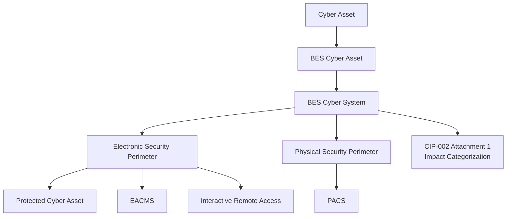

# 01.14 — CIP Roles & Responsibilities Glossary

| Field | Value |
|---|---|
| Document ID | CIP-01.14 |
| Version | 1.0 |
| Date | 2026-03-02 |
| Classification | BES Cyber System Information (BCSI) // Illustrative Portfolio Sample |
| Owner | Karen Whitfield (NERC Compliance Manager) |
| Author | Advisory Team |
| Status | Approved |

## Purpose

This glossary defines the key NERC CIP roles and terms used throughout GridPoint Energy's compliance portfolio and identifies **who at GridPoint fills each role**. Consistent terminology is a compliance control in its own right: RSAW responses, Mitigation Plans, and audit interviews all depend on every stakeholder using terms precisely and identically. Definitions follow NERC's Glossary of Terms and the CIP standards; role assignments follow GridPoint's governance model and the CIP-003 R1 designation.

## 1. Role and Term Glossary

| Term | Definition |
|---|---|
| **CIP Senior Manager** | The single senior management official with overall authority and responsibility for leading and managing implementation of, and continuing adherence to, the CIP standards, as required by CIP-003-8 R1. Approves policies and holds ultimate accountability. |
| **Delegate** | An individual to whom the CIP Senior Manager delegates specific authority in writing (dated, with the delegated authority and delegate identified) per CIP-003-8 R1/R2. Delegation does not transfer ultimate accountability. |
| **BES Cyber System (BCS)** | One or more BES Cyber Assets logically grouped to perform one or more reliability tasks for a functional entity. The unit of impact categorization under CIP-002-5.1a. |
| **BES Cyber Asset (BCA)** | A Cyber Asset that, if rendered unavailable, degraded, or misused, would within 15 minutes adversely impact one or more BES reliability operating tasks. The building block of a BCS. |
| **EACMS** | Electronic Access Control or Monitoring Systems — Cyber Assets that perform electronic access control or monitoring of the ESP or BCS (e.g., firewalls, authentication servers, SIEM/IDS). |
| **PACS** | Physical Access Control Systems — Cyber Assets that control, alert, or log access to the Physical Security Perimeter, excluding locally mounted hardware at the access point. |
| **PCA** | Protected Cyber Asset — a Cyber Asset connected using a routable protocol within an ESP that is not itself a BCA, but shares the perimeter and inherits protections. |
| **ESP** | Electronic Security Perimeter — the logical border surrounding a network to which BES Cyber Systems are connected using a routable protocol (CIP-005-7). |
| **IRA** | Interactive Remote Access — user-initiated electronic access from outside the ESP to a BCS/PCA using a routable protocol, requiring an Intermediate System and multi-factor authentication under CIP-005-7. |
| **PSP** | Physical Security Perimeter — the physical border surrounding locations in which BES Cyber Assets, EACMS, or PACS reside, for which access is controlled (CIP-006-6). |
| **TFE** | Technical Feasibility Exception — a documented, approved exception where strict compliance with a requirement is not technically feasible for a specific asset, with compensating measures. |
| **RSAW** | Reliability Standard Audit Worksheet — the standardized worksheet used by the Regional Entity and entity to document compliance approach and evidence for each requirement during CMEP monitoring. |
| **Mitigation Plan** | A formal plan to correct a confirmed noncompliance and prevent recurrence, submitted to and accepted by the Regional Entity, with milestones and a completion date. |
| **Self-Report** | An entity-initiated CMEP submission disclosing a potential or actual noncompliance to the Regional Entity, often paired with a Mitigation Plan. |
| **CMEP** | Compliance Monitoring and Enforcement Program — NERC's program (Appendix 4C) defining monitoring methods (Audit, Self-Certification, Spot Check, Investigation, Self-Report, Periodic Data Submittal, Complaint) and enforcement. |
| **Reportable Cyber Security Incident** | A Cyber Security Incident that compromised or disrupted a BES Cyber System, associated EACMS, or their reliability tasks — reportable to E-ISAC per CIP-008-6. |
| **Cyber Asset** | Programmable electronic device, including the hardware, software, and data in the device. |
| **Attachment 1 (CIP-002)** | The impact rating criteria appendix used to categorize BCS as High, Medium, or Low impact. |

## 2. Terminology Relationships

## 3. GridPoint Role Assignments

| Role / responsibility | GridPoint incumbent | Basis |
|---|---|---|
| CIP Senior Manager | **Daniel Reyes** (VP Security & Compliance) | CIP-003-8 R1 designation |
| Executive sponsor | **Margaret Chen** (CEO) | Corporate governance |
| Operations executive | **Robert Tan** (VP Grid Operations) | TOP/GOP oversight |
| NERC Compliance Manager / program lead | **Karen Whitfield** | Delegate for CMEP submittals |
| OT/ICS Security Lead (BCS/ESP technical) | **Marcus Bell** | CIP-005/007/010 owner |
| IT Security Manager (BCSI, EACMS, access) | **Priya Nair** | CIP-004/011 support |
| Physical Security Manager (PSP/PACS) | **Frank Delgado** | CIP-006/014 owner |
| Control Center Operations Manager | **James Okafor** | Medium-impact site operations |
| Substation & Field Engineering Lead | **Elena Ruiz** | Substation cyber assets |
| Personnel Risk Assessment coordinator | **Sandra Lee** | CIP-004 R3 PRA / training |
| Independent CIP-014 reviewer | **Independent licensed engineering firm** | CIP-014-3 third-party review |
| Program author / advisory | **Advisory Team** | OT-GRC / NERC CIP advisory |
| Regional Entity | **ReliabilityFirst (RF)** | Oversight (FERC → NERC → RF) |

## 4. Additional CMEP and Program Terms

| Term | Definition |
|---|---|
| **Registered Entity** | An entity registered on the NERC Compliance Registry for one or more functional categories (GridPoint: GO, GOP, TO, TOP, DP). |
| **Regional Entity** | The organization (ReliabilityFirst for GridPoint) delegated by NERC to monitor and enforce Reliability Standards. |
| **Periodic Data Submittal** | A CMEP monitoring method requiring the entity to submit specified data to the Regional Entity on a defined schedule. |
| **Self-Certification** | A CMEP method in which the entity attests to its compliance status for specified standards/requirements. |
| **Spot Check** | A CMEP method in which the Regional Entity requests evidence for a subset of requirements outside a full audit. |
| **Intermediate System** | A Cyber Asset that restricts Interactive Remote Access to only authorized users, required for IRA under CIP-005-7. |
| **Baseline Configuration** | The documented configuration (OS, software, ports, patches) of an applicable Cyber Asset, maintained under CIP-010-4. |
| **Attempt to Compromise** | Activity that seeks to compromise an applicable system, reportable under the CIP-008-6 expanded reporting scope. |

## 5. Accountability vs. Responsibility

The CIP Senior Manager (Daniel Reyes) is **accountable** for the entire CIP program and cannot delegate that accountability, even where he delegates specific authority in writing (e.g., authorizing Karen Whitfield to file Periodic Data Submittals). Control owners are **responsible** for executing and evidencing their assigned controls. This distinction maps to the RACI in 01.07 and governs escalation in 01.11.

Precise, shared use of these terms across interviews, RSAW narratives, and Mitigation Plans reduces audit risk: auditors test not only that controls exist but that the entity understands and describes them accurately. Every author in this portfolio uses the definitions above verbatim.

## 6. Delegation Register (Illustrative)

| Delegated authority | Delegate | Scope of delegation | Basis |
|---|---|---|---|
| File CMEP submittals (Self-Certification, Periodic Data Submittal) | Karen Whitfield | Submission and correspondence with RF | Written delegation under CIP-003-8 R1 |
| Approve routine access authorizations | Priya Nair | CIP-004-7 R4 provisioning approvals | Written delegation |
| Authorize physical access changes | Frank Delgado | CIP-006-6 PSP access decisions | Written delegation |
| Coordinate incident reporting to E-ISAC | Marcus Bell | CIP-008-6 technical reporting | Written delegation |

Ultimate accountability for every delegated authority above remains with the CIP Senior Manager, Daniel Reyes. Delegations are dated, identify the delegate and the specific authority, and are retained as evidence per CIP-003-8 R1.

## 7. Cross-Framework Note

GridPoint's sibling regulatory portfolios (FedRAMP, HIPAA, Banking) use overlapping governance vocabulary but distinct regulatory roles. The NERC CIP definitions in this glossary govern the CIP program exclusively; cross-portfolio terms are not interchangeable, and CIP-specific roles such as CIP Senior Manager have no equivalent authority outside the NERC context.

## Cross-References

- `01.06-cip-senior-manager-designation-and-delegations.md` — formal designation and written delegations
- `01.07-governance-structure-and-raci.md` — full RACI for these roles
- `01.12-compliance-obligations-calendar.md` — obligations mapped to these owners
- `01.13-document-and-evidence-management-plan.md` — RSAW, BCSI, and Mitigation Plan usage

---
[⬅ Previous](01.13-document-and-evidence-management-plan.md) · [🏠 Phase README](01.00-README.md) · [Next ➡](01.15-phase-summary-and-transition.md)
