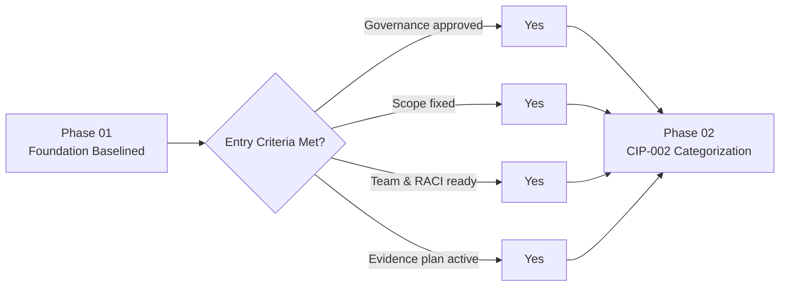

# 01.15 — Phase 01 Summary & Transition

| Field | Value |
|---|---|
| Document ID | CIP-01.15 |
| Version | 1.0 |
| Date | 2026-03-02 |
| Classification | BES Cyber System Information (BCSI) // Illustrative Portfolio Sample |
| Owner | Daniel Reyes (CIP Senior Manager) |
| Author | Advisory Team |
| Status | Approved |

## Purpose

This document closes **Phase 01 — Program Foundation & Registration Scoping** for GridPoint Energy's NERC CIP program and authorizes transition into **Phase 02 — BES Cyber System Categorization (CIP-002-5.1a)**. It records what was baselined, confirms readiness against the Phase 02 entry criteria, captures key decisions and residual risks, and documents the formal handoff.

## 1. What Was Baselined in Phase 01

| Baseline artifact | Document | Outcome |
|---|---|---|
| Utility & business profile | 01.01 | GridPoint (NCR11027) footprint documented |
| Functional registration | 01.02 | GO, GOP, TO, TOP, DP confirmed |
| Regulatory context | 01.03 | FERC → NERC → RF oversight and CMEP established |
| Applicable standards register | 01.04 | 12 CIP standards / versions in scope |
| Program charter & objectives | 01.05 | Mandate and success measures approved |
| CIP Senior Manager designation | 01.06 | Daniel Reyes designated per CIP-003-8 R1; delegations recorded |
| Governance & RACI | 01.07 | Roles and accountabilities assigned |
| Stakeholder register | 01.08 | Internal/external stakeholders identified |
| Scope, assumptions, constraints | 01.09 | Medium/Low scope fixed; no High impact |
| Roadmap & milestones | 01.10 | Kickoff → 2027-Q2 RF audit sequenced |
| Communications & escalation | 01.11 | Comms cadence and escalation to RF/E-ISAC set |
| Obligations calendar | 01.12 | Recurring CIP obligations consolidated |
| Evidence management plan | 01.13 | BCSI handling and RSAW mapping defined |
| Roles glossary | 01.14 | Terminology and incumbents fixed |

## 2. Key Decisions

| # | Decision | Rationale |
|---|---|---|
| K1 | Scope limited to Medium- and Low-impact BCS plus associated EACMS/PACS/PCA | No asset meets CIP-002 High criteria |
| K2 | Program backward-planned from the fixed 2027-Q2 RF audit | Preserve remediation buffer after mock assessment |
| K3 | Daniel Reyes retained as single accountable CIP Senior Manager | Satisfies CIP-003-8 R1 single-authority requirement |
| K4 | Prior CIP-007 R2 patch-cycle lapse tracked via Mitigation Plan and internal controls | Avoid recurrence and demonstrate maturity |
| K5 | Single controlled evidence repository with RSAW cross-reference index | Audit-ready, defensible evidence base |

## 3. Residual Risks Carried Into Phase 02

| # | Risk | Likelihood | Mitigation | Owner |
|---|---|---|---|---|
| R1 | CIP-002 review reclassifies assets, shifting the 118-part applicability baseline | Medium | Early categorization; CIP Senior Manager sign-off | Marcus Bell |
| R2 | Asset inventory or topology gaps delay categorization | Medium | Discovery sprint at Phase 02 start | Marcus Bell |
| R3 | Legacy relays/RTUs cannot meet patching/logging → TFEs | Medium | Identify TFE candidates during categorization | Priya Nair |
| R4 | SME availability constrains evidence collection | Low | RACI commitments; Advisory augmentation | Karen Whitfield |
| R5 | New commissioning (e.g., Sunfield Solar) triggers re-review | Low | Scope change control per 01.09 | Daniel Reyes |

## 4. Phase 02 Readiness Check

| Entry criterion for Phase 02 | Status |
|---|---|
| CIP Senior Manager designated and program governance approved | Met |
| Scope boundary (Medium/Low, EACMS/PACS/PCA) baselined | Met |
| Asset footprint documented and available for categorization | Met |
| Roles, RACI, and stakeholder register in place | Met |
| Evidence repository and BCSI controls operational | Met |
| Roadmap and obligations calendar published | Met |

All entry criteria are **Met**. Phase 02 is authorized to proceed toward the CIP-002 categorization baseline milestone (M1, target 2026-04-30).

## 5. Open Items Carried Forward

| # | Open item | Disposition | Owner | Target |
|---|---|---|---|---|
| O1 | Confirm asset inventory completeness for categorization | Discovery sprint in Phase 02 | Marcus Bell | 2026-04 |
| O2 | Identify candidate TFEs for legacy relays/RTUs | Assess during CIP-002/CIP-010 review | Priya Nair | 2026-05 |
| O3 | Close prior CIP-007 R2 patch-cycle Mitigation Plan | Track to completion | Priya Nair | 2026-Q3 |
| O4 | Vendor contract corpus for CIP-013 review | Collect from Procurement/Legal | Karen Whitfield | 2026-Q2 |

None of the open items block Phase 02 entry; each is risk-accepted, owned, and tracked in the risk & issue log.

## 6. Handoff

Phase 01 deliverables are baselined and version-controlled in the evidence repository. The CIP Senior Manager (Daniel Reyes) authorizes transition to Phase 02, where GridPoint will apply CIP-002-5.1a Attachment 1 criteria to confirm the **14 Medium / 38 Low** BES Cyber System groupings and finalize the BCA/EACMS/PACS/PCA inventory that anchors all downstream control work.

| Handoff element | Detail |
|---|---|
| Outgoing phase | 01 — Program Foundation & Registration Scoping |
| Incoming phase | 02 — BES Cyber System Categorization (CIP-002-5.1a) |
| Authorizing authority | Daniel Reyes, CIP Senior Manager |
| Primary receiver | Marcus Bell, OT/ICS Security Lead |
| First milestone | M1 — CIP-002 categorization baselined (2026-04-30) |
| Baselined inputs | Scope (01.09), roadmap (01.10), obligations (01.12), evidence plan (01.13), glossary (01.14) |

Transition is **approved**. Phase 02 commences against the categorization work stream.

## Cross-References

- `01.09-program-scope-assumptions-constraints.md` — scope confirmed here
- `01.10-engagement-roadmap-and-milestones.md` — milestone M1 that Phase 02 delivers
- `01.14-cip-roles-and-responsibilities-glossary.md` — CIP-002 terminology
- `../02-bes-cyber-system-categorization/02.00-README.md` — next phase entry point

---
[⬅ Previous](01.14-cip-roles-and-responsibilities-glossary.md) · [🏠 Phase README](01.00-README.md) · [Next ➡](../02-bes-cyber-system-categorization/02.00-README.md)
