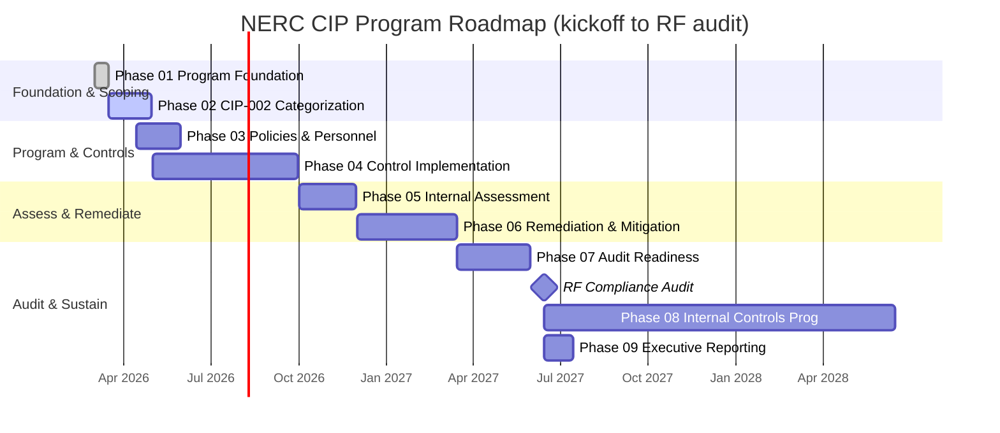

# Diagram — Program Roadmap (Gantt)

| Field | Value |
|---|---|
| Version | 1.0 |
| Date | 2026-03-02 |
| Classification | BES Cyber System Information (BCSI) // Illustrative Portfolio Sample |
| Company | GridPoint Energy, Inc. (NCR11027) |
| Regional Entity | ReliabilityFirst (RF) |
| Phase | 01 — Program Foundation & Registration Scoping |
| Author | Advisory Team |
| Status | Approved |

## Cross-References
`01.10-engagement-roadmap-and-milestones.md`, `trackers/engagement-milestone-tracker.xlsx`.
