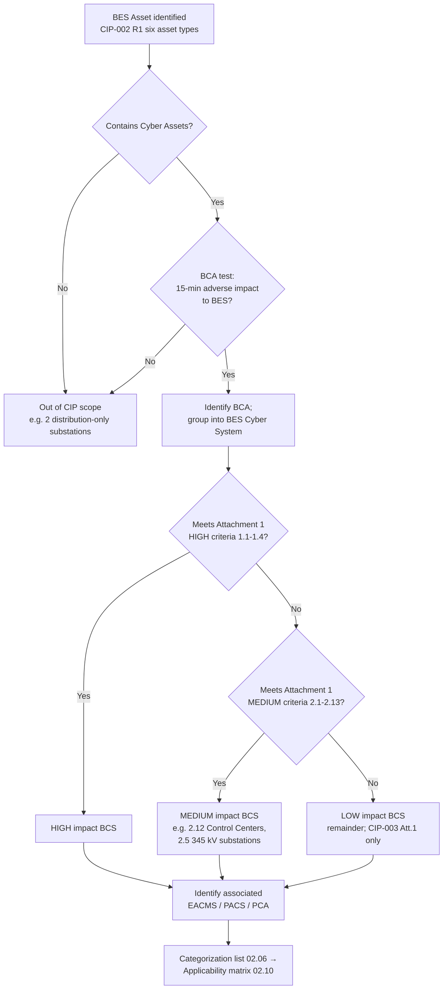

# 02.01 — CIP-002-5.1a Methodology & Approach

| Field | Value |
|---|---|
| Document ID | CIP-02.01 |
| Version | 1.0 |
| Date | 2026-03-02 |
| Classification | BES Cyber System Information (BCSI) // Illustrative Portfolio Sample |
| Owner | Karen Whitfield (NERC Compliance Manager) |
| Author | Advisory Team |
| Status | Approved |

## Purpose

This document establishes the methodology GridPoint Energy, Inc. ("GridPoint") uses to satisfy **CIP-002-5.1a — BES Cyber System Categorization**. It defines the repeatable, defensible process for inventorying Bulk Electric System (BES) assets, identifying BES Cyber Assets (BCAs) and BES Cyber Systems (BCS), applying the **CIP-002 Attachment 1** impact-rating criteria, and categorizing each BCS as High, Medium, or Low impact. CIP-002 is the foundational standard for the entire NERC CIP program: every applicable requirement in CIP-003 through CIP-013 is scoped by the categorization results produced here.

## Scope of CIP-002 at GridPoint

GridPoint is a mid-size, investor-owned electric utility registered with NERC (NCR11027) under the **GO, GOP, TO, TOP, and DP** functions, overseen by **ReliabilityFirst (RF)**. CIP-002 applies to the BES assets GridPoint owns or operates in the Eastern Interconnection: 2 Control Centers, 44 transmission substations, and 4 generation plants. The methodology below produces the categorized inventory that seeds the applicability matrix (02.10) and the baseline gap assessment (02.11).

## The Identify → Categorize Approach

CIP-002-5.1a Requirement R1 requires the Responsible Entity to implement a process that considers each of six BES asset types and, for each, identifies and categorizes the associated BES Cyber Systems. GridPoint executes this as a five-step, evidence-generating workflow.

| Step | Activity | CIP-002 Basis | Output Artifact |
|---|---|---|---|
| 1 | Enumerate BES assets by the six R1 asset types (Control Centers, Transmission stations/substations, generation resources, systems/facilities for protection/restoration, special protection systems, DP-owned assets) | R1 | BES Asset Inventory (02.02) |
| 2 | Identify Cyber Assets at each BES asset; apply the **15-minute adverse-impact test** to determine BCAs | Definitions; R1 | Cyber Asset / BCA Inventory (02.03) |
| 3 | Group BCAs that perform a common reliability function into BES Cyber Systems | Definition of BCS | BCS Identification (02.04) |
| 4 | Apply **Attachment 1** criteria to each BCS to assign High / Medium / Low | R1.1–R1.3, Attachment 1 | Impact-rating analysis (02.05) |
| 5 | Identify associated EACMS, PACS, and PCA; establish electronic/physical boundaries | Definitions; R1 | Associated-systems & boundary docs (02.07, 02.08) |

### The 15-minute rule (BCA test)

A **BES Cyber Asset** is a Cyber Asset that, if rendered unavailable, degraded, or misused, would — **within 15 minutes** of its required operation, misoperation, or non-operation — adversely impact one or more BES Reliability Operating Services. Cyber Assets that fail this test are not BCAs. This test is applied consistently across all GridPoint assets and documented in 02.03.

### From BCA to BCS

A **BES Cyber System** is one or more BCAs logically grouped by a Responsible Entity to perform one or more reliability tasks for a functional entity. GridPoint groups BCAs by asset location and reliability function (e.g., all protection-relay BCAs on a substation bus, or the EMS/SCADA BCAs at a Control Center), producing **52 BCS total: 14 Medium + 38 Low** — no High.

## Categorization Decision Flow

## Use of Attachment 1 Criteria

CIP-002 Attachment 1 provides the objective, bright-line criteria that drive impact ratings. GridPoint applies them in strict precedence — High first, then Medium, then Low as the remainder:

- **High (Section 1):** large Control Centers and generation/transmission thresholds (e.g., criterion 1.x). **None of GridPoint's assets meet High criteria.**
- **Medium (Section 2):** notably **criterion 2.5** (Transmission Facilities operated at 200 kV–499 kV connected at a single station to three or more other Transmission stations) for the 8 345 kV substations, and **criterion 2.12** (Control Centers performing the TOP functional obligation for one or more Medium-impact Facilities) plus **2.11/2.13** for GOP functions at the Control Centers.
- **Low (Section 3):** any BES asset containing a BCS that does not meet a High or Medium criterion — GridPoint's 4 generation plants and 34 remaining substations. Low-impact BCS are subject to **CIP-003 Attachment 1** only.

The detailed criteria-to-asset mapping is the keystone analysis in 02.05.

## Roles & Responsibilities

| Role | Person | CIP-002 Responsibility |
|---|---|---|
| CIP Senior Manager | Daniel Reyes | Approves the categorization; single accountable authority (CIP-003 R1) |
| NERC Compliance Manager | Karen Whitfield | Owns and maintains the CIP-002 process and evidence |
| OT / ICS Security Lead | Marcus Bell | Identifies BCAs/BCS and associated EACMS/PACS/PCA |
| Substation & Field Engineering Lead | Elena Ruiz | Validates substation asset data and connectivity |
| Control Center Operations Manager | James Okafor | Validates Control Center BCS scope |
| Advisory Team | — | Facilitates methodology, drafts categorization document |

## 15-Month Review Cycle

CIP-002-5.1a Requirement **R2** obligates GridPoint to: (R2.1) review the identifications in R1 at least once every **15 calendar months**; and (R2.2) have the **CIP Senior Manager or delegate approve** the identifications at least once every 15 calendar months. GridPoint additionally performs an event-driven review whenever a material change occurs (new substation energized, plant commissioned such as Sunfield Solar, Control Center modernization, or a change in voltage/connectivity that could cross an Attachment 1 threshold). The recurring schedule and triggers are maintained in 02.14. The current categorization was baselined 2026-04.

## Precedence and Consistency Rules

To keep the categorization defensible and repeatable, GridPoint applies the following rules on every pass:

- **Highest rating wins.** A BCS is assigned the highest impact rating for which any of its constituent BCAs qualifies under Attachment 1.
- **Strict criterion precedence.** High criteria (Section 1) are tested before Medium (Section 2); Low is assigned only as the remainder.
- **No redundancy exemption.** The presence of a redundant device does not remove a BCA or lower a BCS rating.
- **Location-bounded grouping.** A BES Cyber System does not span physical sites; grouping is done within a single BES asset.
- **Consistent 15-minute test.** The BCA test is applied identically across Control Centers, substations, and plants, with the rationale recorded per device.

## Common Pitfalls Avoided

| Pitfall | GridPoint control |
|---|---|
| Omitting associated EACMS/PACS/PCA from scope | Step 5 mandatorily identifies associated systems (02.07) |
| Miscounting connectivity for criterion 2.5 | Substation connectivity validated by Field Engineering (Elena Ruiz) |
| Treating a Low remainder asset as out of scope | Low ≠ out of scope; only assets with no BCS are excluded |
| Stale categorization after asset changes | Event-driven review triggers in addition to the 15-month cycle |

## Evidence Produced

Each execution of this methodology generates: the dated BES asset inventory, the BCA/BCS inventory with the 15-minute-rule rationale, the Attachment 1 criteria mapping, the signed categorization list, and the CIP Senior Manager approval record. These artifacts are retained under the Document & Evidence Management Plan (`../01-program-foundation/01.13-document-and-evidence-management-plan.md`) and presented to RF via the applicable RSAW at audit.

## Cross-References

- `../01-program-foundation/01.04-applicable-reliability-standards-register.md` — CIP standards register (CIP-002-5.1a version)
- `../01-program-foundation/01.06-cip-senior-manager-designation-and-delegations.md` — approval authority
- `02.02-bes-asset-inventory.md` — Step 1 output
- `02.05-impact-rating-attachment-1-criteria.md` — Attachment 1 keystone analysis
- `02.14-cip-002-15-month-review-schedule.md` — R2 review cadence

---

[⬅ Previous](02.00-README.md) · [🏠 Phase README](02.00-README.md) · [Next ➡](02.02-bes-asset-inventory.md)
