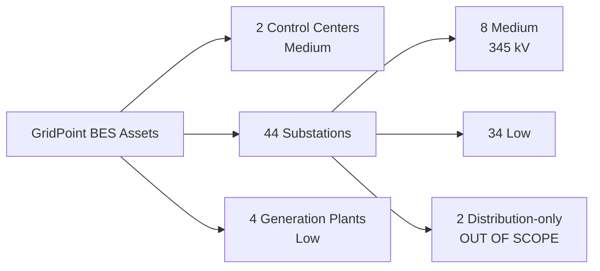

# 02.02 — BES Asset Inventory

| Field | Value |
|---|---|
| Document ID | CIP-02.02 |
| Version | 1.0 |
| Date | 2026-03-02 |
| Classification | BES Cyber System Information (BCSI) // Illustrative Portfolio Sample |
| Owner | Elena Ruiz (Substation & Field Engineering Lead) |
| Author | Advisory Team |
| Status | Approved |

## Purpose

This document is the authoritative inventory of GridPoint Energy's Bulk Electric System (BES) assets — the **Step 1** output of the CIP-002 methodology (02.01). It enumerates each BES asset by the applicable CIP-002 R1 asset type, its reliability function, and its location. This inventory bounds the population within which BES Cyber Assets and BES Cyber Systems are identified (02.03, 02.04) and to which the Attachment 1 impact criteria are applied (02.05).

## Inventory Summary

GridPoint owns and operates the following BES asset footprint in the Eastern Interconnection (ReliabilityFirst region):

| BES Asset Type (CIP-002 R1) | Count | Scoping Result |
|---|---|---|
| Control Centers | 2 | Both in CIP scope → Medium |
| Transmission substations | 44 | 8 Medium + 34 Low in scope; 2 distribution-only out of scope |
| Generation plants | 4 | All in scope → Low |
| **Total BES assets** | **50** | **48 in CIP scope, 2 out of scope** |

Transmission footprint: approximately **1,600 circuit-miles** at 138 kV and 345 kV. Generation nameplate: approximately **1,850 MW**.

## Control Centers

Both Control Centers perform the functional obligations of the Transmission Operator (TOP) and Generator Operator (GOP). They host the EMS/SCADA that monitors and controls GridPoint's Medium-impact Transmission Facilities and dispatches generation.

| Asset ID | Asset Name | Function | Location | Impact |
|---|---|---|---|---|
| CC-01 | Primary Control Center | TOP/GOP — EMS/SCADA real-time monitoring & control | Millbrook, OH | Medium |
| CC-02 | Backup Control Center | TOP/GOP — backup EMS/SCADA, failover operations | Easton, OH | Medium |

## Transmission Substations

Of the 44 substations, **8** operate at 345 kV and meet CIP-002 Attachment 1 Criterion 2.5 (Medium). **34** contain BES Cyber Systems but do not meet High or Medium criteria (Low). **2** are distribution-only, contain no BES Cyber Systems, and are therefore outside CIP scope.

### Medium-impact substations (8 — 345 kV)

| Asset ID | Substation | Voltage | Function | Location (county) | Impact |
|---|---|---|---|---|---|
| SUB-01 | Millbrook 345 | 345 kV | Transmission switching / bus protection | Millbrook (Hale) | Medium |
| SUB-02 | Easton 345 | 345 kV | Transmission switching / interconnection | Easton (Carver) | Medium |
| SUB-03 | Cedar Junction 345 | 345 kV | Transmission hub — 4 line terminations | Cedar Junction (Hale) | Medium |
| SUB-04 | Northgate 345 | 345 kV | Transmission switching / autotransformer | Northgate (Delano) | Medium |
| SUB-05 | Riverside 345 | 345 kV | Transmission hub — 3 line terminations | Riverside (Carver) | Medium |
| SUB-06 | Sunfield Tie 345 | 345 kV | Solar interconnection / switching | Sunfield (Delano) | Medium |
| SUB-07 | Westland 345 | 345 kV | Transmission switching / bus protection | Westland (Truett) | Medium |
| SUB-08 | Harmon 345 | 345 kV | Transmission hub — 3 line terminations | Harmon (Truett) | Medium |

### Low-impact substations (representative — 34 total, 138 kV)

The 34 Low substations operate primarily at 138 kV, contain BES Cyber Systems (protection relays, RTUs), and are subject to CIP-003 Attachment 1 only. A representative sample:

| Asset ID | Substation | Voltage | Function | Location (county) | Impact |
|---|---|---|---|---|---|
| SUB-09 | Ashford 138 | 138 kV | Transmission/distribution step-down | Ashford (Hale) | Low |
| SUB-10 | Brenton 138 | 138 kV | Transmission switching | Brenton (Carver) | Low |
| SUB-11 | Colfax 138 | 138 kV | Transmission/distribution step-down | Colfax (Delano) | Low |
| SUB-12 | Dunmore 138 | 138 kV | Transmission switching | Dunmore (Truett) | Low |
| SUB-13 | Elmwood 138 | 138 kV | Transmission/distribution step-down | Elmwood (Hale) | Low |
| … | (SUB-14 through SUB-42) | 138 kV | Transmission switching / step-down | across 12-county territory | Low |
| SUB-42 | Yates 138 | 138 kV | Transmission/distribution step-down | Yates (Carver) | Low |

### Out-of-scope substations (2 — distribution-only)

| Asset ID | Substation | Voltage | Reason Out of Scope |
|---|---|---|---|
| SUB-43 | Parkview Dist | < 100 kV | Distribution-only; no BES Cyber Systems |
| SUB-44 | Lakeside Dist | < 100 kV | Distribution-only; no BES Cyber Systems |

## Generation Plants

All four generation plants are categorized Low impact — none reaches the single-plant nameplate threshold that would trigger a Medium or High generation criterion. Combined nameplate ≈ 1,850 MW.

| Asset ID | Plant | Type | Nameplate | Function | Location | Impact |
|---|---|---|---|---|---|---|
| GEN-01 | Millbrook CC | Combined-cycle gas | ~700 MW | GOP — dispatchable generation | Millbrook, OH | Low |
| GEN-02 | Easton CC | Combined-cycle gas | ~650 MW | GOP — dispatchable generation | Easton, OH | Low |
| GEN-03 | Cedar Falls Hydro | Hydroelectric | ~80 MW | GOP — hydro generation | Cedar Falls, OH | Low |
| GEN-04 | Sunfield Solar | Utility-scale solar | 220 MW | GOP — solar generation (newly commissioned) | Sunfield, OH | Low |

## Change Drivers Affecting This Baseline

The following recent changes triggered the CIP-002 recategorization reflected in this inventory: commissioning of **Sunfield Solar (220 MW)** and its interconnection substation (SUB-06), addition of two new transmission substations, and Control Center modernization. These changes are tracked under the 15-month/event-driven review schedule (02.14).

## Cross-References

- `02.01-cip-002-methodology-and-approach.md` — Step 1 methodology
- `02.03-cyber-asset-bca-inventory.md` — Cyber Assets/BCAs at each asset
- `02.05-impact-rating-attachment-1-criteria.md` — why 8 substations are Medium
- `../01-program-foundation/01.01-utility-and-business-profile.md` — system/asset footprint

---

[⬅ Previous](02.01-cip-002-methodology-and-approach.md) · [🏠 Phase README](02.00-README.md) · [Next ➡](02.03-cyber-asset-bca-inventory.md)
