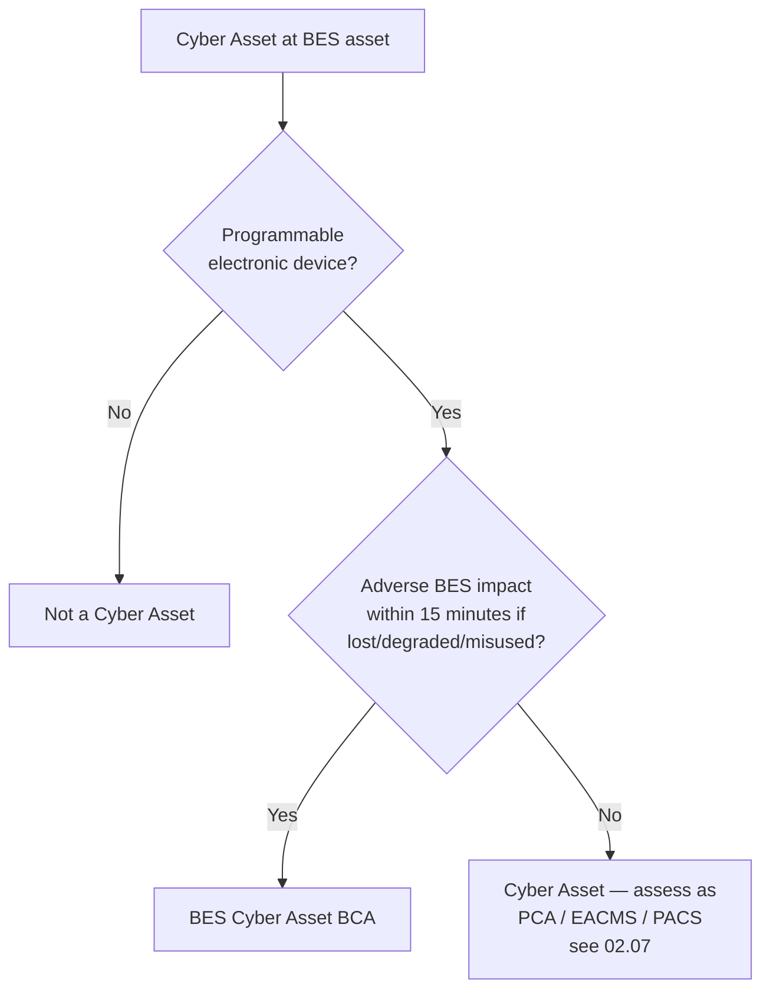

# 02.03 — Cyber Asset & BES Cyber Asset (BCA) Inventory

| Field | Value |
|---|---|
| Document ID | CIP-02.03 |
| Version | 1.0 |
| Date | 2026-03-02 |
| Classification | BES Cyber System Information (BCSI) // Illustrative Portfolio Sample |
| Owner | Marcus Bell (OT / ICS Security Lead) |
| Author | Advisory Team |
| Status | Approved |

## Purpose

This document records how GridPoint identifies **Cyber Assets** at each BES asset and applies the **15-minute adverse-impact test** to determine which qualify as **BES Cyber Assets (BCAs)**. It is the **Step 2** output of the CIP-002 methodology (02.01) and establishes the ~420-BCA population that is grouped into BES Cyber Systems in 02.04.

## Definitions

- **Cyber Asset** — a programmable electronic device, including the hardware, software, and data in those devices.
- **BES Cyber Asset (BCA)** — a Cyber Asset that, if rendered unavailable, degraded, or misused, would — within **15 minutes** of its required operation, misoperation, or non-operation — adversely impact one or more BES Reliability Operating Services. Redundancy does not exempt a Cyber Asset: if the function it performs meets the test, it is a BCA regardless of backups.
- **BES Reliability Operating Services** include dynamic response, monitoring & control, restoration, situational awareness, inter-entity coordination, and protection.

## The 15-Minute Rule Applied

For every Cyber Asset discovered at an in-scope BES asset, GridPoint asks: *If this device fails, misoperates, or is misused, does the adverse impact to a BES Reliability Operating Service manifest within 15 minutes?* If yes, it is a BCA.

| Example device | 15-min impact? | Classification |
|---|---|---|
| Protective relay tripping a 345 kV line | Yes — misoperation affects protection within cycles | BCA |
| EMS/SCADA front-end processor at Control Center | Yes — loss removes real-time monitoring & control | BCA |
| Substation RTU / gateway | Yes — loss removes telemetry & control | BCA |
| Plant DCS controller | Yes — affects generation dispatch/AGC response | BCA |
| Engineering laptop (non-real-time, within ESP) | No | Candidate PCA (02.07) |
| Physical badge-reader panel | No — not a BES function | Candidate PACS (02.07) |

## BCA Population

Application of the 15-minute rule across the 48 in-scope BES assets yields approximately **420 BCAs**. The distribution reflects the density of protection and control devices at Medium-impact facilities:

| Asset group | Assets | Approx. BCAs | Typical BCA types |
|---|---|---|---|
| Control Centers | 2 | ~60 | EMS/SCADA servers, front-end processors, ICCP nodes, HMI, historian front-ends |
| Medium substations (345 kV) | 8 | ~200 | Protective relays, RTUs/gateways, digital fault recorders, bus/breaker IEDs |
| Low substations (138 kV) | 34 | ~120 | Protective relays, RTUs |
| Generation plants | 4 | ~40 | DCS controllers, unit protection relays, plant RTUs |
| **Total** | **48** | **~420** | — |

## Representative BCA List by Asset

The following is a representative extract; the full BCA register is maintained by the OT/ICS Security Lead with device-level detail (make, model, firmware) under BCSI handling controls.

| BCA ID | Device Type | Parent BES Asset | Reliability Function | 15-min? |
|---|---|---|---|---|
| BCA-CC01-001 | EMS/SCADA server | CC-01 Primary Control Center | Monitoring & control | Yes |
| BCA-CC01-004 | Front-end processor | CC-01 Primary Control Center | Telemetry acquisition | Yes |
| BCA-CC01-009 | ICCP node | CC-01 Primary Control Center | Inter-entity coordination | Yes |
| BCA-CC02-002 | Backup EMS server | CC-02 Backup Control Center | Failover monitoring & control | Yes |
| BCA-SUB01-011 | Line protection relay | SUB-01 Millbrook 345 | Protection | Yes |
| BCA-SUB01-015 | Bus protection relay | SUB-01 Millbrook 345 | Protection | Yes |
| BCA-SUB03-007 | RTU/gateway | SUB-03 Cedar Junction 345 | Monitoring & control | Yes |
| BCA-SUB06-004 | Interconnection relay | SUB-06 Sunfield Tie 345 | Protection | Yes |
| BCA-SUB09-002 | Feeder protection relay | SUB-09 Ashford 138 | Protection | Yes |
| BCA-SUB09-005 | RTU | SUB-09 Ashford 138 | Monitoring & control | Yes |
| BCA-GEN01-003 | DCS controller | GEN-01 Millbrook CC | Dynamic response / dispatch | Yes |
| BCA-GEN04-002 | Inverter/plant controller | GEN-04 Sunfield Solar | Generation control | Yes |

## BES Reliability Operating Services Mapping

Each BCA is tagged to the BES Reliability Operating Service(s) it supports. This mapping justifies the 15-minute determination and demonstrates to an auditor that the BCA population is complete.

| BES Reliability Operating Service | Typical GridPoint BCAs |
|---|---|
| Dynamic Response to BES conditions | Plant DCS controllers, AGC-participating units |
| Monitoring & Control | EMS/SCADA servers, RTUs, gateways |
| Restoration of the BES | Blackstart-related controllers (where applicable) |
| Situational Awareness | Front-end processors, historians' real-time feeds |
| Inter-Entity Real-Time Coordination | ICCP nodes at Control Centers |
| Protection | Line, bus, and unit protective relays |

## Data Attributes Captured per BCA

For each BCA the register records the following attributes, supporting both categorization and downstream CIP requirements:

| Attribute | Purpose |
|---|---|
| BCA ID, make/model, firmware | Asset identification; CIP-010 baselines |
| Parent BES asset & parent BCS | Traceability to categorization |
| Reliability function & BROS tag | Justifies 15-minute determination |
| Connectivity (routable / serial / dial-up) | Drives ESP & CIP-005 applicability |
| Impact rating (inherited from BCS) | Scopes applicable requirements |
| External Routable Connectivity (Yes/No) | Determines CIP-005/CIP-007 obligations |

## Methodology Notes

- **No redundancy exemption:** where a BCA is backed by a redundant unit, both are inventoried as BCAs.
- **Transient Cyber Assets & Removable Media** (e.g., maintenance laptops, USB) are not BCAs but are tracked separately for CIP-010 R4 and carried into Phase 04/05 scoping.
- **Serial vs. routable connectivity** is recorded per BCA because it drives ESP and CIP-005 applicability (02.08).
- **External Routable Connectivity (ERC)** is flagged per BCA because it is a key qualifier for several Medium-impact requirement parts.
- Each BCA entry is dated and attributed, supporting the CIP-002 R2 15-month review (02.14).

## Cross-References

- `02.02-bes-asset-inventory.md` — parent BES assets
- `02.04-bes-cyber-system-identification.md` — grouping BCAs into BCS
- `02.07-associated-eacms-pacs-pca.md` — non-BCA Cyber Assets (EACMS/PACS/PCA)
- `02.08-electronic-and-physical-boundary-overview.md` — routable connectivity & ESP

---

[⬅ Previous](02.02-bes-asset-inventory.md) · [🏠 Phase README](02.00-README.md) · [Next ➡](02.04-bes-cyber-system-identification.md)
