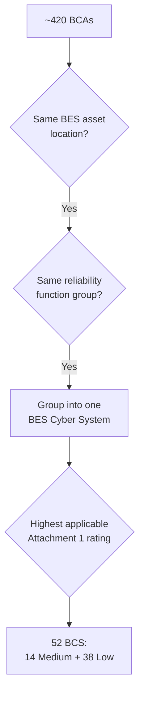

# 02.04 — BES Cyber System Identification

| Field | Value |
|---|---|
| Document ID | CIP-02.04 |
| Version | 1.0 |
| Date | 2026-03-02 |
| Classification | BES Cyber System Information (BCSI) // Illustrative Portfolio Sample |
| Owner | Marcus Bell (OT / ICS Security Lead) |
| Author | Advisory Team |
| Status | Approved |

## Purpose

This document describes how GridPoint groups the ~420 BES Cyber Assets (02.03) into **BES Cyber Systems (BCS)** — the **Step 3** output of the CIP-002 methodology (02.01). Grouping into BCS is the unit of categorization: Attachment 1 impact criteria (02.05) are applied at the BCS level, and CIP compliance obligations attach to BCS. GridPoint identifies **52 BCS: 14 Medium + 38 Low** — no High.

## Definition and Grouping Principle

A **BES Cyber System** is one or more BES Cyber Assets logically grouped by the Responsible Entity to perform one or more reliability tasks for a functional entity. NERC deliberately allows entities discretion in how BCAs are grouped; the grouping must be reasonable, documented, and consistently applied. GridPoint's grouping is driven by three principles:

1. **Common location** — BCAs are grouped within a single BES asset (a Control Center, substation, or plant); a BCS does not span physical sites.
2. **Common reliability function** — BCAs performing the same reliability task (e.g., all line-protection relays on a bus, or all EMS/SCADA real-time servers) are grouped together.
3. **Common impact rating** — all BCAs in a BCS share the same Attachment 1 impact rating, so grouping never mixes Medium and Low BCAs.



## BCS Count and Distribution

| Impact | Location group | # BCS | Composition |
|---|---|---|---|
| Medium | Control Centers | 4 | 2 at CC-01, 2 at CC-02 (e.g., EMS/SCADA BCS + ICCP/comms BCS per site) |
| Medium | 345 kV substations | 10 | Grouped across the 8 Medium substations (larger hubs carry 2 BCS) |
| **Medium subtotal** | | **14** | |
| Low | Generation plants | 4 | 1 BCS per plant |
| Low | 138 kV substations | 34 | 1 BCS per Low substation |
| **Low subtotal** | | **38** | |
| **Total** | | **52** | No High |

### Why 14 Medium from 8 substations + 2 Control Centers

The 8 Medium substations yield **10** Medium BCS because the larger transmission hubs (multiple line terminations and separately administered protection/control functions) are grouped into two BCS — one for bus/line protection and one for monitoring/control (RTU/gateway). The 2 Control Centers yield **4** Medium BCS — each site grouped into a real-time EMS/SCADA BCS and a communications/ICCP BCS. Total Medium = 4 + 10 = **14**.

### Why 38 Low

Each of the 4 generation plants is grouped as a single Low BCS (plant DCS + unit protection), and each of the 34 Low substations is grouped as a single Low BCS. Total Low = 4 + 34 = **38**.

## Representative BCS List

| BCS ID | BCS Name | Parent BES Asset | Reliability Function | Constituent BCA types | Impact |
|---|---|---|---|---|---|
| BCS-CC01-EMS | Primary EMS/SCADA System | CC-01 Primary Control Center | Real-time monitoring & control | EMS servers, FEPs, HMI | Medium |
| BCS-CC01-COM | Primary Comms/ICCP System | CC-01 Primary Control Center | Inter-entity coordination | ICCP nodes, comms front-ends | Medium |
| BCS-CC02-EMS | Backup EMS/SCADA System | CC-02 Backup Control Center | Failover monitoring & control | Backup EMS servers, FEPs | Medium |
| BCS-CC02-COM | Backup Comms/ICCP System | CC-02 Backup Control Center | Inter-entity coordination | ICCP nodes | Medium |
| BCS-SUB01-PROT | Millbrook 345 Protection | SUB-01 Millbrook 345 | Protection | Line/bus protection relays | Medium |
| BCS-SUB01-CTRL | Millbrook 345 Control | SUB-01 Millbrook 345 | Monitoring & control | RTU/gateway, IEDs | Medium |
| BCS-SUB03-PROT | Cedar Junction 345 Protection | SUB-03 Cedar Junction 345 | Protection | Protection relays | Medium |
| BCS-SUB06-PROT | Sunfield Tie 345 Protection | SUB-06 Sunfield Tie 345 | Protection | Interconnection relays | Medium |
| BCS-SUB09-LOW | Ashford 138 System | SUB-09 Ashford 138 | Protection & control | Relays, RTU | Low |
| BCS-SUB12-LOW | Dunmore 138 System | SUB-12 Dunmore 138 | Protection & control | Relays, RTU | Low |
| BCS-GEN01-LOW | Millbrook CC Plant System | GEN-01 Millbrook CC | Dynamic response / dispatch | DCS, unit protection | Low |
| BCS-GEN04-LOW | Sunfield Solar Plant System | GEN-04 Sunfield Solar | Generation control | Inverter/plant controllers | Low |

## Grouping Approaches Considered

NERC permits several valid approaches to defining a BES Cyber System. GridPoint evaluated three and selected the function-plus-location model for its balance of manageability and auditability.

| Approach | Description | GridPoint decision |
|---|---|---|
| One BCS per BCA | Every device is its own system | Rejected — administratively unmanageable at ~420 devices |
| One BCS per entire asset | All BCAs at a site form a single system | Used for Low sites and smaller Medium sites |
| Function-based grouping within a site | Separate protection vs. control systems | Used at larger Medium hubs (SUB-01, SUB-03) and Control Centers |

The mixed model keeps the count reasonable (52 BCS) while preserving meaningful functional boundaries where separately administered protection and control systems justify distinct BCS.

## Benefits of the Chosen Grouping

- **Auditability:** each CIP obligation maps to a discrete, named BCS with a documented Attachment 1 basis.
- **Change isolation:** a modification to a substation's control system affects only the corresponding control BCS, simplifying CIP-010 change management.
- **Consistent ratings:** because no BCS mixes Medium and Low BCAs, the impact rating is unambiguous.
- **Clean scoping of associated systems:** EACMS/PACS/PCA (02.07) attach to specific BCS.

## Grouping Rationale Documentation

For each BCS, GridPoint records: the constituent BCA IDs (traceable to 02.03), the reliability function(s) performed, the parent BES asset, and the assigned impact rating with its Attachment 1 basis (02.05). This traceability lets an RF auditor follow any compliance obligation from a CIP requirement back to the specific BCS and its BCAs. Grouping decisions are reviewed on the CIP-002 R2 15-month cycle (02.14).

## Traceability Chain

The grouping preserves an unbroken chain from device to compliance obligation, which an RF auditor can walk in either direction:

```
BES Asset (02.02) → BCA (02.03) → BES Cyber System (02.04)
  → Impact rating via Attachment 1 (02.05) → Categorization list (02.06)
  → Applicable requirement parts (02.10)
```

Every one of the 52 BCS carries a stable BCS ID that is referenced consistently across all Phase 02 documents and inherited by later phases.

## Cross-References

- `02.03-cyber-asset-bca-inventory.md` — BCA population being grouped
- `02.05-impact-rating-attachment-1-criteria.md` — impact criteria applied per BCS
- `02.06-high-medium-low-categorization-list.md` — full categorized BCS list
- `02.07-associated-eacms-pacs-pca.md` — systems associated with each BCS

---

[⬅ Previous](02.03-cyber-asset-bca-inventory.md) · [🏠 Phase README](02.00-README.md) · [Next ➡](02.05-impact-rating-attachment-1-criteria.md)
