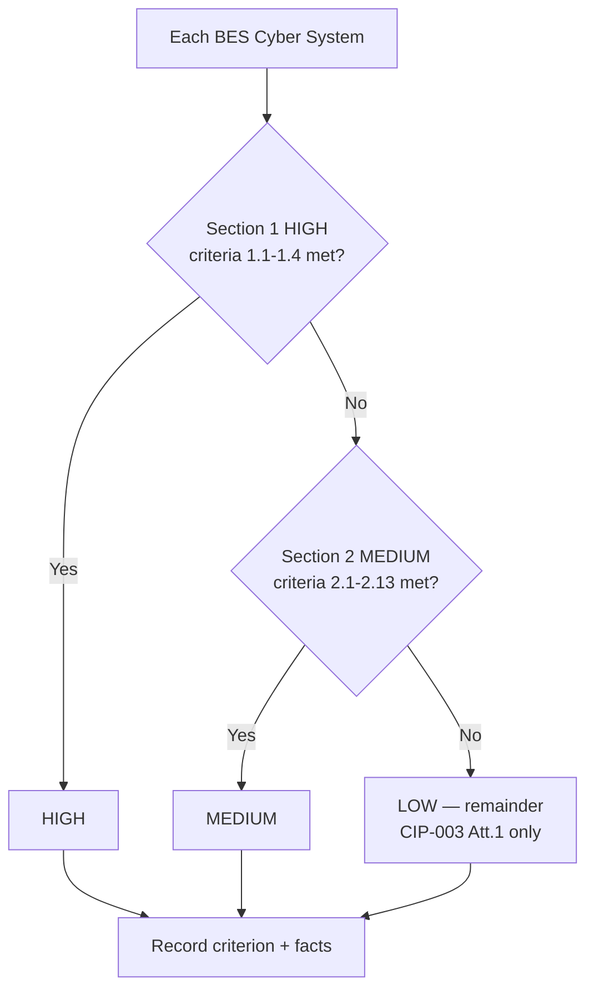

# 02.05 — Impact Rating: CIP-002 Attachment 1 Criteria

| Field | Value |
|---|---|
| Document ID | CIP-02.05 |
| Version | 1.0 |
| Date | 2026-03-02 |
| Classification | BES Cyber System Information (BCSI) // Illustrative Portfolio Sample |
| Owner | Karen Whitfield (NERC Compliance Manager) |
| Author | Advisory Team |
| Status | Approved |

## Purpose

This is the **keystone impact-rating analysis** of GridPoint's CIP-002 program. It applies **CIP-002-5.1a Attachment 1 — Impact Rating Criteria** to every BES Cyber System (BCS) identified in 02.04 and documents the specific criterion (or absence of one) that drives each BCS's High / Medium / Low rating. It provides the defensible, auditable rationale for GridPoint's categorization result: **0 High · 14 Medium · 38 Low**. This document is the primary evidence an RF auditor examines to test CIP-002 R1 compliance.

## How Attachment 1 Works

Attachment 1 is organized into three sections, applied in strict precedence:

- **Section 1 — High Impact:** bright-line criteria for the largest, most consequential facilities (large Control Centers, certain generation/transmission thresholds). If any criterion 1.x is met, the BCS is High.
- **Section 2 — Medium Impact:** criteria 2.1 through 2.13 for significant generation, transmission, and Control Center facilities. If no High criterion is met but a criterion 2.x is met, the BCS is Medium.
- **Section 3 — Low Impact:** every BES asset that contains a BES Cyber System and does not meet a High or Medium criterion. Low is the **remainder** category; it is not a bright-line test but a residual assignment.

A BCS receives the **highest** rating for which it qualifies. GridPoint documents each determination with the voltage, connectivity, MW, and functional facts that were tested against the criterion.

## Section 1 — High Impact: Why GridPoint Has None

GridPoint tested each BCS against the High criteria and **none qualifies**. The determinative facts:

| High criterion (paraphrased) | Threshold | GridPoint fact | Met? |
|---|---|---|---|
| 1.1 — Large generating stations | Single plant ≥ 1500 MW in a single Interconnection | Largest plant (Millbrook CC) ≈ 700 MW | No |
| 1.2 — Reactive resources / specified facilities | Designated critical facilities | None designated | No |
| 1.3 — Control Centers performing functional obligations for High-impact BES Cyber Systems | Controls High-impact assets | GridPoint has no High-impact assets to control | No |
| 1.4 — Control Centers performing TOP obligations for assets meeting Medium criteria 2.3, 2.6, or 2.9 at 500 kV / defined thresholds | ≥ 500 kV or specified aggregate | GridPoint's highest voltage is 345 kV; no 500 kV Facilities | No |

**Conclusion:** GridPoint operates no plant ≥ 1500 MW, no Facilities at ≥ 500 kV, and no Control Center that controls a High-impact asset. Therefore **0 High-impact BCS**. This is a material and defensible outcome that bounds the entire compliance program to Medium and Low obligations.

## Section 2 — Medium Impact Determinations

Two Attachment 1 Medium criteria drive GridPoint's 14 Medium BCS: **2.12** (Control Centers) and **2.5** (345 kV transmission substations). Criteria **2.11/2.13** are noted as applicable to the Control Centers' GOP functions.

### Criterion 2.12 — Control Centers (Transmission Operator)

**Criterion 2.12 (paraphrased):** Each Control Center or backup Control Center used to perform the functional obligations of the **Transmission Operator** for one or more of the assets that meet Medium-impact criterion 2.3, 2.5, or 2.9 — but which do not qualify for a High-impact rating.

Both GridPoint Control Centers perform the TOP functional obligations for the 8 Medium-impact 345 kV substations (which qualify under criterion 2.5). Neither Control Center controls a High-impact asset (there are none) and neither meets the ≥ 500 kV threshold of High criterion 1.4. Therefore both Control Centers — and their constituent BCS — are **Medium** under 2.12.

**Criterion 2.11 / 2.13 (GOP functions):** The Control Centers also perform Generator Operator functional obligations for GridPoint's generation fleet. Criterion 2.13 (Control Centers performing the functional obligations of the GOP for aggregate generation) and 2.11 (generation aggregation) are referenced as applicable; the governing Medium determination for the Control Centers remains 2.12 via their TOP obligations for the Medium 345 kV substations.

| BCS | Parent asset | Criterion | Basis |
|---|---|---|---|
| BCS-CC01-EMS, BCS-CC01-COM | CC-01 Primary Control Center | 2.12 (2.13 GOP) | Performs TOP obligations for 8 Medium 345 kV substations |
| BCS-CC02-EMS, BCS-CC02-COM | CC-02 Backup Control Center | 2.12 (2.13 GOP) | Backup Control Center performing same TOP obligations |

### Criterion 2.5 — 345 kV Transmission Substations

**Criterion 2.5 (paraphrased):** Transmission Facilities operated at **200 kV to 499 kV** at a single station or substation, where the station or substation is **connected at 200 kV or higher to three or more other Transmission stations or substations** and has an "aggregate weighted value" exceeding **3000** according to the table in criterion 2.5 — or otherwise meeting the connectivity element of 2.5. Facilities operated at 200 kV–499 kV meeting the connectivity/weighted-value test are Medium impact.

All 8 of GridPoint's 345 kV substations operate within the 200 kV–499 kV band and connect at 345 kV to three or more other Transmission stations (or meet the aggregate weighted-value threshold), satisfying criterion 2.5. Their constituent BCS are therefore **Medium**.

| Medium substation | Voltage | Connectivity / basis | Criterion | BCS |
|---|---|---|---|---|
| SUB-01 Millbrook 345 | 345 kV | Connected to 3+ Transmission stations; weighted value > 3000 | 2.5 | BCS-SUB01-PROT, BCS-SUB01-CTRL |
| SUB-02 Easton 345 | 345 kV | Interconnection; 3+ station connections | 2.5 | BCS-SUB02-PROT |
| SUB-03 Cedar Junction 345 | 345 kV | Hub — 4 line terminations | 2.5 | BCS-SUB03-PROT, BCS-SUB03-CTRL |
| SUB-04 Northgate 345 | 345 kV | 3+ station connections; autotransformer | 2.5 | BCS-SUB04-PROT |
| SUB-05 Riverside 345 | 345 kV | Hub — 3 line terminations | 2.5 | BCS-SUB05-PROT |
| SUB-06 Sunfield Tie 345 | 345 kV | Solar interconnection; 3+ connections | 2.5 | BCS-SUB06-PROT |
| SUB-07 Westland 345 | 345 kV | 3+ station connections | 2.5 | BCS-SUB07-PROT |
| SUB-08 Harmon 345 | 345 kV | Hub — 3 line terminations | 2.5 | BCS-SUB08-PROT |

The 8 substations yield **10 Medium BCS** because the larger hubs (SUB-01, SUB-03) are grouped into separate protection and control BCS (see 02.04). Combined with the 4 Control Center BCS, GridPoint has **14 Medium BCS**.

## Section 3 — Low Impact (Remainder)

Every remaining BES asset that contains a BES Cyber System — and does not meet a High or Medium criterion — is **Low impact**. Low is a residual assignment, not a bright-line test.

| Low asset group | Count | Why not Medium | BCS |
|---|---|---|---|
| Generation plants | 4 | No single plant ≥ 1500 MW (High 1.1); no plant meets Medium generation aggregate thresholds (2.1) | 4 Low BCS |
| 138 kV substations | 34 | Operated below 200 kV; do not meet the 2.5 voltage/connectivity test | 34 Low BCS |

Total Low = 4 + 34 = **38 Low BCS**. Low-impact BCS are subject to **CIP-003 Attachment 1** requirements only (cyber security awareness, physical security controls, electronic access controls, Cyber Security Incident response, and Transient Cyber Asset / Removable Media risk mitigation) — they are **not** subject to the full Medium-impact requirement set of CIP-004 through CIP-011/013.

> **Note:** The 2 distribution-only substations (SUB-43, SUB-44) contain no BES Cyber Systems and are therefore **not categorized at all** — they are outside CIP scope, distinct from Low impact.

## Criteria-to-Asset Mapping Summary

| Impact | Attachment 1 basis | Assets | # BCS |
|---|---|---|---|
| High | None met (1.1–1.4 all fail) | — | 0 |
| Medium | 2.12 (Control Centers, TOP) | CC-01, CC-02 | 4 |
| Medium | 2.5 (345 kV, connectivity/weighted value) | SUB-01 … SUB-08 | 10 |
| Low | Remainder (no High/Medium criterion) | 4 plants + 34 substations | 38 |
| Out of scope | No BES Cyber System | SUB-43, SUB-44 | n/a |
| **Total categorized** | | | **52** |

## Auditability and Review

Each determination in this document is supported by the underlying asset facts (voltage, connectivity diagrams, MW ratings, functional registrations) retained under the evidence-management plan. The analysis is re-performed on the CIP-002 R2 **15-month** cycle and upon any event that could cross a threshold — for example, a new 500 kV interconnection (would trigger High criterion 1.4 testing) or a plant uprate approaching 1500 MW (High 1.1). GridPoint's current outcome — 0 High, 14 Medium, 38 Low — is baselined 2026-04 and approved by the CIP Senior Manager, Daniel Reyes.

## Cross-References

- `02.04-bes-cyber-system-identification.md` — BCS being rated
- `02.06-high-medium-low-categorization-list.md` — the resulting categorization list
- `02.02-bes-asset-inventory.md` — asset voltages and connectivity
- `02.10-applicability-matrix.md` — how ratings map to applicable requirement parts
- `../01-program-foundation/01.04-applicable-reliability-standards-register.md` — CIP-002-5.1a reference

---

[⬅ Previous](02.04-bes-cyber-system-identification.md) · [🏠 Phase README](02.00-README.md) · [Next ➡](02.06-high-medium-low-categorization-list.md)
