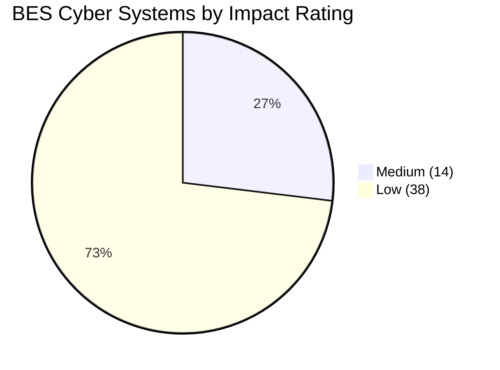

# 02.06 — High / Medium / Low Categorization List

| Field | Value |
|---|---|
| Document ID | CIP-02.06 |
| Version | 1.0 |
| Date | 2026-03-02 |
| Classification | BES Cyber System Information (BCSI) // Illustrative Portfolio Sample |
| Owner | Karen Whitfield (NERC Compliance Manager) |
| Author | Advisory Team |
| Status | Approved |

## Purpose

This document is the consolidated **CIP-002-5.1a categorization list**: every BES Cyber System (BCS) with its assigned impact rating and the specific Attachment 1 criterion that drove the rating. It is the single-page authoritative answer to "what is categorized, at what level, and why" — the output that feeds the applicability matrix (02.10) and every downstream compliance obligation. Result: **0 High · 14 Medium · 38 Low = 52 BCS**.

## Categorization Result at a Glance

| Impact | # BCS | Assets |
|---|---|---|
| High | 0 | None (no asset meets Attachment 1 Section 1) |
| Medium | 14 | 2 Control Centers (4 BCS) + 8 × 345 kV substations (10 BCS) |
| Low | 38 | 4 generation plants (4 BCS) + 34 × 138 kV substations (34 BCS) |
| **Total** | **52** | 48 in-scope BES assets |

## Medium-Impact BCS (14)

| # | BCS ID | Parent BES Asset | Reliability Function | Attachment 1 Criterion |
|---|---|---|---|---|
| 1 | BCS-CC01-EMS | CC-01 Primary Control Center | EMS/SCADA monitoring & control | 2.12 (TOP) |
| 2 | BCS-CC01-COM | CC-01 Primary Control Center | Comms / ICCP | 2.12 (TOP) |
| 3 | BCS-CC02-EMS | CC-02 Backup Control Center | Backup EMS/SCADA | 2.12 (TOP) |
| 4 | BCS-CC02-COM | CC-02 Backup Control Center | Backup comms / ICCP | 2.12 (TOP) |
| 5 | BCS-SUB01-PROT | SUB-01 Millbrook 345 | Line/bus protection | 2.5 |
| 6 | BCS-SUB01-CTRL | SUB-01 Millbrook 345 | Monitoring & control | 2.5 |
| 7 | BCS-SUB02-PROT | SUB-02 Easton 345 | Protection | 2.5 |
| 8 | BCS-SUB03-PROT | SUB-03 Cedar Junction 345 | Protection | 2.5 |
| 9 | BCS-SUB03-CTRL | SUB-03 Cedar Junction 345 | Monitoring & control | 2.5 |
| 10 | BCS-SUB04-PROT | SUB-04 Northgate 345 | Protection | 2.5 |
| 11 | BCS-SUB05-PROT | SUB-05 Riverside 345 | Protection | 2.5 |
| 12 | BCS-SUB06-PROT | SUB-06 Sunfield Tie 345 | Interconnection protection | 2.5 |
| 13 | BCS-SUB07-PROT | SUB-07 Westland 345 | Protection | 2.5 |
| 14 | BCS-SUB08-PROT | SUB-08 Harmon 345 | Protection | 2.5 |

## Low-Impact BCS (38)

Low-impact BCS are subject to **CIP-003 Attachment 1** only. All are rated Low by remainder (no High or Medium Attachment 1 criterion met).

### Generation plants (4)

| # | BCS ID | Parent BES Asset | Function | Basis |
|---|---|---|---|---|
| 1 | BCS-GEN01-LOW | GEN-01 Millbrook CC | Combined-cycle generation | Remainder (< 1500 MW) |
| 2 | BCS-GEN02-LOW | GEN-02 Easton CC | Combined-cycle generation | Remainder (< 1500 MW) |
| 3 | BCS-GEN03-LOW | GEN-03 Cedar Falls Hydro | Hydro generation | Remainder |
| 4 | BCS-GEN04-LOW | GEN-04 Sunfield Solar | Solar generation | Remainder |

### 138 kV substations (34)

| # | BCS ID | Parent BES Asset | Function | Basis |
|---|---|---|---|---|
| 5 | BCS-SUB09-LOW | SUB-09 Ashford 138 | Protection & control | Remainder (< 200 kV) |
| 6 | BCS-SUB10-LOW | SUB-10 Brenton 138 | Protection & control | Remainder (< 200 kV) |
| 7 | BCS-SUB11-LOW | SUB-11 Colfax 138 | Protection & control | Remainder (< 200 kV) |
| 8 | BCS-SUB12-LOW | SUB-12 Dunmore 138 | Protection & control | Remainder (< 200 kV) |
| 9 | BCS-SUB13-LOW | SUB-13 Elmwood 138 | Protection & control | Remainder (< 200 kV) |
| 10–37 | BCS-SUB14-LOW … BCS-SUB41-LOW | SUB-14 … SUB-41 (138 kV) | Protection & control | Remainder (< 200 kV) |
| 38 | BCS-SUB42-LOW | SUB-42 Yates 138 | Protection & control | Remainder (< 200 kV) |

## Not Categorized (Out of CIP Scope)

| Asset | Reason |
|---|---|
| SUB-43 Parkview Dist | Distribution-only; contains no BES Cyber System |
| SUB-44 Lakeside Dist | Distribution-only; contains no BES Cyber System |

## Criterion Frequency Summary

| Attachment 1 criterion | # BCS driven | Asset type |
|---|---|---|
| 2.12 (Control Center — TOP obligations) | 4 | Control Centers |
| 2.5 (200–499 kV connectivity / weighted value) | 10 | 345 kV substations |
| Low remainder (no High/Medium criterion) | 38 | Plants + 138 kV substations |
| High (Section 1) | 0 | — |

## Downstream Impact of This List

The ratings recorded here directly determine each BCS's compliance obligations:

- **Medium BCS (14)** are subject to the full applicable requirement set across CIP-004 through CIP-011 and CIP-013, plus formal ESP/PSP under CIP-005/CIP-006.
- **Low BCS (38)** are subject to CIP-003 Attachment 1 only.
- The combined applicable requirement-part population (Medium + Low) is **118**, which anchors the baseline gap assessment (02.11).

## Maintenance and Change Control

Any change that could alter a rating — a new interconnection raising a substation's connectivity, a plant uprate, or a new Control Center function — triggers a re-evaluation under 02.14. Additions or retirements of BCS are version-controlled, and each revision of this list is re-approved by the CIP Senior Manager.

## Approval

This categorization list was reviewed by the NERC Compliance Manager (Karen Whitfield) and **approved by the CIP Senior Manager, Daniel Reyes**, satisfying CIP-002-5.1a R1 identification and supporting the R2 approval obligation. It is baselined 2026-04 and re-approved at least once every 15 calendar months (02.14). The formal, signed categorization document is 02.09.

## Cross-References

- `02.05-impact-rating-attachment-1-criteria.md` — criterion-by-criterion rationale
- `02.04-bes-cyber-system-identification.md` — BCS grouping
- `02.09-cip-002-categorization-document.md` — signed formal document
- `02.10-applicability-matrix.md` — requirement parts applicable per rating

---

[⬅ Previous](02.05-impact-rating-attachment-1-criteria.md) · [🏠 Phase README](02.00-README.md) · [Next ➡](02.07-associated-eacms-pacs-pca.md)
