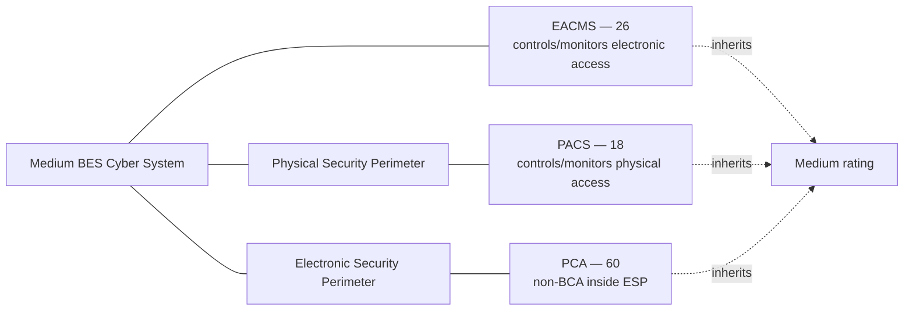

# 02.07 — Associated Systems: EACMS, PACS & PCA

| Field | Value |
|---|---|
| Document ID | CIP-02.07 |
| Version | 1.0 |
| Date | 2026-03-02 |
| Classification | BES Cyber System Information (BCSI) // Illustrative Portfolio Sample |
| Owner | Marcus Bell (OT / ICS Security Lead) |
| Author | Advisory Team |
| Status | Approved |

## Purpose

Categorizing a BES Cyber System (BCS) is not complete until the Cyber Assets **associated** with it are identified. This document identifies GridPoint's **Electronic Access Control or Monitoring Systems (EACMS)**, **Physical Access Control Systems (PACS)**, and **Protected Cyber Assets (PCA)** associated with the Medium-impact BCS, explains how each **inherits the impact rating** of the BCS it protects or shares an Electronic Security Perimeter with, and provides representative examples. Counts: **EACMS 26 · PACS 18 · PCA 60**.

## Why Associated Systems Matter

Under the NERC CIP framework, many requirement parts in CIP-004 through CIP-011 apply not only to BCS but also to their associated EACMS, PACS, and PCA. These systems are the access, monitoring, and co-located Cyber Assets that, if compromised, could be used to attack or bypass protections around the BCS. Each associated system **inherits the impact rating of the BCS it is associated with** — GridPoint's are all associated with Medium-impact BCS, so all are treated as Medium for applicability purposes.

## Definitions

| Term | Definition | Rating inheritance |
|---|---|---|
| **EACMS** | Electronic Access Control or Monitoring Systems — Cyber Assets that perform electronic access control to, or electronic access monitoring of, the ESP or BCS. Includes Electronic Access Points (EAPs), firewalls, authentication servers, intrusion detection, and SIEM/log collectors. | Inherits highest rating of BCS it controls/monitors |
| **PACS** | Physical Access Control Systems — Cyber Assets that control, alert, or log access to the Physical Security Perimeter, exclusive of locally mounted hardware/devices at the access point. Includes badge/card access controllers, alarm management servers. | Inherits rating of BCS whose PSP it protects |
| **PCA** | Protected Cyber Asset — a Cyber Asset connected using a routable protocol within an ESP that is **not** a BCA. It is protected because it shares the ESP with BCS. | Inherits rating of the BCS sharing the ESP |

## EACMS Inventory (26)

GridPoint's EACMS protect and monitor electronic access to the Medium-impact BCS ESPs at the 2 Control Centers and 8 Medium substations, plus the shared remote-access infrastructure.

| EACMS category | Count | Representative examples | Associated BCS |
|---|---|---|---|
| Electronic Access Points (ESP firewalls / EAPs) | 10 | Perimeter firewall pairs at CC-01, CC-02, and Medium substations | All Medium BCS |
| Authentication / identity servers | 4 | RADIUS/TACACS+ and directory servers for OT access | Control Center + substation BCS |
| Intermediate System (remote access) | 3 | Jump-host / secure gateway for Interactive Remote Access | Medium BCS (IRA) |
| Intrusion detection / monitoring | 5 | OT IDS sensors, SIEM/log collectors monitoring ESP | All Medium BCS |
| Multi-factor authentication (MFA) servers | 4 | MFA broker supporting IRA to Medium substations | Medium BCS |
| **Total EACMS** | **26** | | |

## PACS Inventory (18)

PACS control and monitor physical access to the Physical Security Perimeters (PSPs) enclosing the Medium-impact BCS.

| PACS category | Count | Representative examples | Associated PSP |
|---|---|---|---|
| Access control panels / controllers | 8 | Badge-access door controllers at CC-01, CC-02, Medium substations | Control Center + Medium substation PSPs |
| Access management / authorization servers | 4 | Physical access management server, card database | Enterprise PSP management |
| Alarm & monitoring servers | 4 | Intrusion-alarm and door-forced-open monitoring | Medium PSPs |
| Badge-credentialing workstations | 2 | Enrollment / credential issuance | PSP administration |
| **Total PACS** | **18** | | |

> Locally mounted hardware at the access point (e.g., the card reader or door strike itself) is explicitly excluded from the PACS definition; only the controlling/monitoring Cyber Assets are counted.

## PCA Inventory (60)

PCAs are non-BCA Cyber Assets connected by routable protocol inside a Medium-impact BCS ESP. They are in scope because they share the ESP and could be leveraged to reach the BCS.

| PCA category | Count | Representative examples | Shares ESP with |
|---|---|---|---|
| Engineering / maintenance workstations | 18 | Relay-setting and configuration workstations inside ESP | Substation & Control Center BCS |
| Historian / data-collection servers | 10 | Non-real-time historians within ESP | Control Center BCS |
| Network infrastructure (managed switches) | 16 | Managed switches inside ESP (not performing access control) | Medium BCS |
| HMI / operator workstations (non-BCA) | 8 | Local display stations not meeting the BCA 15-min test | Substation BCS |
| Printers / auxiliary routable devices | 8 | Networked auxiliary devices inside ESP | Medium BCS |
| **Total PCA** | **60** | | |

## Inheritance Rule Illustrated

Because GridPoint has **no High-impact BCS**, and all EACMS/PACS/PCA are associated with **Medium-impact** BCS, every associated system is treated as Medium for applicability. For example:

| Associated system | Associated BCS | BCS rating | System's effective rating |
|---|---|---|---|
| ESP firewall at SUB-01 (EACMS) | BCS-SUB01-PROT | Medium | Medium |
| Badge controller at CC-01 (PACS) | BCS-CC01-EMS | Medium | Medium |
| Engineering workstation in CC-01 ESP (PCA) | BCS-CC01-EMS | Medium | Medium |

Low-impact BES assets (generation plants, 34 substations) do not have a formal ESP/PSP and therefore do not generate PCAs; their electronic and physical access controls are governed by CIP-003 Attachment 1 (02.08).

## Why Correct Classification Matters

Misclassifying an associated system has direct compliance consequences. Common boundary judgments GridPoint documented:

| Device | Correct class | Rationale |
|---|---|---|
| ESP firewall performing access control | EACMS | Controls electronic access to the ESP |
| SIEM collecting ESP logs | EACMS | Performs electronic access monitoring |
| Badge-access controller server | PACS | Controls/logs access to the PSP |
| Card reader / door strike at the door | Neither | Locally mounted access-point hardware, excluded from PACS |
| Managed switch inside the ESP (no access-control role) | PCA | Routable, inside ESP, not a BCA and not an EACMS |
| Engineering laptop temporarily connected | Transient Cyber Asset | Not permanently connected; CIP-010 R4, not a PCA |

## Associated Systems Count Summary

| Associated system | Count | Effective rating |
|---|---|---|
| EACMS | 26 | Medium (inherited) |
| PACS | 18 | Medium (inherited) |
| PCA | 60 | Medium (inherited) |
| **Total associated Cyber Assets** | **104** | Medium |

These 104 associated Cyber Assets, together with the ~420 BCAs grouped into 52 BCS, define the full population that the applicability matrix (02.10) scopes against the applicable CIP requirement parts.

## Cross-References

- `02.04-bes-cyber-system-identification.md` — BCS the systems are associated with
- `02.06-high-medium-low-categorization-list.md` — BCS ratings inherited
- `02.08-electronic-and-physical-boundary-overview.md` — ESP/PSP that scope PCA/EACMS/PACS
- `02.10-applicability-matrix.md` — requirement parts applicable to associated systems

---

[⬅ Previous](02.06-high-medium-low-categorization-list.md) · [🏠 Phase README](02.00-README.md) · [Next ➡](02.08-electronic-and-physical-boundary-overview.md)
