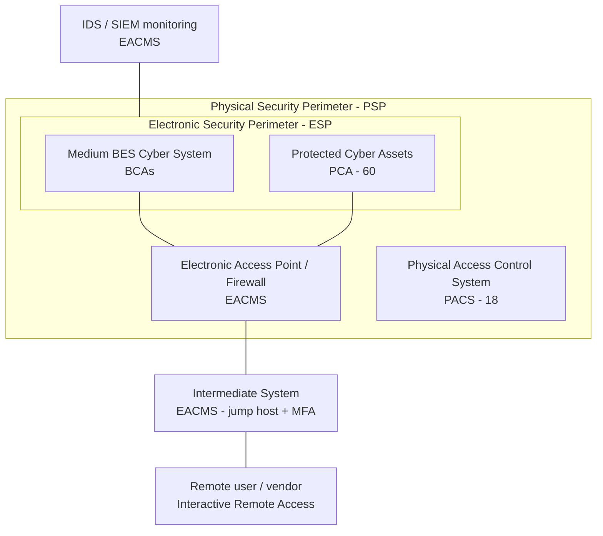

# 02.08 — Electronic & Physical Boundary Overview

| Field | Value |
|---|---|
| Document ID | CIP-02.08 |
| Version | 1.0 |
| Date | 2026-03-02 |
| Classification | BES Cyber System Information (BCSI) // Illustrative Portfolio Sample |
| Owner | Marcus Bell (OT / ICS Security Lead) |
| Author | Advisory Team |
| Status | Approved |

## Purpose

This document establishes, at the categorization stage, the **electronic and physical boundary** concepts that scope GridPoint's Medium-impact BES Cyber Systems (BCS) and defines how electronic access is controlled for Low-impact assets. It introduces the **Electronic Security Perimeter (ESP)**, **Physical Security Perimeter (PSP)**, and **Interactive Remote Access (IRA) via an Intermediate System**, and distinguishes the CIP-003 Attachment 1 electronic access controls that apply to Low-impact assets. These concepts are introduced here so the categorization is complete; the boundaries are **formally defined, implemented, and evidenced in Phase 04 (CIP-005 / CIP-006)**.

## Boundary Concepts

| Concept | Definition | Applies to |
|---|---|---|
| **ESP** | Electronic Security Perimeter — the logical border surrounding a network to which BES Cyber Systems are connected using a routable protocol. | Medium-impact BCS |
| **EAP** | Electronic Access Point — a Cyber Asset interface on an ESP that controls routable communication in/out (an EACMS). | Medium ESPs |
| **PSP** | Physical Security Perimeter — the physical border (six-wall or equivalent) around the Cyber Assets that constitute a BCS. | Medium-impact BCS |
| **IRA** | Interactive Remote Access — user-initiated access from outside the ESP, which must traverse an **Intermediate System** and use encryption and multi-factor authentication. | Medium-impact BCS |
| **Intermediate System** | An EACMS (e.g., a hardened jump-host) that brokers all IRA so that no direct interactive session reaches a BCS. | Remote access to Medium BCS |

## Medium-Impact Boundary Model

Each Medium-impact BCS (the 2 Control Centers and 8 Medium substations) is enclosed by both an ESP (logical) and a PSP (physical). Routable communication crosses the ESP only through Electronic Access Points (EACMS). Interactive Remote Access is forced through an Intermediate System with MFA. Protected Cyber Assets (PCA) reside inside the ESP alongside the BCS.

## Interactive Remote Access (IRA)

All remote interactive access to Medium-impact BCS — including vendor support sessions — must:

1. Originate outside the ESP and terminate first at an **Intermediate System** (jump-host EACMS); no direct session to a BCA.
2. Use **encryption** for the session.
3. Enforce **multi-factor authentication (MFA)** before access is granted.

This model is the control that closes **GAP-01** (CIP-005 R2 — vendor IRA lacked an Intermediate System / MFA at 2 substations), carried into remediation and implemented under Phase 04.

## Low-Impact Electronic Access Controls (CIP-003 Attachment 1)

Low-impact BES assets — the 4 generation plants and 34 Low substations — do **not** require a formal ESP or PSP. Instead, they are governed by **CIP-003-8 Attachment 1**, which requires:

| CIP-003 Att.1 Section | Control for Low-impact assets |
|---|---|
| Section 1 | Cyber security awareness (reinforced ≥ every 15 months) |
| Section 2 | Physical security controls for BES Cyber Systems and associated electronic access points |
| Section 3 | **Electronic access controls** — permit only necessary inbound/outbound routable communications and authenticate Dial-up Connectivity, where such connectivity exists (no formal ESP required) |
| Section 4 | Cyber Security Incident response |
| Section 5 | Transient Cyber Asset and Removable Media malicious-code risk mitigation |

The key distinction: Low-impact assets implement **electronic access controls** at the boundary of their low-impact BES Cyber Systems, but GridPoint is not obligated to define a discrete ESP, EAP list, or PSP for them, and they generate no PCAs.

## Medium vs. Low Boundary Comparison

| Attribute | Medium-impact BCS | Low-impact BCS |
|---|---|---|
| Formal ESP required | Yes | No |
| Electronic Access Points enumerated | Yes (EACMS) | No — electronic access controls per CIP-003 Att.1 §3 |
| Formal PSP required | Yes | Physical controls per CIP-003 Att.1 §2 (no six-wall PSP mandate) |
| IRA via Intermediate System + MFA | Required (CIP-005 R2) | Not required |
| Governing standard | CIP-005, CIP-006 (full) | CIP-003 Attachment 1 |
| Generates PCA | Yes (60 total) | No |

## Physical Security Perimeter (PSP) Concept

For Medium-impact BCS, a PSP is the physical border enclosing the BCAs — a six-wall (or equivalent) boundary with monitored and logged access points. At GridPoint the PSPs enclose:

| PSP location | Encloses | Access control |
|---|---|---|
| CC-01 Primary Control Center | EMS/SCADA and comms BCS rooms | Badge + monitoring (PACS) |
| CC-02 Backup Control Center | Backup EMS/SCADA and comms BCS rooms | Badge + monitoring (PACS) |
| 8 × 345 kV substation control houses | Protection/control BCS | Badge/lock + alarm monitoring (PACS) |

Physical access to each PSP is controlled and monitored by the PACS inventory (02.07). A monitoring shortfall at one Medium substation is tracked as **GAP-04** (CIP-006 R1) and remediated in Phase 04.

## Boundary Scoping Outcome

At the conclusion of categorization, GridPoint has identified: **10 Medium-impact BES asset locations requiring a formal ESP and PSP** (2 Control Centers + 8 × 345 kV substations), the associated EACMS that will serve as Electronic Access Points and Intermediate Systems, and the 38 Low-impact assets requiring CIP-003 Attachment 1 electronic and physical access controls. This scoping is the direct input to Phase 04.

## Scope Note — Formalization in Phase 04

The boundaries introduced here are **conceptual scoping only**, produced to complete the CIP-002 categorization. The formal ESP/EAP definitions and diagrams (CIP-005-7) and the PSP definitions, access controls, and monitoring (CIP-006-6) are developed, implemented, and evidenced in **Phase 04 — Electronic & Physical Security Perimeters**. This document establishes which assets require those formal boundaries so downstream phases inherit a correct scope.

## Cross-References

- `02.07-associated-eacms-pacs-pca.md` — EACMS/PACS/PCA within these boundaries
- `02.06-high-medium-low-categorization-list.md` — Medium BCS requiring ESP/PSP
- `../01-program-foundation/01.04-applicable-reliability-standards-register.md` — CIP-005-7 / CIP-006-6 / CIP-003-8 versions
- Phase 04 — Electronic & Physical Security Perimeters (formal ESP/PSP implementation)

---

[⬅ Previous](02.07-associated-eacms-pacs-pca.md) · [🏠 Phase README](02.00-README.md) · [Next ➡](02.09-cip-002-categorization-document.md)
