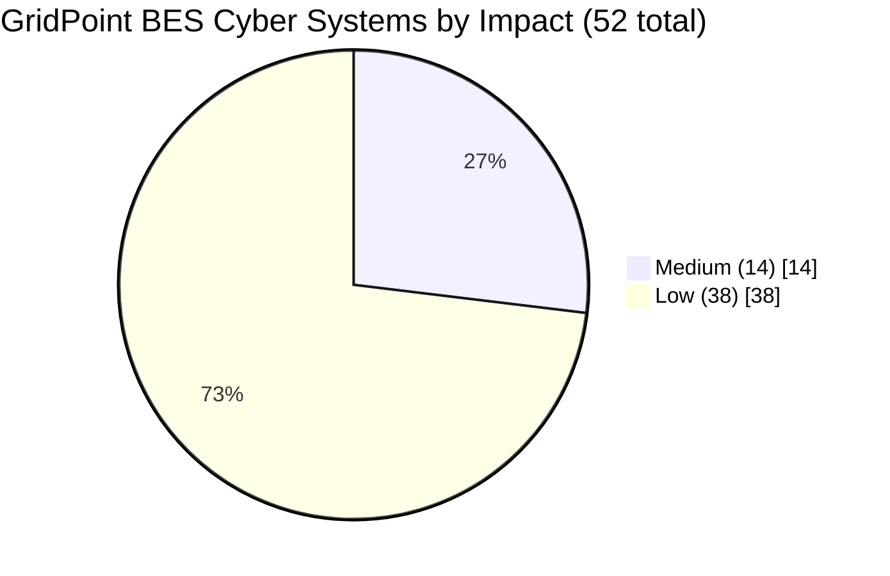

# 02.09 — CIP-002 BES Cyber System Categorization Document (Approved)

| Field | Value |
|---|---|
| Document ID | CIP-002-CATDOC-2026-001 |
| Version | 1.0 |
| Date | 2026-03-02 |
| Classification | BES Cyber System Information (BCSI) // Illustrative Portfolio Sample |
| Owner | Karen Whitfield, NERC Compliance Manager |
| Author | Advisory Team (OT GRC / NERC CIP Advisory) |
| Approved By | Daniel Reyes, CIP Senior Manager |
| Status | Approved |

## Purpose

This is the formal, dated, and approved **CIP-002-5.1a** BES Cyber System categorization document of record for **GridPoint Energy, Inc.** (NCR11027). It consolidates the identification and impact-rating work performed across documents 02.01–02.08 into a single authoritative deliverable, presents the categorization results, records the method used, states the required review commitment under CIP-002-5.1a **Requirement R2**, and captures the approval and signature of the designated **CIP Senior Manager**. It is the keystone artifact of Phase 02 and the compliance baseline that every subsequent phase inherits.

This document satisfies the obligation under CIP-002-5.1a **R1** to identify and categorize BES Cyber Systems, and establishes the approved list required by **R2** for review and approval at least once every 15 calendar months.

## 1. Scope and Applicability

GridPoint Energy is a mid-size, investor-owned electric utility registered as **GO, GOP, TO, TOP, and DP** within the **ReliabilityFirst (RF)** footprint of the Eastern Interconnection. This categorization covers all BES assets owned or operated by GridPoint that contain, or are associated with, BES Cyber Systems, evaluated against the impact-rating criteria of **CIP-002-5.1a Attachment 1**.

| Attribute | Value |
|---|---|
| Registered Entity | GridPoint Energy, Inc. |
| NERC Compliance Registry ID | NCR11027 |
| Regional Entity | ReliabilityFirst (RF) |
| Functional registrations | GO · GOP · TO · TOP · DP |
| Standard applied | CIP-002-5.1a (Categorization) |
| Attachment applied | Attachment 1 — Impact Rating Criteria |
| Effective categorization date | 2026-03-02 |

## 2. Summary of Categorization Results

GridPoint's BES assets categorize to **Medium** and **Low** impact only. **No asset meets any CIP-002-5.1a Attachment 1 High-impact criterion** (e.g., Criterion 1.x large control-center or single-plant ≥1500 MW thresholds).

| Impact Rating | BES Cyber Systems (grouped) | Where |
|---|---|---|
| **High** | **0** | None — no High criteria met |
| **Medium** | **14** | 4 at the 2 Control Centers + 10 across the 8 Medium (345 kV) substations |
| **Low** | **38** | 4 at the 4 generation plants + 34 at the 34 Low substations |
| **Total** | **52** | Enterprise BES Cyber System population |

### 2.1 Associated Cyber Asset Populations

| Population | Count | Definition (CIP-002 / Glossary) |
|---|---|---|
| BES Cyber Assets (BCAs) | ~420 | Cyber Assets that, if rendered unavailable/degraded/misused, would adversely impact the BES within 15 minutes |
| EACMS | 26 | Electronic Access Control or Monitoring Systems |
| PACS | 18 | Physical Access Control Systems |
| PCA | 60 | Protected Cyber Assets within a defined ESP |

### 2.2 Asset Reconciliation

| Asset class | Total | Medium | Low | Out of CIP scope |
|---|---|---|---|---|
| Control Centers | 2 | 2 | 0 | 0 |
| Substations | 44 | 8 | 34 | 2 (distribution-only, no BCS) |
| Generation plants | 4 | 0 | 4 | 0 |

## 3. Categorization Method

The categorization followed the methodology defined in **02.01** and executed in **02.02–02.08**, consistent with CIP-002-5.1a R1 and the NERC *Guidelines and Technical Basis*:

1. **BES asset inventory (02.02)** — enumerate all Control Centers, Transmission stations/substations, and generation resources that are BES elements.
2. **BCA identification (02.03)** — identify programmable electronic devices meeting the 15-minute adverse-impact BES Cyber Asset test.
3. **BES Cyber System grouping (02.04)** — group BCAs into BES Cyber Systems by function and location.
4. **Attachment 1 impact rating (02.05)** — apply each criterion to every BCS; document the specific criterion met.
5. **Categorization list (02.06)** — assign High/Medium/Low and produce the approved list.
6. **Associated systems (02.07)** — identify EACMS, PACS, and PCA associated with each Medium BCS.
7. **Boundary definition (02.08)** — define the ESP and PSP boundaries for Medium BCS; document CIP-003 Attachment 1 electronic access controls for Low assets.

### 3.1 Attachment 1 Criteria Applied

| Asset group | Impact | Attachment 1 criterion | Rationale |
|---|---|---|---|
| Control Centers (Millbrook, Easton) | Medium | **2.12** (+ 2.11 / 2.13 for GOP) | Perform TOP functional obligations for one or more Medium Facilities |
| 8 × 345 kV substations | Medium | **2.5** | 200–499 kV connected at a single station to three or more Transmission stations / aggregate weighted-value threshold |
| 4 generation plants | Low | — (default Low) | Contain BCS; do not meet High/Medium criteria |
| 34 substations | Low | — (default Low) | Contain BCS; do not meet High/Medium criteria |
| 2 distribution-only substations | Out of scope | — | Contain no BES Cyber Systems |

Low-impact BES assets are subject to **CIP-003-8 Attachment 1** only; no formal ESP is required.

## 4. Review and Maintenance Commitment (CIP-002-5.1a R2)

GridPoint commits, per **CIP-002-5.1a R2**, that the CIP Senior Manager or delegate shall **review and approve the identifications in R1 at least once every 15 calendar months**, even if there are no changes. The formal review schedule and interim recategorization triggers are maintained in **02.14**.

| Commitment | Requirement | Frequency | Owner |
|---|---|---|---|
| Review & approve BCS identifications | CIP-002 R2.1 | ≤ 15 calendar months | CIP Senior Manager (Daniel Reyes) |
| Interim recategorization on material asset change | CIP-002 R1 | Event-driven | NERC Compliance Manager (Karen Whitfield) |
| Maintenance of the approved list | CIP-002 R1/R2 | Continuous | Karen Whitfield |

Known upcoming triggers include the newly commissioned **Sunfield Solar (220 MW)** site and control-center modernization work; these are tracked for interim re-evaluation in **02.14**.

## 5. Statement of Compliance

The identifications and categorizations recorded herein are, to the best of GridPoint's knowledge, complete and accurate as of the effective date. Supporting evidence (asset inventories, BCA determinations, criterion mappings, and boundary diagrams) is retained in the document and evidence repository per **01.13** and is available for RSAW review during the **ReliabilityFirst Compliance Audit (2027-Q2)**.

## 6. Approval and Signature Block

By signature below, the designated **CIP Senior Manager** approves this CIP-002-5.1a categorization as the official record of BES Cyber System identification and impact rating for GridPoint Energy, Inc.

| Role | Name | Signature | Date |
|---|---|---|---|
| **CIP Senior Manager** (approver) | **Daniel Reyes** | ______________________ | 2026-03-02 |
| NERC Compliance Manager (owner) | Karen Whitfield | ______________________ | 2026-03-02 |
| OT / ICS Security Lead (technical review) | Marcus Bell | ______________________ | 2026-03-02 |
| Advisory Team (author) | Advisory Team | ______________________ | 2026-03-02 |

**Approval statement:** *"I, Daniel Reyes, as the designated CIP Senior Manager for GridPoint Energy, Inc. (NCR11027), have reviewed and hereby approve the BES Cyber System identifications and impact categorizations set forth in this document as required by CIP-002-5.1a R1 and R2."*

## Cross-References

| Reference | Purpose |
|---|---|
| [02.05 — Impact Rating (Attachment 1 Criteria)](02.05-impact-rating-attachment-1-criteria.md) | Criterion-by-criterion rating basis |
| [02.06 — High/Medium/Low Categorization List](02.06-high-medium-low-categorization-list.md) | Detailed BCS list underlying the summary |
| [02.07 — Associated EACMS / PACS / PCA](02.07-associated-eacms-pacs-pca.md) | Associated cyber asset populations |
| [02.08 — Electronic & Physical Boundary Overview](02.08-electronic-and-physical-boundary-overview.md) | ESP / PSP boundary basis |
| [02.14 — CIP-002 R2 15-Month Review Schedule](02.14-cip-002-15-month-review-schedule.md) | Review commitment and triggers |
| [01.06 — CIP Senior Manager Designation & Delegations](../01-program-foundation/01.06-cip-senior-manager-designation-and-delegations.md) | Authority of the approver |
| [01.04 — Applicable Reliability Standards Register](../01-program-foundation/01.04-applicable-reliability-standards-register.md) | Standards baseline |

---

[⬅ Previous](02.08-electronic-and-physical-boundary-overview.md) · [🏠 Phase README](02.00-README.md) · [Next ➡](02.10-applicability-matrix.md)
