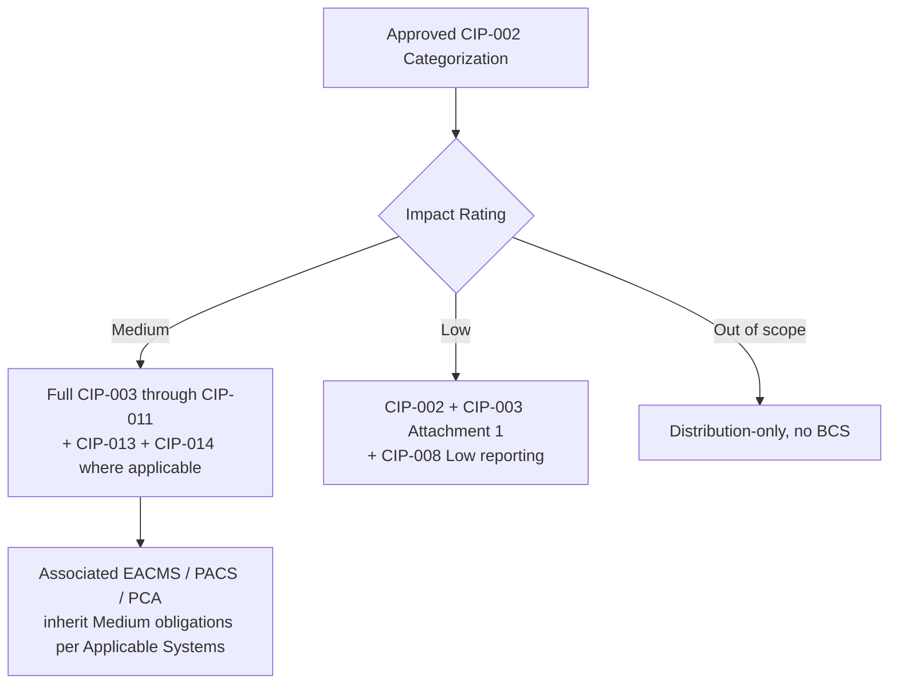

# 02.10 — CIP Applicability Matrix (Medium / Low / Associated Systems)

| Field | Value |
|---|---|
| Document ID | CIP-002-APPMTX-2026-002 |
| Version | 1.0 |
| Date | 2026-03-02 |
| Classification | BES Cyber System Information (BCSI) // Illustrative Portfolio Sample |
| Owner | Karen Whitfield, NERC Compliance Manager |
| Author | Advisory Team (OT GRC / NERC CIP Advisory) |
| Status | Approved |

## Purpose

This applicability matrix translates the approved CIP-002 categorization (02.09) into the set of **CIP Reliability Standards and requirements that apply** to GridPoint's assets by impact rating. It answers the question every downstream control owner asks: *"Which requirements do I owe for a Medium BCS, for a Low BCS, and for associated EACMS / PACS / PCA?"* The matrix scopes the **118 applicable requirement parts** that drive the Phase 02 baseline gap assessment (02.11) and the Phase 03–06 implementation work.

## 1. How Applicability Works Under CIP

CIP standards apply through each standard's **Section 4 Applicability** and the **Applicable Systems** column of every requirement table. Applicability is driven by:

- **Impact rating** of the BES Cyber System (High / Medium / Low), and
- **Associated system type** (EACMS, PACS, PCA), and, for some requirements,
- **Connectivity attributes** (e.g., "with External Routable Connectivity" (ERC), or "with Interactive Remote Access" (IRA)).

GridPoint has **no High-impact** assets, so High-only obligations are not applicable. Low-impact BES assets are governed almost entirely by **CIP-003-8**, principally its **Attachment 1** (cyber security plan sections) and **Attachment 2** (evidence).

## 2. Standards × Impact Applicability Grid

Legend: **✔** applies · **◐** applies in part (subset of parts / conditional on ERC or IRA) · **—** not applicable.

| CIP Standard (version) | Medium BCS | Low BCS | EACMS (assoc.) | PACS (assoc.) | PCA (assoc.) |
|---|---|---|---|---|---|
| CIP-002-5.1a — Categorization | ✔ | ✔ | ✔ | ✔ | ✔ |
| CIP-003-8 — Security Management Controls | ✔ | ✔ (Attachment 1) | ✔ | ✔ | ◐ |
| CIP-004-7 — Personnel & Training | ✔ | — | ✔ | ✔ | ◐ |
| CIP-005-7 — ESP(s) & Remote Access | ✔ | — | ✔ | — | ✔ |
| CIP-006-6 — Physical Security | ✔ | — | ✔ | ✔ | ✔ |
| CIP-007-6 — System Security Management | ✔ | — | ✔ | ◐ | ✔ |
| CIP-008-6 — Incident Reporting & Response | ✔ | ◐ (Low reporting) | ✔ | ✔ | ✔ |
| CIP-009-6 — Recovery Plans | ✔ | — | ◐ | — | ✔ |
| CIP-010-4 — Config Change & Vuln. Assess. | ✔ | — | ✔ | ◐ | ✔ |
| CIP-011-3 — Information Protection (BCSI) | ✔ | ◐ | ✔ | ✔ | ✔ |
| CIP-013-2 — Supply Chain Risk Management | ✔ | — | ✔ | — | — |
| CIP-014-3 — Physical Security (critical stns) | ◐ (risk-assessment gated) | — | — | — | — |

**Notes on conditional applicability**

- **CIP-005-7** applies to Medium BCS with **External Routable Connectivity**; **R2 (IRA)** applies where Interactive Remote Access exists — relevant to the vendor-access gap **GAP-01**.
- **CIP-006-6** distinguishes obligations for BCS/PCA versus the PACS and EACMS that protect the PSP.
- **CIP-014-3** applies only to Transmission stations/substations identified as **critical** through the R1 risk assessment; GridPoint's 345 kV Medium substations are evaluated but final CIP-014 applicability is confirmed in a separate risk assessment (Phase 07 scope). Shown **◐** pending that determination.
- **CIP-008-6** imposes a limited **Low-impact reporting** obligation (Reportable Cyber Security Incident / attempts to compromise) alongside the CIP-003 Attachment 1 Section 4 incident-response plan.

## 3. Medium-Impact Applicable Requirements (Representative)

The following requirement parts constitute the core Medium-impact obligation set and are the largest contributor to the 118 in-scope parts.

| Standard | Key applicable requirements | Applies to |
|---|---|---|
| CIP-004-7 | R2 (training), R3 (PRA), R4 (access mgmt), R5 (access revocation) | Medium BCS + EACMS/PACS/PCA |
| CIP-005-7 | R1 (ESP), R2 (IRA / Intermediate System / MFA) | Medium BCS w/ ERC; EACMS |
| CIP-006-6 | R1 (physical security plan), R2 (visitor control), R3 (PACS testing) | Medium BCS + PCA; PACS/EACMS |
| CIP-007-6 | R1 (ports/services), R2 (patch mgmt), R3 (malware), R4 (logging), R5 (access control) | Medium BCS + PCA/EACMS |
| CIP-009-6 | R1 (recovery plan), R2 (implementation/testing), R3 (review/update) | Medium BCS + PCA |
| CIP-010-4 | R1 (baseline config), R2 (monitoring), R3 (vuln assessment), R4 (TCA/Removable Media) | Medium BCS + PCA/EACMS |
| CIP-011-3 | R1 (BCSI protection), R2 (reuse/disposal) | Medium BCS + associated systems |
| CIP-013-2 | R1 (SCRM plan), R2 (implementation), R3 (review) | Medium BCS + EACMS |

## 4. Low-Impact Applicable Requirements (CIP-003-8 Attachment 1)

| CIP-003-8 Attachment 1 Section | Topic | Applies to |
|---|---|---|
| Section 1 | Cyber security awareness | All Low BES assets |
| Section 2 | Physical security controls | Low BES assets w/ BCS |
| Section 3 | Electronic access controls (inbound/outbound; dial-up) | Low BES assets w/ routable/dial-up connectivity |
| Section 4 | Cyber Security Incident response | All Low BES assets |
| Section 5 | Transient Cyber Assets & Removable Media | Low BES assets using TCA/RM |

Low-impact obligations require a documented **cyber security policy (CIP-003 R1)** and one or more **cyber security plan(s) (CIP-003 R2)** implementing Attachment 1; there is **no ESP, no formal BCA inventory, and no per-device requirement list** for Low assets.

## 5. Associated Systems (EACMS / PACS / PCA) Rule of Thumb

| Associated system | Inherits obligations from | Primary standards |
|---|---|---|
| **EACMS** | The Medium BCS it controls/monitors access for | CIP-004, 005, 006, 007, 010, 011, 013 |
| **PACS** | The PSP it enforces | CIP-004, 006, 007 (subset), 011 |
| **PCA** | The ESP it resides within | CIP-005, 006, 007, 009, 010, 011 |

## 6. Applicable Requirement-Part Count (Basis for Gap Assessment)

The applicability determinations above resolve to **118 applicable CIP requirement parts** across the Medium and Low populations. This count is the denominator for the baseline gap assessment in **02.11**.

## Cross-References

| Reference | Purpose |
|---|---|
| [02.09 — CIP-002 Categorization Document](02.09-cip-002-categorization-document.md) | Approved impact ratings driving applicability |
| [02.07 — Associated EACMS / PACS / PCA](02.07-associated-eacms-pacs-pca.md) | Associated system populations |
| [02.11 — Baseline Gap Assessment](02.11-baseline-gap-assessment.md) | Uses the 118 applicable parts |
| [01.04 — Applicable Reliability Standards Register](../01-program-foundation/01.04-applicable-reliability-standards-register.md) | Standard versions and applicability |

---

[⬅ Previous](02.09-cip-002-categorization-document.md) · [🏠 Phase README](02.00-README.md) · [Next ➡](02.11-baseline-gap-assessment.md)
