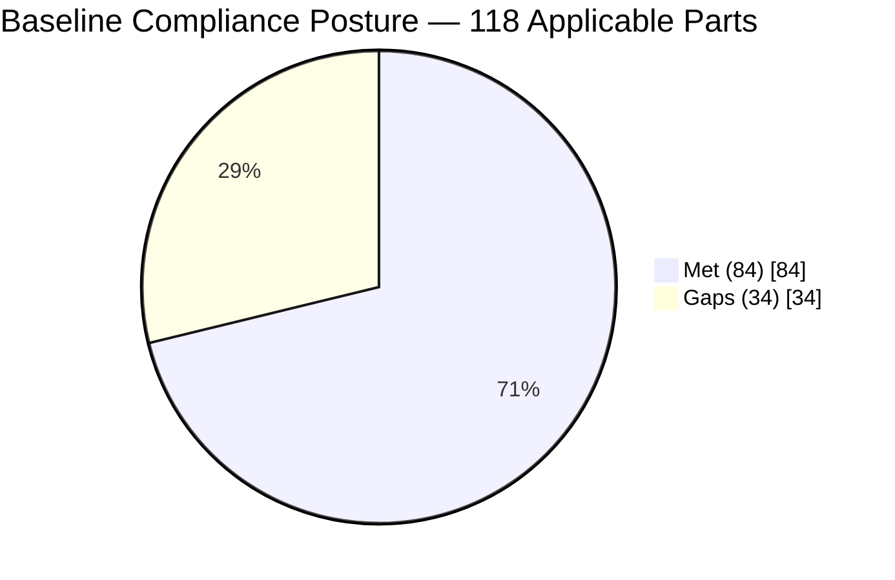
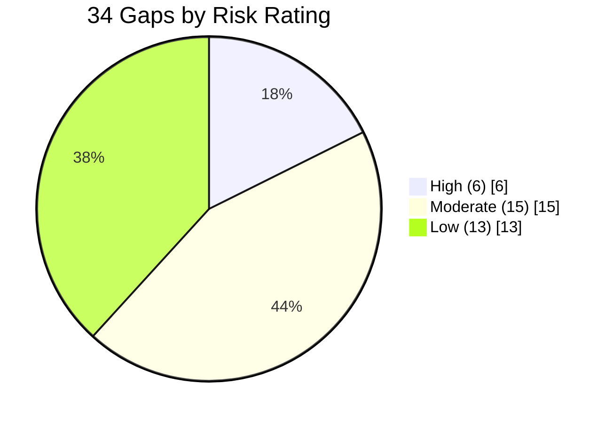

# 02.11 — Baseline Gap Assessment (vs. 118 Applicable Requirement Parts)

| Field | Value |
|---|---|
| Document ID | CIP-002-BGA-2026-003 |
| Version | 1.0 |
| Date | 2026-03-02 |
| Classification | BES Cyber System Information (BCSI) // Illustrative Portfolio Sample |
| Owner | Karen Whitfield, NERC Compliance Manager |
| Author | Advisory Team (OT GRC / NERC CIP Advisory) |
| Status | Approved |

## Purpose

This baseline gap assessment measures GridPoint Energy's current compliance posture against **all 118 applicable CIP requirement parts** identified in the applicability matrix (02.10). It establishes the **pre-implementation baseline** that the Phase 03–06 remediation work is measured against, quantifies met versus gapped parts, and feeds the risk-ranked gap register (02.12) and the remediation roadmap (02.13). The assessment is a point-in-time snapshot as of **2026-03-02**.

## 1. Method

The Advisory Team assessed each of the 118 applicable requirement parts using a documented, RSAW-aligned procedure:

1. **Scope** — take the 118 applicable parts from 02.10 (Medium BCS, Low BCS, and associated EACMS/PACS/PCA).
2. **Evidence request** — collect current policies, procedures, configurations, records, and logs from control owners.
3. **Assess** — evaluate each part against its RSAW measures and the *Guidelines and Technical Basis*, scoring **Met** or **Gap**.
4. **Corroborate** — interview control owners (Marcus Bell — OT/ICS; Priya Nair — IT Security; Frank Delgado — Physical Security; Sandra Lee — Personnel Risk) and sample evidence.
5. **Rate** — for each gap, assign a preliminary risk rating (High / Moderate / Low) based on reliability impact, likelihood, and audit exposure.
6. **Record** — log every result in `trackers/gap-assessment-register.xlsx`, carried forward to 02.12.

Scoring convention: a part is **Met** only where sufficient, current, and repeatable evidence exists; partial or undocumented practices are scored **Gap**.

## 2. Headline Results

| Metric | Count | Percent |
|---|---|---|
| Applicable requirement parts assessed | 118 | 100% |
| **Met** | **84** | **71%** |
| **Gaps** | **34** | **29%** |

### 2.1 Gaps by Risk Rating

| Risk rating | Gaps | Share of gaps |
|---|---|---|
| **High** | **6** | 18% |
| **Moderate** | **15** | 44% |
| **Low** | **13** | 38% |
| **Total** | **34** | 100% |

## 3. Results by CIP Standard

The table below distributes the 118 applicable parts and the 34 gaps across the applicable standards. Counts are illustrative but reconcile to the totals (118 parts; 84 met; 34 gaps = 6 High / 15 Moderate / 13 Low).

| Standard | Applicable parts | Met | Gaps | High | Moderate | Low |
|---|---|---|---|---|---|---|
| CIP-002-5.1a | 4 | 4 | 0 | 0 | 0 | 0 |
| CIP-003-8 | 12 | 9 | 3 | 0 | 1 | 2 |
| CIP-004-7 | 14 | 10 | 4 | 1 | 2 | 1 |
| CIP-005-7 | 10 | 7 | 3 | 1 | 1 | 1 |
| CIP-006-6 | 12 | 9 | 3 | 1 | 1 | 1 |
| CIP-007-6 | 18 | 12 | 6 | 1 | 3 | 2 |
| CIP-008-6 | 8 | 6 | 2 | 0 | 1 | 1 |
| CIP-009-6 | 8 | 6 | 2 | 0 | 1 | 1 |
| CIP-010-4 | 14 | 9 | 5 | 1 | 2 | 2 |
| CIP-011-3 | 8 | 5 | 3 | 1 | 1 | 1 |
| CIP-013-2 | 6 | 4 | 2 | 0 | 1 | 1 |
| CIP-014-3 | 4 | 3 | 1 | 0 | 1 | 0 |
| **Total** | **118** | **84** | **34** | **6** | **15** | **13** |

### 3.1 Observations by Standard

- **CIP-002-5.1a (4/4 met):** categorization is complete and approved (02.09); no gaps.
- **CIP-007-6 (6 gaps — largest):** system security management is the highest-volume gap area, driven by the patch-evaluation cycle lapse (**GAP-02**), ports/services hardening, and logging coverage.
- **CIP-010-4 (5 gaps):** configuration baselines are incomplete for Medium substation BCS (**GAP-03**); monitoring and vulnerability-assessment cadence need maturing.
- **CIP-005-7 (3 gaps):** the vendor Interactive Remote Access weakness (**GAP-01**) is the most reliability-significant electronic-access gap.
- **CIP-004-7 (4 gaps):** access authorization/revocation record completeness (**GAP-05**) following recent staffing changes.
- **CIP-006-6 (3 gaps):** physical access monitoring at one Medium substation (**GAP-04**).
- **CIP-011-3 (3 gaps):** BCSI handling procedure not applied to engineering file shares (**GAP-06**).

## 4. The Six High-Risk Gaps (Preview)

These six drive the Phase 03 kickoff of remediation; they are fully specified with owners and target phases in **02.12**.

| Gap ID | Standard | Summary |
|---|---|---|
| GAP-01 | CIP-005-7 R2 | Vendor IRA lacks Intermediate System / MFA at 2 substations |
| GAP-02 | CIP-007-6 R2 | Patch-evaluation cycle exceeded 35 days on control-center BCS |
| GAP-03 | CIP-010-4 R1 | Configuration baselines incomplete for 10 Medium substation BCS |
| GAP-04 | CIP-006-6 R1 | Physical access controls at 1 Medium substation not fully monitored |
| GAP-05 | CIP-004-7 R4/R5 | Access authorization/revocation records incomplete |
| GAP-06 | CIP-011-3 R1 | BCSI handling not applied to engineering file shares |

## 5. Baseline Statement

As of **2026-03-02**, GridPoint meets **84 of 118 (71%)** applicable CIP requirement parts. The **34 gaps (29%)** constitute the remediation backlog. This baseline is frozen as the reference posture; progress in Phases 03–06 is reported as movement against these numbers. The register of record is `trackers/gap-assessment-register.xlsx`.

## Cross-References

| Reference | Purpose |
|---|---|
| [02.10 — Applicability Matrix](02.10-applicability-matrix.md) | Source of the 118 applicable parts |
| [02.12 — Gap Register & Risk Ranking](02.12-gap-register-and-risk-ranking.md) | Full enumeration of all 34 gaps |
| [02.13 — Pre-Implementation Remediation Roadmap](02.13-pre-implementation-remediation-roadmap.md) | Sequencing of gap closure |
| [01.13 — Document & Evidence Management Plan](../01-program-foundation/01.13-document-and-evidence-management-plan.md) | Evidence handling for RSAW |

---

[⬅ Previous](02.10-applicability-matrix.md) · [🏠 Phase README](02.00-README.md) · [Next ➡](02.12-gap-register-and-risk-ranking.md)
