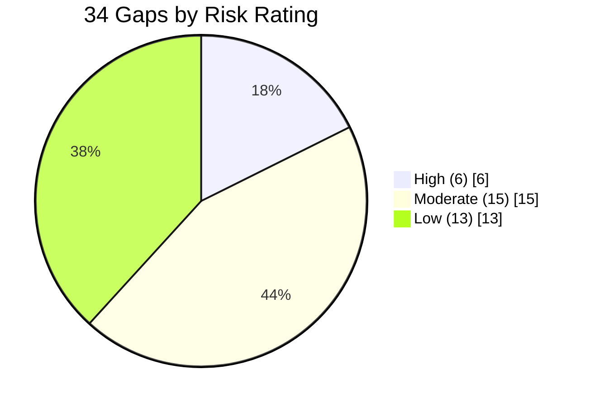

# 02.12 — Gap Register & Risk Ranking (All 34 Gaps)

| Field | Value |
|---|---|
| Document ID | CIP-002-GAPREG-2026-004 |
| Version | 1.0 |
| Date | 2026-03-02 |
| Classification | BES Cyber System Information (BCSI) // Illustrative Portfolio Sample |
| Owner | Karen Whitfield, NERC Compliance Manager |
| Author | Advisory Team (OT GRC / NERC CIP Advisory) |
| Status | Approved |

## Purpose

This is the authoritative, risk-ranked **gap register** for GridPoint Energy's pre-implementation CIP compliance baseline. It enumerates **all 34 gaps** identified in the baseline gap assessment (02.11) against the 118 applicable requirement parts, assigns each a stable **Gap ID (GAP-01 … GAP-34)**, an owning standard and requirement, a description, a risk rating, an accountable owner, and a target remediation phase. It is the keystone control artifact of Phase 02 and the primary input to the remediation roadmap (02.13). The living version of record is the spreadsheet **`trackers/gap-assessment-register.xlsx`**; this document is the narrative and audit-facing snapshot as of **2026-03-02**.

## 1. Risk-Ranking Methodology

Each gap is scored on three axes, then rolled up to a single rating:

| Axis | Question | Scale |
|---|---|---|
| **Reliability impact** | If exploited, how severe is the BES consequence? | Low / Moderate / High |
| **Likelihood** | How exposed is the control today (connectivity, prior events)? | Low / Moderate / High |
| **Audit exposure** | How likely is a Potential Non-Compliance finding at the RF audit? | Low / Moderate / High |

Roll-up rating:

- **High** — reliability-significant, exploitable now, and/or repeat/self-logged exposure; must start in Phase 03.
- **Moderate** — material control weakness with a workable interim mitigation; closes in Phase 04–05.
- **Low** — documentation/evidence completeness or cadence issue; closes in Phase 05–06.

## 2. Summary by Rating and Standard

| Standard | High | Moderate | Low | Total |
|---|---|---|---|---|
| CIP-003-8 | 0 | 1 | 2 | 3 |
| CIP-004-7 | 1 | 2 | 1 | 4 |
| CIP-005-7 | 1 | 1 | 1 | 3 |
| CIP-006-6 | 1 | 1 | 1 | 3 |
| CIP-007-6 | 1 | 3 | 2 | 6 |
| CIP-008-6 | 0 | 1 | 1 | 2 |
| CIP-009-6 | 0 | 1 | 1 | 2 |
| CIP-010-4 | 1 | 2 | 2 | 5 |
| CIP-011-3 | 1 | 1 | 1 | 3 |
| CIP-013-2 | 0 | 1 | 1 | 2 |
| CIP-014-3 | 0 | 1 | 0 | 1 |
| **Total** | **6** | **15** | **13** | **34** |

## 3. High-Risk Gaps (6)

These six are the reliability-significant gaps and begin remediation in Phase 03. Each carries a required interim mitigation until fully closed.

### GAP-01 — CIP-005-7 R2 — Vendor IRA lacks Intermediate System / MFA (High)

| Attribute | Detail |
|---|---|
| Standard / Requirement | CIP-005-7 R2 (Interactive Remote Access) |
| Applicable systems | Medium BCS at 2 substations with vendor remote access |
| Description | Vendor Interactive Remote Access is established without routing through an Intermediate System and without multi-factor authentication at two Medium substations, contrary to CIP-005-7 R2.1–R2.3. |
| Risk | **High** — direct routable vendor path into ESP; high reliability and audit exposure. |
| Interim mitigation | Disable standing vendor access; enable per-session, escorted, logged access only. |
| Owner | Marcus Bell (OT/ICS Security Lead) |
| Target phase | Phase 03 (start) → Phase 04 (close) |

### GAP-02 — CIP-007-6 R2 — Patch-evaluation cycle exceeded 35 days (High)

| Attribute | Detail |
|---|---|
| Standard / Requirement | CIP-007-6 R2 (Security Patch Management) |
| Applicable systems | Control-center Medium BCS |
| Description | Security patch evaluation cycle exceeded the 35-calendar-day requirement (prior self-log) on control-center BCS; evaluation and mitigation-plan evidence incomplete. |
| Risk | **High** — repeat/self-logged issue; elevated audit exposure per CIP-007 R2.2/R2.3. |
| Interim mitigation | Manual out-of-cycle patch evaluation sweep; compensating monitoring. |
| Owner | Priya Nair (IT Security Manager) |
| Target phase | Phase 03 (start) → Phase 04 (close) |

### GAP-03 — CIP-010-4 R1 — Configuration baselines incomplete (High)

| Attribute | Detail |
|---|---|
| Standard / Requirement | CIP-010-4 R1 (Configuration Change Management) |
| Applicable systems | 10 Medium substation BCS |
| Description | Baseline configurations (OS, software, ports/services, security patches) are incomplete or unverified for the 10 Medium substation BCS, undermining change-management authorization evidence. |
| Risk | **High** — no reliable baseline to detect unauthorized change; broad Medium footprint. |
| Interim mitigation | Freeze changes pending baseline capture; manual change log. |
| Owner | Elena Ruiz (Substation & Field Engineering Lead) |
| Target phase | Phase 03 (start) → Phase 05 (close) |

### GAP-04 — CIP-006-6 R1 — Physical access not fully monitored (High)

| Attribute | Detail |
|---|---|
| Standard / Requirement | CIP-006-6 R1 (Physical Security Plan) |
| Applicable systems | 1 Medium substation PSP |
| Description | Physical access controls at one Medium substation are not fully monitored (unmonitored access point; alarm/logging gap), contrary to CIP-006-6 R1.4–R1.5. |
| Risk | **High** — undetected physical access to Medium BCS. |
| Interim mitigation | Temporary guard tour / interim intrusion sensor; manual access logging. |
| Owner | Frank Delgado (Physical Security Manager) |
| Target phase | Phase 03 (start) → Phase 04 (close) |

### GAP-05 — CIP-004-7 R4/R5 — Access authorization/revocation records incomplete (High)

| Attribute | Detail |
|---|---|
| Standard / Requirement | CIP-004-7 R4 (Access Management) / R5 (Access Revocation) |
| Applicable systems | Medium BCS + associated EACMS/PACS |
| Description | Authorization and revocation records are incomplete for recent staffing changes; some terminations lack evidence of 24-hour revocation of physical/electronic access per R5.1. |
| Risk | **High** — potential orphaned access; direct audit finding risk. |
| Interim mitigation | Immediate access recertification sweep; verify all recent terminations revoked. |
| Owner | Sandra Lee (Personnel Risk Coordinator) with Priya Nair |
| Target phase | Phase 03 (start) → Phase 04 (close) |

### GAP-06 — CIP-011-3 R1 — BCSI handling not applied to engineering file shares (High)

| Attribute | Detail |
|---|---|
| Standard / Requirement | CIP-011-3 R1 (Information Protection) |
| Applicable systems | Engineering file shares holding BCSI |
| Description | The BCSI identification and handling procedure is not applied to engineering file shares; BCSI (e.g., network diagrams, baselines) is stored without access restriction or labeling. |
| Risk | **High** — unprotected BCSI disclosure risk; broad exposure. |
| Interim mitigation | Restrict share permissions; inventory and relabel BCSI. |
| Owner | Marcus Bell with Karen Whitfield |
| Target phase | Phase 03 (start) → Phase 04 (close) |

## 4. Moderate-Risk Gaps (15)

| Gap ID | Standard / Req | Description | Owner | Target phase |
|---|---|---|---|---|
| GAP-07 | CIP-003-8 R2 (Att.1 Sec.3) | Low-impact electronic access controls plan lacks documented inbound/outbound restriction rationale for 6 Low substations. | Marcus Bell | Phase 04 |
| GAP-08 | CIP-004-7 R2 | Role-based CIP training content does not yet cover all applicable topics (e.g., BCSI handling, IRA) for all access holders. | Sandra Lee | Phase 04 |
| GAP-09 | CIP-004-7 R3 | Personnel Risk Assessments (7-year criminal history / identity) not evidenced for 3 recently onboarded contractors. | Sandra Lee | Phase 04 |
| GAP-10 | CIP-005-7 R1 | ESP documentation does not identify all external routable connectivity points at 2 Medium substations. | Marcus Bell | Phase 04 |
| GAP-11 | CIP-006-6 R2 | Visitor control program lacks continuous escort logging evidence at the Backup Control Center (Easton). | Frank Delgado | Phase 04 |
| GAP-12 | CIP-007-6 R1 | Enabled logical network accessible ports not fully documented/justified across control-center BCS and PCA. | Priya Nair | Phase 04 |
| GAP-13 | CIP-007-6 R4 | Security event logging (R4.1) does not capture all required event types on 4 Medium BCS; no automated review. | Priya Nair | Phase 04 |
| GAP-14 | CIP-007-6 R3 | Malicious code prevention lacks signature-update evidence on 2 EACMS. | Priya Nair | Phase 05 |
| GAP-15 | CIP-008-6 R1 | Cyber Security Incident Response Plan does not fully address CIP-008-6 R1.2 reportable-attempt criteria/timelines. | Karen Whitfield | Phase 04 |
| GAP-16 | CIP-009-6 R1 | Recovery plan lacks defined backup/restore data-protection roles for Medium BCS per R1.3–R1.5. | James Okafor | Phase 05 |
| GAP-17 | CIP-010-4 R2 | Configuration monitoring (R2.1) for 10 Medium BCS lacks a 35-day baseline-deviation detection process. | Elena Ruiz | Phase 05 |
| GAP-18 | CIP-010-4 R3 | Active vulnerability assessment (R3.2) not performed within the required cycle for control-center BCS. | Marcus Bell | Phase 05 |
| GAP-19 | CIP-011-3 R2 | Media reuse/disposal (R2.1/R2.2) sanitization records incomplete for retired substation assets. | Elena Ruiz | Phase 05 |
| GAP-20 | CIP-013-2 R1 | Supply-chain risk-management plan does not yet address vendor remote-access and incident-notification terms. | Karen Whitfield | Phase 05 |
| GAP-21 | CIP-014-3 R5 | Physical security plan for candidate critical station pending completion of the R4 threat/vulnerability evaluation. | Frank Delgado | Phase 06 |

## 5. Low-Risk Gaps (13)

| Gap ID | Standard / Req | Description | Owner | Target phase |
|---|---|---|---|---|
| GAP-22 | CIP-003-8 R1 | Cyber security policy annual review (15-month) approval evidence not current for one policy section. | Karen Whitfield | Phase 05 |
| GAP-23 | CIP-003-8 (Att.1 Sec.1) | Low-impact security awareness reinforcement not evidenced at 15-month cadence for 2 generation plants. | Sandra Lee | Phase 05 |
| GAP-24 | CIP-004-7 R5 | Revocation of shared-account access not evidenced within the R5.3 timeframe for one prior transfer. | Priya Nair | Phase 05 |
| GAP-25 | CIP-005-7 R1.5 | Method to detect malicious inbound/outbound communications not documented for one Medium ESP. | Marcus Bell | Phase 05 |
| GAP-26 | CIP-006-6 R3 | PACS maintenance/testing (R3.1) interval documentation incomplete for one PACS. | Frank Delgado | Phase 05 |
| GAP-27 | CIP-007-6 R5 | System access controls (R5.5 password parameters) not enforced/evidenced on 2 legacy PCA. | Priya Nair | Phase 06 |
| GAP-28 | CIP-007-6 R2 | Patch-source identification (R2.1) list not documented for all software sources on Medium BCS. | Priya Nair | Phase 06 |
| GAP-29 | CIP-008-6 R3 | Incident response plan review/update and lessons-learned (R3.1) not evidenced within 90 days of last test. | Karen Whitfield | Phase 06 |
| GAP-30 | CIP-009-6 R3 | Recovery plan review/update (R3.1) after last exercise not documented. | James Okafor | Phase 06 |
| GAP-31 | CIP-010-4 R4 | Transient Cyber Asset / Removable Media controls (Att.1) procedure not consistently applied by field crews. | Elena Ruiz | Phase 06 |
| GAP-32 | CIP-010-4 R1 | Baseline configuration documentation incomplete for 3 associated EACMS. | Marcus Bell | Phase 06 |
| GAP-33 | CIP-011-3 R1 | BCSI labeling/handling reminders not embedded in engineering document templates. | Karen Whitfield | Phase 06 |
| GAP-34 | CIP-013-2 R3 | SCRM plan periodic review (R3.1, 15-month) schedule not yet established. | Karen Whitfield | Phase 06 |

## 6. Register Governance

- **System of record:** `trackers/gap-assessment-register.xlsx` (columns: Gap ID, Standard, Requirement, Applicable Systems, Description, Reliability Impact, Likelihood, Audit Exposure, Risk Rating, Interim Mitigation, Owner, Target Phase, Status, Evidence Link, Close Date).
- **Update cadence:** reviewed monthly by the NERC Compliance Manager; status changes require owner sign-off.
- **Traceability:** each gap maps forward to a remediation action in **02.13** and, where a compliance obligation is at risk, to a **Mitigation Plan** for RF.
- **Closure evidence:** retained per **01.13** and made available for the **RF Compliance Audit (2027-Q2)** RSAW review.

## 7. Rollup Verification

| Rating | Gap IDs | Count |
|---|---|---|
| High | GAP-01…GAP-06 | 6 |
| Moderate | GAP-07…GAP-21 | 15 |
| Low | GAP-22…GAP-34 | 13 |
| **Total** | GAP-01…GAP-34 | **34** |

## Cross-References

| Reference | Purpose |
|---|---|
| [02.11 — Baseline Gap Assessment](02.11-baseline-gap-assessment.md) | Source assessment and totals |
| [02.13 — Pre-Implementation Remediation Roadmap](02.13-pre-implementation-remediation-roadmap.md) | Sequencing and closure plan |
| [`trackers/gap-assessment-register.xlsx`](trackers/gap-assessment-register.xlsx) | Living register of record |
| [01.07 — Governance Structure & RACI](../01-program-foundation/01.07-governance-structure-and-raci.md) | Owner accountability |

---

[⬅ Previous](02.11-baseline-gap-assessment.md) · [🏠 Phase README](02.00-README.md) · [Next ➡](02.13-pre-implementation-remediation-roadmap.md)
