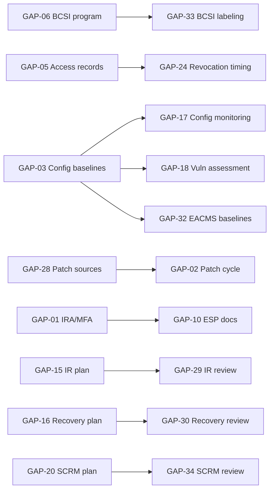
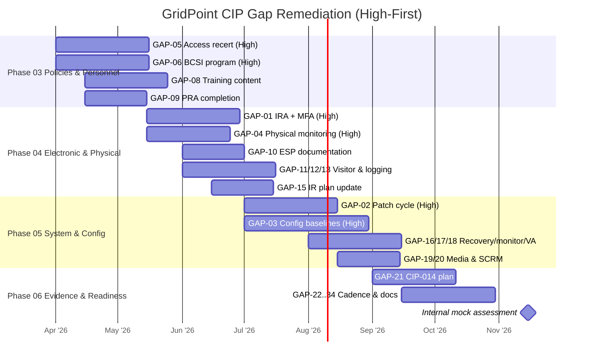

# 02.13 — Pre-Implementation Remediation Roadmap

| Field | Value |
|---|---|
| Document ID | CIP-002-RMROAD-2026-005 |
| Version | 1.0 |
| Date | 2026-03-02 |
| Classification | BES Cyber System Information (BCSI) // Illustrative Portfolio Sample |
| Owner | Karen Whitfield, NERC Compliance Manager |
| Author | Advisory Team (OT GRC / NERC CIP Advisory) |
| Status | Approved |

## Purpose

This roadmap sequences the closure of the **34 baseline gaps** (02.12) across the program's implementation phases (**Phase 03 – Phase 06**), on a **High-risk-first** basis, with owners, dependencies, and target completion aligned to the **ReliabilityFirst Compliance Audit (2027-Q2)**. It converts the static gap register into a time-phased plan of action so that every gap has a scheduled closure window and each remediation stream has a clear predecessor/successor chain.

## 1. Sequencing Principles

1. **High-risk first.** All 6 High gaps (GAP-01…06) begin in **Phase 03** with interim mitigations active from day one.
2. **Policy before control.** Governance and personnel foundations (Phase 03) precede technical control build-out (Phases 04–05).
3. **Dependency-aware.** Configuration baselines (GAP-03) precede configuration monitoring (GAP-17) and vulnerability assessment (GAP-18).
4. **Evidence-ready before audit.** All closures target completion by **2026-Q4** to allow the internal mock assessment before the RF audit in 2027-Q2.
5. **Mitigation Plans** are filed with RF for any gap tied to an open compliance obligation.

## 2. Phase Alignment

| Program phase | Theme | Gap focus |
|---|---|---|
| **Phase 03** — Policies, Governance & Personnel | Policy, PRA, training, access mgmt, BCSI program | GAP-05, GAP-06 (start all High); GAP-08, GAP-09 |
| **Phase 04** — Electronic & Physical Security | ESP, IRA/MFA, physical monitoring, logging | GAP-01, GAP-04 (close); GAP-07, GAP-10, GAP-11, GAP-12, GAP-13, GAP-15 |
| **Phase 05** — System Security & Config Mgmt | Patching, baselines, monitoring, recovery, SCRM | GAP-02, GAP-03 (close); GAP-14, GAP-16, GAP-17, GAP-18, GAP-19, GAP-20 |
| **Phase 06** — Evidence, Testing & Audit Readiness | Cadence, review, documentation completeness | GAP-21, GAP-22…GAP-34 |

Note: High gaps **start** in Phase 03 with interim mitigation; several **close** in Phase 04–05 as durable controls come online.

## 3. High-Gap Remediation Streams

| Gap ID | Standard | Owner | Start | Target close | Key dependency |
|---|---|---|---|---|---|
| GAP-01 | CIP-005-7 R2 | Marcus Bell | Phase 03 | Phase 04 | Intermediate System + MFA procurement/config |
| GAP-02 | CIP-007-6 R2 | Priya Nair | Phase 03 | Phase 05 | Patch source list (GAP-28); patch tooling |
| GAP-03 | CIP-010-4 R1 | Elena Ruiz | Phase 03 | Phase 05 | Asset baseline capture at 10 Medium substations |
| GAP-04 | CIP-006-6 R1 | Frank Delgado | Phase 03 | Phase 04 | Monitoring/alarm install at 1 substation |
| GAP-05 | CIP-004-7 R4/R5 | Sandra Lee | Phase 03 | Phase 04 | Access recertification + revocation workflow |
| GAP-06 | CIP-011-3 R1 | Marcus Bell | Phase 03 | Phase 04 | BCSI inventory + share re-permissioning |

## 4. Dependency Map

## 5. Remediation Gantt

## 6. Interim Mitigation Posture

Until durable controls close each High gap, the following compensating measures remain active and evidenced:

| Gap ID | Interim mitigation | Verification owner |
|---|---|---|
| GAP-01 | Standing vendor access disabled; per-session escorted, logged access only | Marcus Bell |
| GAP-02 | Manual out-of-cycle patch evaluation sweep; enhanced monitoring | Priya Nair |
| GAP-03 | Change freeze + manual change log pending baseline capture | Elena Ruiz |
| GAP-04 | Interim intrusion sensor / guard tour; manual access log | Frank Delgado |
| GAP-05 | Immediate access recertification; verify recent terminations revoked | Sandra Lee |
| GAP-06 | Share permissions restricted; BCSI inventory underway | Marcus Bell |

## 7. Milestones and Gate Criteria

| Milestone | Date | Gate criteria |
|---|---|---|
| High gaps mitigated (interim) | 2026-04 | All 6 High gaps have active, evidenced interim mitigations |
| High gaps closed (durable) | 2026-Q3 | GAP-01…06 durable controls in place and evidenced |
| Control implementation complete | 2026-Q3 | All 34 gaps closed or on approved Mitigation Plan |
| Internal (mock) assessment | 2026-Q4 | RSAW dry run; no open High findings |
| RF Compliance Audit | 2027-Q2 | Audit-ready evidence for all 118 applicable parts |

## Cross-References

| Reference | Purpose |
|---|---|
| [02.12 — Gap Register & Risk Ranking](02.12-gap-register-and-risk-ranking.md) | Source gaps and owners |
| [02.11 — Baseline Gap Assessment](02.11-baseline-gap-assessment.md) | Baseline posture |
| [01.10 — Engagement Roadmap & Milestones](../01-program-foundation/01.10-engagement-roadmap-and-milestones.md) | Program-level timeline |
| [01.12 — Compliance Obligations Calendar](../01-program-foundation/01.12-compliance-obligations-calendar.md) | Audit and deadline alignment |

---

[⬅ Previous](02.12-gap-register-and-risk-ranking.md) · [🏠 Phase README](02.00-README.md) · [Next ➡](02.14-cip-002-15-month-review-schedule.md)
