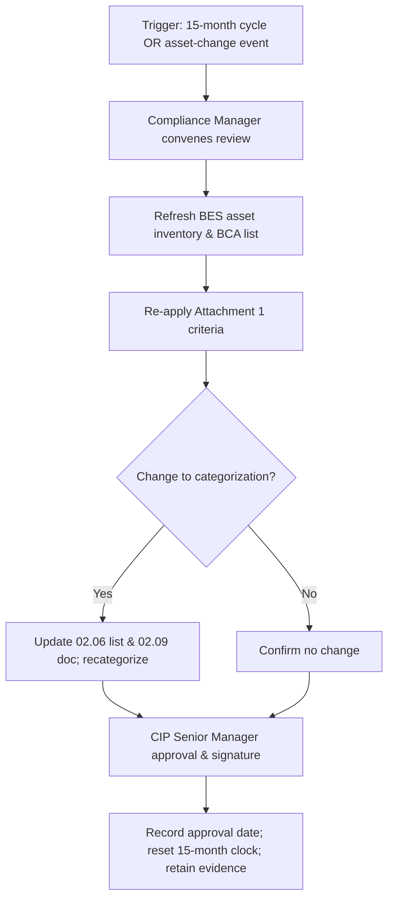

# 02.14 — CIP-002 R2 15-Month Review Process & Schedule

| Field | Value |
|---|---|
| Document ID | CIP-002-REVSCH-2026-006 |
| Version | 1.0 |
| Date | 2026-03-02 |
| Classification | BES Cyber System Information (BCSI) // Illustrative Portfolio Sample |
| Owner | Karen Whitfield, NERC Compliance Manager |
| Author | Advisory Team (OT GRC / NERC CIP Advisory) |
| Status | Approved |

## Purpose

This document defines the recurring process and schedule by which GridPoint Energy satisfies **CIP-002-5.1a Requirement R2** — review and approval of the BES Cyber System identifications and categorizations (02.09) **at least once every 15 calendar months** by the CIP Senior Manager or delegate — and specifies the **event-driven triggers** that require interim recategorization under R1 (for example, the newly commissioned **Sunfield Solar** site and other material asset changes). It ensures the approved categorization never lapses and that asset changes are captured promptly.

## 1. Regulatory Basis

| Requirement | Obligation | GridPoint response |
|---|---|---|
| CIP-002-5.1a R1 | Identify and categorize BES Cyber Systems and associated systems | Baselined and approved in 02.09 |
| CIP-002-5.1a R2.1 | Review the R1 identifications at least once each 15 calendar months | Scheduled review (Section 3) |
| CIP-002-5.1a R2.2 | Have the CIP Senior Manager or delegate approve the identifications at least once each 15 calendar months | Approval by Daniel Reyes (or delegate) |

The 15-calendar-month clock runs from the **date of the last approval**, regardless of whether changes occurred. A review with **no changes** still requires documented approval to remain compliant.

## 2. Review Process

### 2.1 Roles

| Role | Responsibility |
|---|---|
| CIP Senior Manager — Daniel Reyes | Approve the identifications (R2.2); may delegate in writing |
| NERC Compliance Manager — Karen Whitfield | Convene and document the review; maintain the schedule |
| OT/ICS Security Lead — Marcus Bell | Refresh BCA/BCS inventory and boundary data |
| Substation & Field Engineering Lead — Elena Ruiz | Provide substation asset changes |
| Control Center Operations Manager — James Okafor | Provide control-center changes |

## 3. Standing Review Schedule

The baseline approval date is **2026-03-02**; the next mandatory review/approval is due no later than **2026-06-02 + 15 months = 2027-06-02** (within 15 calendar months of baseline). GridPoint adopts a conservative internal cadence with a buffer ahead of the regulatory deadline.

| Cycle | Internal target date | Regulatory deadline (≤15 mo.) | Approver | Notes |
|---|---|---|---|---|
| Baseline approval | 2026-03-02 | — | Daniel Reyes | Established in 02.09 |
| Review 1 | 2027-03-01 | 2027-06-02 | Daniel Reyes | Precedes RF audit (2027-Q2) |
| Review 2 | 2028-03-01 | 2028-06-01 | Daniel Reyes / delegate | Annual internal cadence |
| Review 3 | 2029-03-01 | 2029-06-01 | Daniel Reyes / delegate | Annual internal cadence |

Adopting a ~12-month internal cadence keeps every approval comfortably inside the 15-calendar-month regulatory ceiling and aligns the review with the annual compliance calendar (01.12).

## 4. Interim Recategorization Triggers (Event-Driven)

Any of the following material asset changes triggers an **out-of-cycle** re-evaluation under R1 without waiting for the 15-month cycle:

| Trigger category | Example (GridPoint) | Action |
|---|---|---|
| New generation resource | **Sunfield Solar (220 MW)** commissioning / any capacity change affecting criteria | Re-apply Attachment 1; confirm Low vs Medium |
| New / modified substation | New 345 kV substation or voltage/connectivity change affecting Criterion 2.5 | Re-evaluate Medium vs Low |
| Control-center change | Control-center modernization, function relocation, or new TOP/GOP obligation | Re-apply Criterion 2.11/2.12/2.13 |
| Connectivity change | New External Routable Connectivity or IRA path | Update ESP/boundary and associated-systems scope |
| Retirement / decommission | Asset removal or loss of BES status | Remove from categorization; update inventories |
| Associated-systems change | New/removed EACMS, PACS, or PCA | Update 02.07 populations |
| Regulatory change | New CIP-002 version or Attachment 1 criteria revision | Re-baseline against new criteria |

Interim recategorizations follow the same process (Section 2), require CIP Senior Manager approval, and **reset the 15-month clock** upon approval.

## 5. Review Checklist (Executed Each Cycle)

The NERC Compliance Manager executes the following checklist at every review, whether cyclical or event-driven. Each item is initialed and dated to form the review evidence package.

| # | Checklist item | Source document | Owner |
|---|---|---|---|
| 1 | Confirm BES asset inventory is current (additions, retirements, reratings) | 02.02 | Elena Ruiz / James Okafor |
| 2 | Confirm BCA and BCS inventories reconcile to inventory | 02.03 / 02.04 | Marcus Bell |
| 3 | Re-apply Attachment 1 criteria to any changed asset | 02.05 | Advisory Team |
| 4 | Confirm High/Medium/Low list and counts (14 Medium / 38 Low) | 02.06 | Karen Whitfield |
| 5 | Confirm associated EACMS/PACS/PCA populations current | 02.07 | Marcus Bell |
| 6 | Confirm ESP/PSP boundaries reflect connectivity changes | 02.08 | Marcus Bell |
| 7 | Update the categorization document and obtain approval | 02.09 | Daniel Reyes |
| 8 | Record approval date and reset the 15-month clock | 02.14 | Karen Whitfield |

## 6. Escalation and Non-Compliance Avoidance

To prevent an inadvertent lapse of the 15-calendar-month deadline, the following controls apply:

- **Early-warning alerts** at 90, 60, and 30 days before each regulatory deadline, raised by the Compliance Manager through the escalation path in 01.11.
- **Delegate coverage**: if the CIP Senior Manager is unavailable, a written delegation (per 01.06) authorizes an alternate approver so approval is never blocked.
- **Deadline register**: the internal target dates in Section 3 sit ~3 months ahead of the regulatory ceiling, providing schedule buffer.
- A missed approval is treated as a **potential CIP-002 R2 non-compliance** and, if it occurs, is self-reported to ReliabilityFirst with a Mitigation Plan.

## 7. Evidence and Recordkeeping

| Evidence item | Retention | Location |
|---|---|---|
| Signed approval record (each cycle) | ≥ audit cycle + current | Evidence repository (per 01.13) |
| Completed review checklist (Section 5) | Each review | Phase 02 trackers |
| Refreshed asset/BCA inventory | Each review | Phase 02 trackers |
| Change log of triggers evaluated | Continuous | `trackers/gap-assessment-register.xlsx` companion log |
| Delegation letters (if delegate approves) | While in effect | Governance records (01.06) |
| Early-warning alert records | Each cycle | Compliance calendar (01.12) |

## Cross-References

| Reference | Purpose |
|---|---|
| [02.09 — CIP-002 Categorization Document](02.09-cip-002-categorization-document.md) | The approved list subject to review |
| [02.06 — High/Medium/Low Categorization List](02.06-high-medium-low-categorization-list.md) | Detailed list updated on review |
| [01.06 — CIP Senior Manager Designation & Delegations](../01-program-foundation/01.06-cip-senior-manager-designation-and-delegations.md) | Approver authority and delegation |
| [01.12 — Compliance Obligations Calendar](../01-program-foundation/01.12-compliance-obligations-calendar.md) | Calendar alignment |

---

[⬅ Previous](02.13-pre-implementation-remediation-roadmap.md) · [🏠 Phase README](02.00-README.md) · [Next ➡](02.15-phase-summary-and-transition.md)
