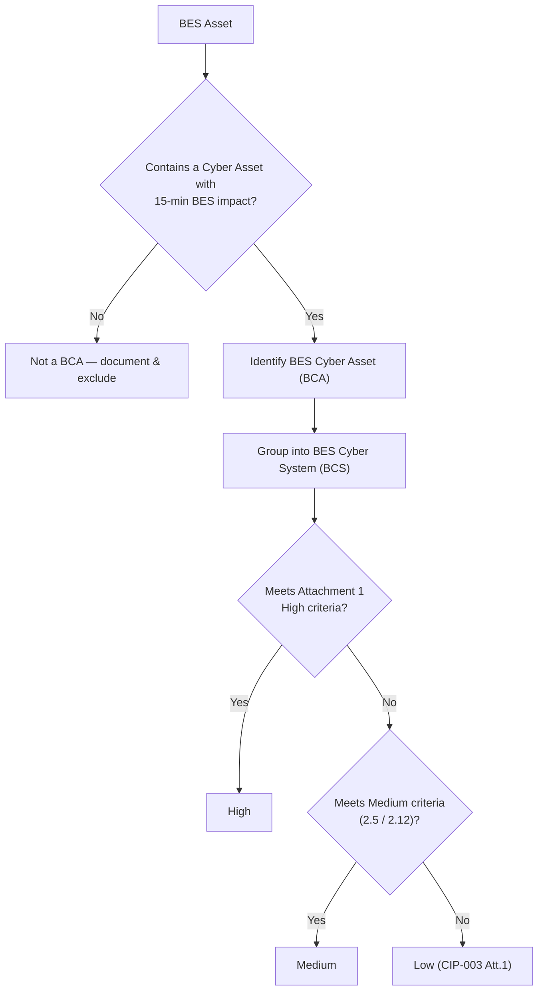

# Diagram — CIP-002 Categorization Decision Flow

| Field | Value |
|---|---|
| Version | 1.0 |
| Date | 2026-03-02 |
| Classification | BES Cyber System Information (BCSI) // Illustrative Portfolio Sample |
| Company | GridPoint Energy, Inc. (NCR11027) |
| Regional Entity | ReliabilityFirst (RF) |
| Phase | 02 — BES Cyber System Categorization (CIP-002) |
| Author | Advisory Team |
| Status | Approved |

## Cross-References
`02.01-cip-002-methodology-and-approach.md`, `02.05-impact-rating-attachment-1-criteria.md`.
