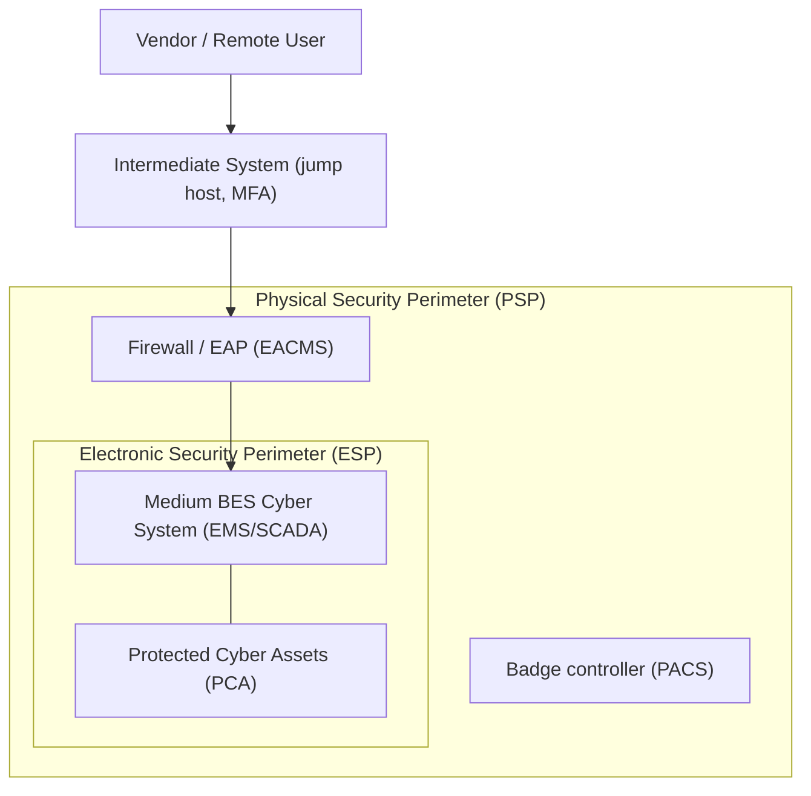

# Diagram — ESP / PSP Boundary Concept (Medium BCS)

| Field | Value |
|---|---|
| Version | 1.0 |
| Date | 2026-03-02 |
| Classification | BES Cyber System Information (BCSI) // Illustrative Portfolio Sample |
| Company | GridPoint Energy, Inc. (NCR11027) |
| Regional Entity | ReliabilityFirst (RF) |
| Phase | 02 — BES Cyber System Categorization (CIP-002) |
| Author | Advisory Team |
| Status | Approved |

## Cross-References
`02.08-electronic-and-physical-boundary-overview.md`, `02.07-associated-eacms-pacs-pca.md`.
