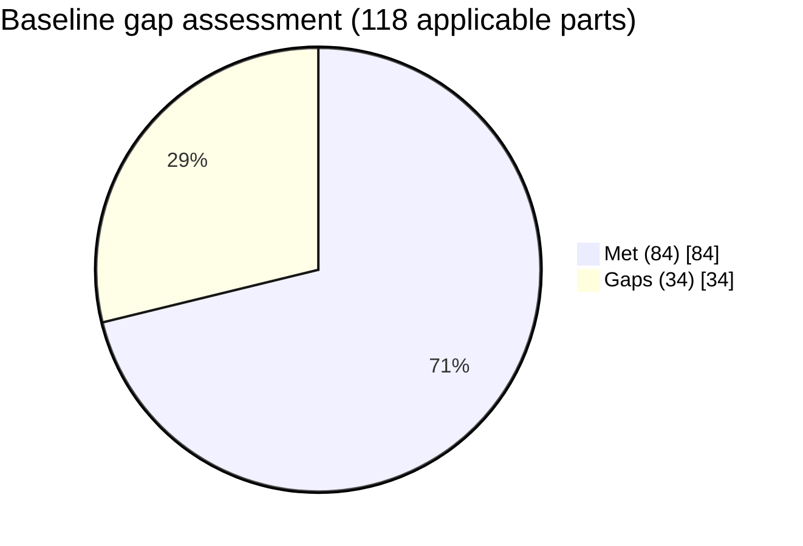

# Diagram — Baseline Gap Heatmap

| Field | Value |
|---|---|
| Version | 1.0 |
| Date | 2026-03-02 |
| Classification | BES Cyber System Information (BCSI) // Illustrative Portfolio Sample |
| Company | GridPoint Energy, Inc. (NCR11027) |
| Regional Entity | ReliabilityFirst (RF) |
| Phase | 02 — BES Cyber System Categorization (CIP-002) |
| Author | Advisory Team |
| Status | Approved |

Gaps by risk: **6 High · 15 Moderate · 13 Low**. High gaps (GAP-01…06) target Phases 03–04.

| CIP Standard | Gaps |
|---|---|
| CIP-005 | 🔴 High (IRA/MFA) |
| CIP-007 | 🔴 High (patch cycle) + Moderate |
| CIP-010 | 🔴 High (baselines) + Moderate |
| CIP-006 | 🔴 High (access monitoring) |
| CIP-004 | 🔴 High (access records) |
| CIP-011 | 🔴 High (BCSI) |

## Cross-References
`02.11-baseline-gap-assessment.md`, `02.12-gap-register-and-risk-ranking.md`.
