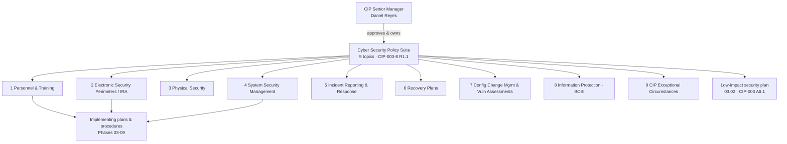

# 03.01 — Cyber Security Policy Suite (CIP-003 R1)

| Field | Value |
|---|---|
| Document ID | CIP-03.01 |
| Version | 1.0 |
| Date | 2026-03-02 |
| Classification | BES Cyber System Information (BCSI) // Illustrative Portfolio Sample |
| Owner | Daniel Reyes (CIP Senior Manager) |
| Author | Advisory Team |
| Status | Approved |

## Purpose

This document establishes the **cyber security policy suite** that GridPoint Energy, Inc. ("GridPoint") maintains to satisfy **CIP-003-8 Requirement R1 — Security Management Controls**. It defines the nine required policy topics for High- and Medium-impact BES Cyber Systems, the structure and ownership of each policy, the mandatory **15-calendar-month review-and-approval cadence**, and the role of the **CIP Senior Manager (Daniel Reyes)** as the single accountable authority who reviews and approves the suite. The policy suite is the apex governance layer of the entire NERC CIP program: every implementing plan, procedure, and control document in Phases 03–09 traces upward to a policy topic defined here. Completion of the suite from seven to nine topics **closes GAP-18** from the Phase-02 gap register.

## Regulatory Basis — CIP-003-8 R1

CIP-003-8 R1 obligates the Responsible Entity to review and obtain **CIP Senior Manager approval** of one or more documented cyber security policies at least once every **15 calendar months**. The requirement is split by impact level:

| Requirement Part | Applies To | Obligation |
|---|---|---|
| **R1.1** | High- and Medium-impact BES Cyber Systems | Documented cyber security policies addressing **nine specified topics** |
| **R1.2** | Assets containing Low-impact BES Cyber Systems | Documented policy(ies) addressing the Attachment 1 subject matter (awareness, physical access, electronic access, incident response, TCA/Removable Media, vendor remote access) |
| **R2** | Low-impact assets | Implement the Attachment 1 security plan (see 03.02) |

GridPoint has **14 Medium** and **38 Low** BES Cyber Systems (no High). Because Medium-impact systems are in scope, the **full nine-topic R1.1 suite** is mandatory. The Low-impact policy obligation (R1.2) is satisfied by the same suite plus the Low-impact security plan documented in **03.02**.

## The Nine Required Policy Topics (CIP-003-8 R1.1)

Each topic below is maintained as a discrete, individually versioned policy under a common template. The topic numbering follows the order enumerated in CIP-003-8 R1.1.

| # | Policy Topic (CIP-003-8 R1.1) | Implementing Standard(s) | Policy Owner |
|---|---|---|---|
| 1 | **Personnel & Training** | CIP-004-7 | Karen Whitfield (NERC Compliance Manager) |
| 2 | **Electronic Security Perimeters**, including Interactive Remote Access | CIP-005-7 | Priya Nair (IT Security Manager) |
| 3 | **Physical Security of BES Cyber Systems** | CIP-006-6 | Frank Delgado (Physical Security Manager) |
| 4 | **System Security Management** | CIP-007-6 | Marcus Bell (OT / ICS Security Lead) |
| 5 | **Incident Reporting & Response Planning** | CIP-008-6 | Marcus Bell (OT / ICS Security Lead) |
| 6 | **Recovery Plans for BES Cyber Systems** | CIP-009-6 | James Okafor (Control Center Operations Manager) |
| 7 | **Configuration Change Management & Vulnerability Assessments** | CIP-010-4 | Marcus Bell (OT / ICS Security Lead) |
| 8 | **Information Protection** (BCSI) | CIP-011-3 | Priya Nair (IT Security Manager) |
| 9 | **Declaring & Responding to CIP Exceptional Circumstances** | CIP-003-8 (cross-cutting) | Daniel Reyes (CIP Senior Manager) |

> **GAP-18 closure:** The pre-program suite contained only seven of the nine topics — **Recovery Plans (topic 6)** and **Declaring & Responding to CIP Exceptional Circumstances (topic 9)** were missing. Both were authored, reviewed, and approved by the CIP Senior Manager during Phase 03, bringing the suite to the complete set of nine and closing GAP-18.

### CIP Exceptional Circumstances (topic 9)

A **CIP Exceptional Circumstance (CEC)** is a situation involving a risk of injury or death, a natural disaster, civil unrest, an imminent or existing hardware/software/equipment failure, a Cyber Security Incident requiring emergency assistance, a response to a system-wide operational emergency, or an impending or existing environmental emergency. Policy topic 9 defines how GridPoint **declares** a CEC, which requirement parts permit deviation during a declared CEC, who may authorize the declaration, and how the entity returns to normal compliance and records the event as evidence.

## Policy Suite Structure

Every policy in the suite follows a uniform template so that the CIP Senior Manager can review consistently and RF auditors can trace obligation-to-policy-to-procedure cleanly.

| Section | Content |
|---|---|
| Header | Policy ID, version, effective date, classification, owner, approver |
| Purpose & Scope | Objective; applicability to Medium and/or Low BES Cyber Systems, EACMS, PACS, PCA |
| Policy Statements | Mandatory "shall" statements establishing the control intent |
| Roles & Responsibilities | Accountable owner, implementers, and the CIP Senior Manager authority |
| Implementing Documents | Pointers to the plans/procedures that operationalize the policy |
| Review & Approval | 15-month cadence, event-driven triggers, approval record |
| Revision History | Version, date, change summary, approver |

## Ownership Model

- **Accountable authority:** the **CIP Senior Manager, Daniel Reyes**, owns the suite as a whole. Under CIP-003-8 R1 he is the single individual who must review and approve every policy on the mandatory cadence. This authority is designated in `../01-program-foundation/01.06-cip-senior-manager-designation-and-delegations.md`.
- **Policy owners:** each topic has a named subject-matter owner (table above) responsible for drafting, keeping content current with the corresponding standard, and presenting proposed changes for approval.
- **Program coordination:** **Karen Whitfield (NERC Compliance Manager)** coordinates the review calendar, maintains the master policy register, and assembles approval evidence for the RSAW.
- **Delegation:** CIP-003-8 permits the CIP Senior Manager to delegate specified authorities in writing; however, **policy approval under R1 is retained by Daniel Reyes** and is not delegated, preserving a clean chain of accountability.

## 15-Month Review & Approval Cadence

CIP-003-8 R1 requires review **and** CIP Senior Manager approval at least once every **15 calendar months**. GridPoint operates the cadence as follows:

| Activity | Frequency | Responsible | Evidence |
|---|---|---|---|
| Scheduled policy review | ≤ 15 calendar months | Policy owners | Marked-up drafts, review notes |
| CIP Senior Manager approval | ≤ 15 calendar months | Daniel Reyes | Signed/dated approval record |
| Event-driven review | On material change | Karen Whitfield | Trigger log, revised policy |
| Register reconciliation | Quarterly | Karen Whitfield | Policy register export |

**Event-driven triggers** that force an off-cycle review include: a new or revised CIP standard becoming enforceable; a material asset change (e.g., the Sunfield Solar commissioning or a substation recategorization); an internal or RF audit finding; a Cyber Security Incident lesson-learned; or an organizational change affecting a policy owner. The recurring schedule and approval evidence are governed centrally in **03.11 (Policy Governance — Review & Approval)**.

## Policy Register (Suite Snapshot)

The master policy register records the live state of all nine topics. The snapshot below reflects the Phase-03 baseline; the register is maintained by the NERC Compliance Manager and reconciled quarterly.

| Policy ID | Topic | Version | Approved | Next Review Due | Status |
|---|---|---|---|---|---|
| POL-01 | Personnel & Training | 1.0 | 2026-03-02 | 2027-06 | Approved |
| POL-02 | Electronic Security Perimeters / IRA | 1.0 | 2026-03-02 | 2027-06 | Approved |
| POL-03 | Physical Security of BES Cyber Systems | 1.0 | 2026-03-02 | 2027-06 | Approved |
| POL-04 | System Security Management | 1.0 | 2026-03-02 | 2027-06 | Approved |
| POL-05 | Incident Reporting & Response Planning | 1.0 | 2026-03-02 | 2027-06 | Approved |
| POL-06 | Recovery Plans for BES Cyber Systems | 1.0 | 2026-03-02 | 2027-06 | Approved (new — GAP-18) |
| POL-07 | Config Change Mgmt & Vulnerability Assessments | 1.0 | 2026-03-02 | 2027-06 | Approved |
| POL-08 | Information Protection (BCSI) | 1.0 | 2026-03-02 | 2027-06 | Approved |
| POL-09 | Declaring & Responding to CIP Exceptional Circumstances | 1.0 | 2026-03-02 | 2027-06 | Approved (new — GAP-18) |

The next scheduled CIP Senior Manager approval falls comfortably before the 15-calendar-month deadline and is aligned to precede the **ReliabilityFirst Compliance Audit (2027-Q2)** so the suite is demonstrably current at audit.

## Low-Impact Policy Obligation (R1.2)

Because GridPoint owns assets containing **Low-impact** BES Cyber Systems, CIP-003-8 **R1.2** additionally requires documented cyber security policy(ies) addressing the Attachment 1 subject matter — cyber security awareness; physical security controls; electronic access controls; Cyber Security Incident response; Transient Cyber Assets and Removable Media; and vendor electronic remote access. GridPoint satisfies R1.2 through the same governed suite, with the operational detail carried in the **Low-impact security plan (03.02)**. This keeps a single, coherent policy layer over both Medium and Low populations while respecting the different control depth each requires.

## Traceability to Implementing Documents

Policies state intent; they do not contain operational detail. Each topic points to the plans and procedures that implement it, keeping policies stable while procedures evolve:

| Policy Topic | Primary Implementing Documents (this & later phases) |
|---|---|
| 1 Personnel & Training | 03.03–03.09 (awareness, training, PRA, access, BCSI) |
| 2 Electronic Security Perimeters / IRA | Phase 04 (CIP-005 ESP & remote access) |
| 3 Physical Security | Phase 04 (CIP-006 PSP) |
| 4 System Security Management | Phase 04 (CIP-007 ports, patching, malware, logging) |
| 5 Incident Reporting & Response | Phase 05 (CIP-008 plan & reporting) |
| 6 Recovery Plans | Phase 05 (CIP-009 recovery & testing) |
| 7 Config Change Mgmt & Vuln Assessments | Phase 04 (CIP-010 baselines & assessments) |
| 8 Information Protection (BCSI) | 03.09 + Phase 06 (CIP-011 handling) |
| 9 CIP Exceptional Circumstances | Program-wide deviation register |

## Policy Statements — Illustrative Anchors

Each policy is intentionally concise, stating control intent in "shall" terms and deferring operational detail to implementing procedures. Representative anchor statements by topic:

| Topic | Illustrative Policy Statement |
|---|---|
| 1 Personnel & Training | GridPoint **shall** ensure personnel are risk-assessed, trained, authorized on need, and de-authorized promptly before/after access to BES Cyber Systems. |
| 2 ESP / IRA | GridPoint **shall** protect Medium BES Cyber Systems within an Electronic Security Perimeter and route Interactive Remote Access through an Intermediate System with MFA. |
| 3 Physical Security | GridPoint **shall** control and monitor physical access to BES Cyber Systems within defined Physical Security Perimeters. |
| 4 System Security Mgmt | GridPoint **shall** manage ports, patches, malicious code, security events, and system access to protect BES Cyber Systems. |
| 5 Incident Response | GridPoint **shall** identify, classify, respond to, and report Cyber Security Incidents, including Reportable Incidents to the E-ISAC. |
| 6 Recovery Plans | GridPoint **shall** maintain and test recovery plans for BES Cyber Systems to restore reliability functions. |
| 7 Config / Vuln | GridPoint **shall** maintain configuration baselines, control changes, and perform vulnerability assessments. |
| 8 Information Protection | GridPoint **shall** identify, classify, and protect BES Cyber System Information throughout its lifecycle. |
| 9 CIP Exceptional Circumstances | GridPoint **shall** declare, document, and recover from CIP Exceptional Circumstances under defined authority. |

## Governance Controls Over the Suite

To keep the suite defensible between reviews, GridPoint applies the following standing controls:

- **Single source of truth.** The approved policy set lives in the controlled repository; drafts and superseded versions are archived, never co-mingled with the live set.
- **Change control.** Any policy change is version-bumped, summarized in the revision history, and re-approved by the CIP Senior Manager before taking effect.
- **Traceability discipline.** Every implementing plan/procedure names its parent policy topic, so an auditor can walk obligation → policy → procedure → evidence without gaps.
- **No silent lapses.** The register's next-review dates are monitored so no policy exceeds the 15-calendar-month approval window.

## Evidence Produced

Each review cycle generates: the current approved policy set (nine documents), the dated **CIP Senior Manager approval record**, the review notes and marked-up drafts, the trigger log for any event-driven revisions, and the policy register showing version and next-review date for each topic. These artifacts are retained under the Document & Evidence Management Plan (`../01-program-foundation/01.13-document-and-evidence-management-plan.md`) and presented to ReliabilityFirst via the **CIP-003 RSAW** at the 2027-Q2 audit.

## Cross-References

- `../01-program-foundation/01.06-cip-senior-manager-designation-and-delegations.md` — CIP Senior Manager authority
- `../02-bes-cyber-system-categorization/02.12-gap-register-and-risk-ranking.md` — GAP-18 origin
- `03.02-low-impact-security-plan.md` — CIP-003 Attachment 1 plan (R1.2 / R2)
- `03.11-policy-governance-review-approval.md` — 15-month cadence & approval evidence
- `03.12-procedures-index.md` — policy-to-procedure traceability index

---

[⬅ Previous](03.00-README.md) · [🏠 Phase README](03.00-README.md) · [Next ➡](03.02-low-impact-security-plan.md)
