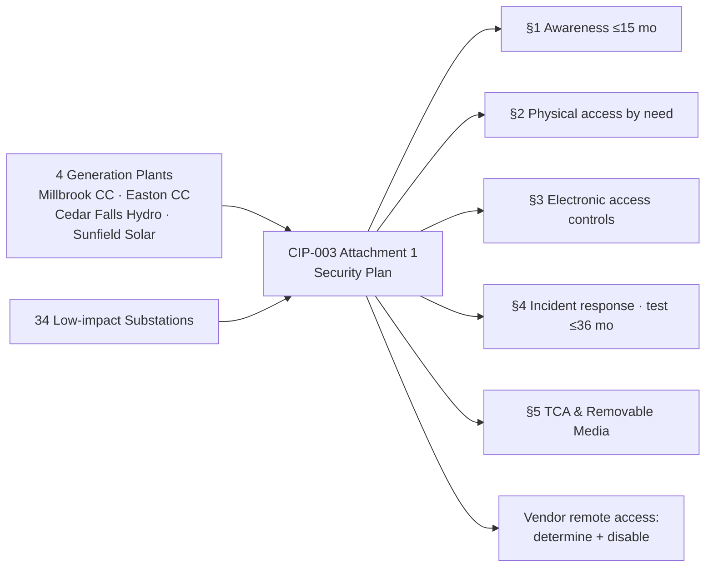

# 03.02 — Low-Impact BES Cyber System Security Plan (CIP-003 Attachment 1)

| Field | Value |
|---|---|
| Document ID | CIP-03.02 |
| Version | 1.0 |
| Date | 2026-03-02 |
| Classification | BES Cyber System Information (BCSI) // Illustrative Portfolio Sample |
| Owner | Marcus Bell (OT / ICS Security Lead) |
| Author | Advisory Team |
| Status | Approved |

## Purpose

This document is GridPoint Energy, Inc.'s **Low-impact BES Cyber System Security Plan**, satisfying **CIP-003-8 Requirement R2 and Attachment 1**. It defines the security controls applied to assets containing **Low-impact BES Cyber Systems** — GridPoint's **4 generation plants** (Millbrook CC, Easton CC, Cedar Falls Hydro, Sunfield Solar) and **34 Low-impact substations** — across the five Attachment 1 subject-matter sections plus **vendor electronic remote access** controls. Documenting the awareness and electronic-access sections **closes GAP-22 and GAP-30** from the Phase-02 gap register. Low-impact assets are **not** subject to the full CIP-004 through CIP-011 requirement set; Attachment 1 is the complete control obligation for them.

## Applicability

| Attribute | Value |
|---|---|
| Standard | CIP-003-8 R2, Attachment 1 |
| In-scope assets | 4 generation plants + 34 Low-impact substations |
| Low BES Cyber Systems | 38 (4 at plants + 34 at substations) |
| Formal ESP / PSP required? | **No** — Attachment 1 controls only (no CIP-005 ESP, no CIP-006 PSP) |
| CIP-004 PRA / training required? | **No** for Low-impact-only personnel (Attachment 1 awareness applies) |
| Reference standard | CIP-003-8 |

> Low-impact does **not** mean out of scope. The 2 distribution-only substations that contain **no** BES Cyber Systems are out of CIP scope; the 34 Low substations and 4 plants are fully in scope for Attachment 1.

## The Five Required Attachment 1 Sections (plus vendor remote access)

| § | Attachment 1 Section | GridPoint Control Summary | Responsible |
|---|---|---|---|
| 1 | **Cyber Security Awareness** | Reinforce cyber security practices at least once every **15 calendar months** for personnel with electronic/physical access to Low-impact assets | Karen Whitfield |
| 2 | **Physical Security Controls** | Control physical access to (a) the Low-impact BES Cyber Systems and (b) the Low-impact BCS Electronic Access Points, based on need — locks, controlled entry, monitoring at plants and substation control houses | Frank Delgado |
| 3 | **Electronic Access Controls** | Permit only **necessary inbound and outbound routable-protocol** electronic access; control Dial-up Connectivity where present, at each asset with such connectivity | Priya Nair |
| 4 | **Cyber Security Incident Response** | Plan to identify, classify, respond to, and report Cyber Security Incidents; test the plan at least every **36 calendar months**; update as needed | Marcus Bell |
| 5 | **Transient Cyber Assets & Removable Media** | Mitigate the risk of malicious code introduced via **Transient Cyber Assets (TCA)** and **Removable Media** — managed/on-demand methods for TCA; malicious-code mitigation for Removable Media | Marcus Bell |
| + | **Vendor Electronic Remote Access** | Have methods to (a) determine active vendor remote access sessions, and (b) disable such access, for Low-impact assets that permit vendor electronic remote access | Priya Nair |

> **GAP-22 (awareness) and GAP-30 (electronic access controls)** were closed by documenting Sections 1 and 3 of this plan and mapping them to the 4 plants and 34 substations with dated evidence.

### Section 1 — Cyber Security Awareness

Personnel with authorized electronic or authorized unescorted physical access to Low-impact assets receive reinforcement of cyber security practices **at least once every 15 calendar months**. Methods include briefings, email bulletins, and posted materials at plant and substation locations. (Note: this 15-month Low-impact cadence is distinct from the **quarterly** CIP-004 R1 awareness reinforcement that applies to Medium-impact personnel — see 03.04.)

### Section 2 — Physical Security Controls

GridPoint controls physical access based on need to the Low-impact BES Cyber Systems and their Low-impact BCS Electronic Access Points. Controls include keyed/badge locks on control houses and plant control rooms, perimeter fencing, and access logging where feasible. Full CIP-006 PSP controls are **not** required for Low-impact assets.

### Section 3 — Electronic Access Controls

For each Low-impact asset, GridPoint permits only **necessary inbound and outbound electronic access** for communication using a routable protocol when entering or leaving the asset, and controls **Dial-up Connectivity** (where it exists) via authentication. This is an access-control obligation, not a formal Electronic Security Perimeter.

### Section 4 — Cyber Security Incident Response

A Cyber Security Incident response plan for Low-impact assets addresses identification, classification, response, and the CIP-008 reporting obligation (including **Reportable Cyber Security Incidents** to the E-ISAC). The plan is **tested at least once every 36 calendar months** and updated as roles or infrastructure change.

### Section 5 — Transient Cyber Assets & Removable Media

Malicious-code risk from **TCA** (e.g., maintenance laptops, engineering devices) is mitigated using managed and/or on-demand methods (antivirus, application whitelisting, or manual review) prior to connection. **Removable Media** malicious-code mitigation is applied before use on Low-impact BES Cyber Systems.

### Vendor Electronic Remote Access (CIP-003-8 addition)

Where a Low-impact asset permits vendor electronic remote access, GridPoint maintains one or more methods to **determine active vendor remote-access sessions** and to **disable** those sessions. This addresses supply-chain remote-access risk for the 18 authorized vendors/contractors that may touch Low-impact assets.

## Control-to-Asset Coverage

## Roles & Responsibilities

| Role | Person | Attachment 1 Responsibility |
|---|---|---|
| CIP Senior Manager | Daniel Reyes | Approves the plan; single accountable authority |
| OT / ICS Security Lead | Marcus Bell | Owns the plan; TCA/Removable Media & incident response |
| IT Security Manager | Priya Nair | Electronic access & vendor remote-access methods |
| Physical Security Manager | Frank Delgado | Physical access controls at plants/substations |
| NERC Compliance Manager | Karen Whitfield | Awareness delivery & evidence retention |
| Substation & Field Engineering Lead | Elena Ruiz | Field implementation validation |

## Distinctions from Medium-Impact Controls

To keep the program defensible, GridPoint documents where the Low-impact obligation intentionally differs from the Medium-impact control set:

| Control Area | Low-impact (Attachment 1) | Medium-impact (full CIP) |
|---|---|---|
| Awareness | Reinforce ≤ 15 months | CIP-004 R1 — each quarter |
| Personnel Risk Assessment | Not required | CIP-004 R3 — before access + 7 yrs |
| Training | Not required (awareness only) | CIP-004 R2 — before access + 15 months |
| Electronic boundary | Access controls, no formal ESP | CIP-005 ESP + Intermediate System / IRA |
| Physical boundary | Access controls by need, no formal PSP | CIP-006 PSP with monitoring |
| Incident response test | ≤ 36 months | CIP-008 program |

Applying only the Attachment 1 controls to Low-impact assets — and not over-applying Medium controls — is a deliberate, documented scoping decision that keeps the program proportionate and audit-defensible.

## Review Cadence

The Low-impact security plan is reviewed and approved by the **CIP Senior Manager** on the CIP-003 **15-calendar-month** cadence and revised on event-driven triggers (new Low asset energized, vendor-access change, incident lesson-learned). Evidence is retained under the Document & Evidence Management Plan and presented via the **CIP-003 RSAW**.

## Cross-References

- `03.01-cyber-security-policy-suite.md` — parent policy (topic mapping, R1.2)
- `../02-bes-cyber-system-categorization/02.06-high-medium-low-categorization-list.md` — Low-impact asset list
- `../02-bes-cyber-system-categorization/02.12-gap-register-and-risk-ranking.md` — GAP-22, GAP-30 origin
- `03.04-security-awareness-program.md` — Medium-impact quarterly awareness (contrast)
- `03.12-procedures-index.md` — TCA / Removable Media procedures

---

[⬅ Previous](03.01-cyber-security-policy-suite.md) · [🏠 Phase README](03.00-README.md) · [Next ➡](03.03-personnel-and-training-program-overview.md)
