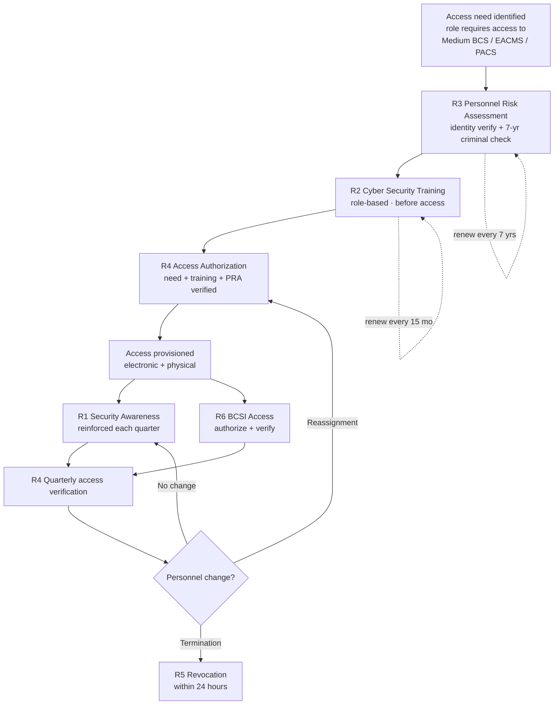

# 03.03 — Personnel & Training Program Overview (CIP-004)

| Field | Value |
|---|---|
| Document ID | CIP-03.03 |
| Version | 1.0 |
| Date | 2026-03-02 |
| Classification | BES Cyber System Information (BCSI) // Illustrative Portfolio Sample |
| Owner | Karen Whitfield (NERC Compliance Manager) |
| Author | Advisory Team |
| Status | Approved |

## Purpose

This document provides the program-level overview of GridPoint Energy, Inc.'s **CIP-004-7 Personnel & Training** program. It shows how Requirements **R1 through R6** fit together as a single access-governance lifecycle — from awareness and training, through personnel risk assessment and access authorization, to access revocation and BCSI access management. It establishes the in-scope population — **142 personnel** and **18 vendors/contractors** with authorized access to Medium-impact BES Cyber Systems — and orients the detailed implementing documents (03.04–03.09) that follow. CIP-004 controls apply to Medium-impact BES Cyber Systems and their associated **EACMS and PACS**; Low-impact personnel are governed instead by the Attachment 1 awareness control in 03.02.

## CIP-004-7 Requirements at a Glance

| Req | Title | Core Obligation | Cadence | Implementing Doc |
|---|---|---|---|---|
| **R1** | Security Awareness Program | Reinforce cyber security practices | Each calendar **quarter** | 03.04 |
| **R2** | Cyber Security Training Program | Role-based training, nine content topics | **Before access** + every **15 months** | 03.05 |
| **R3** | Personnel Risk Assessment | Identity verification + 7-year criminal history check | Before access + every **7 years** | 03.06 |
| **R4** | Access Management Program | Authorize on need + training + PRA; verify | Authorize on grant; verify **quarterly** | 03.07 |
| **R5** | Access Revocation | Remove ability to access on termination | Within **24 hours** of termination | 03.08 |
| **R6** | BCSI Access Management | Authorize & verify access to BCSI | Authorize on grant; verify quarterly | 03.09 |

## In-Scope Population

| Population | Count | Scope Basis |
|---|---|---|
| GridPoint personnel with authorized electronic/physical access to Medium BES Cyber Systems | **142** | CIP-004-7 R2–R6 |
| Vendors / contractors with authorized access | **18** | CIP-004-7 R2–R6 |
| **Total access-holding population** | **160** | — |
| Training completion at Phase-03 close | **100%** | R2 |
| PRAs current (personnel + vendors) | **142 + 18 = 160** | R3 |
| Quarterly access reviews | Instituted | R4 |

The population is scoped to individuals granted authorized electronic access **or** authorized unescorted physical access to Medium-impact BES Cyber Systems, or access to their associated EACMS/PACS. Personnel touching only Low-impact assets are excluded from the CIP-004 R2/R3 obligations but receive Attachment 1 awareness.

## How the Pieces Fit — Access Lifecycle

The lifecycle enforces a strict **prerequisite chain**: no individual is authorized under R4 until the **PRA (R3)** is complete and **training (R2)** has been finished — both **before** access is granted. Once provisioned, R1 awareness and R4/R6 quarterly verification keep the population current, and R5 removes access promptly when someone leaves or changes roles.

## Program Ownership

| Role | Person | Program Responsibility |
|---|---|---|
| CIP Senior Manager | Daniel Reyes | Accountable authority; approves the program |
| NERC Compliance Manager | Karen Whitfield | Owns CIP-004 program & evidence |
| HR / PRA Coordinator | Sandra Lee | Runs PRAs (R3) and renewal tracking |
| OT / ICS Security Lead | Marcus Bell | Role-based OT training content; OT access |
| IT Security Manager | Priya Nair | Access provisioning/deprovisioning; BCSI access |
| Physical Security Manager | Frank Delgado | Unescorted physical access authorization (PACS) |

## Gaps Addressed in the Personnel Program

Phase 03 closes several Phase-02 gaps through the CIP-004 program: **GAP-05** (access authorization/revocation records — R4/R5), **GAP-11** (dispersed training records — R2), **GAP-20** (manual PRA renewal tracking — R3), and **GAP-26** (revocation timing evidence — R5). Each closure is detailed in the corresponding implementing document.

## Scope Boundary — What CIP-004 Does and Does Not Cover

| Attribute | Value |
|---|---|
| Applies to | Personnel with authorized access to **Medium** BES Cyber Systems + associated **EACMS / PACS** |
| Does not apply to | Low-impact-only personnel (governed by CIP-003 Att.1 awareness — 03.02) |
| Access types governed | Authorized electronic access; authorized unescorted physical access; BCSI access |
| Standard | CIP-004-7 |
| Population | 142 personnel + 18 vendors = 160 |

CIP-004 is fundamentally an **access-governance** standard: it ensures that the people who can reach GridPoint's most critical cyber systems are trained, vetted, deliberately authorized, promptly de-authorized, and continually reinforced. Every requirement exists to reduce insider and third-party risk to the Medium-impact BES Cyber Systems that carry GridPoint's TOP/GOP reliability functions.

## Program Metrics

The program is measured against a small set of audit-relevant indicators, reported to the CIP Senior Manager:

| Metric | Target | Phase-03 Result |
|---|---|---|
| Training completion (R2) | 100% | 100% (160/160) |
| PRAs current (R3) | 100% | 100% (160/160) |
| Quarterly awareness delivered (R1) | Every quarter | Instituted |
| Quarterly access verification (R4) | Every quarter | Instituted |
| Revocation within 24 hours (R5) | 100% | Process in place |

## Evidence Model

The program produces an integrated evidence set: the awareness delivery log (R1), the training completion register showing 100% (R2), the PRA register with completion and renewal dates (R3), the access authorization matrix and quarterly verification records (R4), the revocation action log with timestamps (R5), and the BCSI access list with quarterly verification (R6). All are retained under `../01-program-foundation/01.13-document-and-evidence-management-plan.md` and presented via the **CIP-004 RSAW** at the 2027-Q2 RF audit.

## Cross-References

- `03.04-security-awareness-program.md` — R1 detail
- `03.05-cyber-security-training-program.md` — R2 detail
- `03.06-personnel-risk-assessment-program.md` — R3 detail
- `03.07-access-authorization-program.md` — R4 detail
- `03.08-access-revocation-program.md` — R5 detail
- `03.09-bcsi-access-management.md` — R6 detail
- `03.10-roles-and-training-matrix.md` — role-to-training mapping

---

[⬅ Previous](03.02-low-impact-security-plan.md) · [🏠 Phase README](03.00-README.md) · [Next ➡](03.04-security-awareness-program.md)
