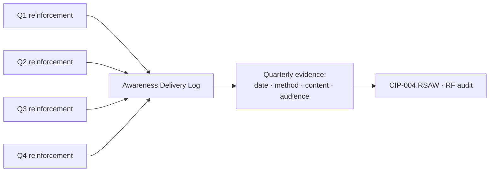

# 03.04 — Security Awareness Program (CIP-004 R1)

| Field | Value |
|---|---|
| Document ID | CIP-03.04 |
| Version | 1.0 |
| Date | 2026-03-02 |
| Classification | BES Cyber System Information (BCSI) // Illustrative Portfolio Sample |
| Owner | Karen Whitfield (NERC Compliance Manager) |
| Author | Advisory Team |
| Status | Approved |

## Purpose

This document defines GridPoint Energy, Inc.'s **Security Awareness Program**, satisfying **CIP-004-7 Requirement R1**. It establishes the ongoing **quarterly reinforcement** of cyber security practices for personnel with authorized electronic or authorized unescorted physical access to Medium-impact BES Cyber Systems and their associated EACMS/PACS, the delivery methods, the topic set, and the records that evidence compliance. Awareness under R1 is distinct from role-based **training** under R2 (03.05): awareness is a continual reinforcement, not a graded, before-access curriculum.

## Regulatory Basis — CIP-004-7 R1

CIP-004-7 R1 requires the Responsible Entity to implement one or more documented processes that **reinforce cyber security practices** (which may include associated physical security practices) **at least once each calendar quarter**. Key characteristics:

| Attribute | CIP-004-7 R1 Requirement |
|---|---|
| Frequency | At least once **each calendar quarter** |
| Population | Personnel with authorized electronic/unescorted physical access to Medium BCS + associated EACMS/PACS |
| Nature | Reinforcement (not testing); no completion-grading obligation |
| Evidence | Records that reinforcement occurred each quarter |

> The R1 **quarterly** cadence for Medium-impact personnel is separate from — and more frequent than — the CIP-003 Attachment 1 Low-impact awareness cadence of **once every 15 calendar months** (see 03.02).

## Quarterly Reinforcement Cadence

GridPoint delivers at least one awareness reinforcement in **every calendar quarter** (Q1: Jan–Mar, Q2: Apr–Jun, Q3: Jul–Sep, Q4: Oct–Dec). A quarter is satisfied by at least one documented delivery reaching the in-scope population; multiple deliveries per quarter are common but only one is required.

| Quarter | Planned Reinforcement | Primary Method |
|---|---|---|
| Q1 | Phishing & credential hygiene refresher | Email bulletin + intranet |
| Q2 | Physical security & tailgating; visitor control | Briefing + posters |
| Q3 | Removable media, TCA, and vendor remote access | Email bulletin + toolbox talk |
| Q4 | Incident recognition & reporting; annual recap | Live briefing + intranet |

## Delivery Methods

CIP-004-7 R1 does not prescribe a method; GridPoint uses a layered mix so reinforcement reaches control-center staff, substation/field engineers, and IT/OT administrators alike:

| Method | Description | Audience Reach |
|---|---|---|
| Email security bulletins | Short targeted messages from the Compliance/OT security team | All in-scope personnel |
| Intranet awareness portal | Standing content, posted advisories, current-threat notices | All personnel |
| Live / virtual briefings | Facilitated sessions, quarterly all-hands security segment | Control center & field |
| Posters & signage | Physical reminders at PSPs, control rooms, plant entries | On-site personnel |
| Toolbox talks | Short pre-shift briefings for field crews | Substation/field |

## Topic Set

Awareness content reinforces practices aligned to the CIP control families and current threat conditions, including:

- Recognizing and reporting **phishing** and social engineering
- **Password / credential** hygiene and multi-factor authentication
- **Physical security**: badge use, tailgating, escorting visitors, PSP discipline
- **Removable Media and Transient Cyber Assets** handling and malicious-code risk
- **Vendor remote access** awareness and session discipline
- **BCSI** handling, labeling, and protection
- **Incident recognition** and the initial notification path (CIP-008)
- Current threat intelligence and lessons learned from incidents/exercises

## Records & Evidence

For each quarter, GridPoint retains: the **date** of reinforcement, the **method(s)** used, the **content** delivered (copy of the bulletin, briefing deck, or poster), and the **audience/distribution** record. These entries populate the Awareness Delivery Log, demonstrating that at least one reinforcement occurred in every calendar quarter with no gap. Records are retained under `../01-program-foundation/01.13-document-and-evidence-management-plan.md`.

## Awareness vs. Training — Program Distinction

CIP-004 deliberately separates the two personnel-preparedness controls. Documenting the distinction prevents the common audit finding of conflating the two:

| Attribute | R1 Awareness (this doc) | R2 Training (03.05) |
|---|---|---|
| Purpose | Reinforce good practices | Impart required competencies |
| Cadence | Each calendar **quarter** | Before access + every **15 months** |
| Graded / completion-tracked? | No (reinforcement) | Yes (100% completion) |
| Prerequisite to access? | No | **Yes** |
| Content | Current threats, reminders | Nine R2.1 content topics |

## Coverage Assurance

The awareness population aligns to the CIP-004 in-scope group of **142 personnel + 18 vendors**. Distribution lists are reconciled against the access authorization matrix (03.07) each quarter so that new authorizations are added to awareness distribution and departures are removed, ensuring reinforcement reaches exactly the current access-holding population with no gaps.

## Roles & Responsibilities

| Role | Person | R1 Responsibility |
|---|---|---|
| NERC Compliance Manager | Karen Whitfield | Owns the program; schedules & logs quarterly delivery |
| OT / ICS Security Lead | Marcus Bell | Provides OT-specific threat content |
| IT Security Manager | Priya Nair | Provides IT/phishing content; portal maintenance |
| Physical Security Manager | Frank Delgado | Physical-security reinforcement content |
| CIP Senior Manager | Daniel Reyes | Accountable authority |

## Cross-References

- `03.03-personnel-and-training-program-overview.md` — CIP-004 program context
- `03.05-cyber-security-training-program.md` — R2 role-based training (contrast)
- `03.02-low-impact-security-plan.md` — Low-impact awareness (15-month cadence)
- `../01-program-foundation/01.13-document-and-evidence-management-plan.md` — evidence retention

---

[⬅ Previous](03.03-personnel-and-training-program-overview.md) · [🏠 Phase README](03.00-README.md) · [Next ➡](03.05-cyber-security-training-program.md)
