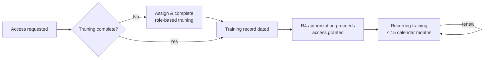

# 03.05 — Cyber Security Training Program (CIP-004 R2)

| Field | Value |
|---|---|
| Document ID | CIP-03.05 |
| Version | 1.0 |
| Date | 2026-03-02 |
| Classification | BES Cyber System Information (BCSI) // Illustrative Portfolio Sample |
| Owner | Karen Whitfield (NERC Compliance Manager) |
| Author | Advisory Team |
| Status | Approved |

## Purpose

This document defines GridPoint Energy, Inc.'s **role-based Cyber Security Training Program**, satisfying **CIP-004-7 Requirement R2**. It establishes that in-scope personnel complete training **before being granted authorized access** to Medium-impact BES Cyber Systems (and associated EACMS/PACS) and thereafter **at least once every 15 calendar months**, defines the required content topics and how they are tailored by role, and describes completion tracking that reached **100%** of the in-scope population at Phase-03 close. Consolidating previously dispersed training records into a single tracked register **closes GAP-11**.

## Regulatory Basis — CIP-004-7 R2

CIP-004-7 R2 requires a training program with content covering the topics in **R2.1**, delivered **prior to granting authorized electronic access or authorized unescorted physical access** (except during CIP Exceptional Circumstances) per **R2.2**, and completed **at least once every 15 calendar months** per **R2.3**.

| Part | Obligation |
|---|---|
| R2.1 | Training content covering the nine required topics (below) |
| R2.2 | Complete training **before** access is granted (CEC exception) |
| R2.3 | Complete training at least once every **15 calendar months** |

## The Nine Required Training Content Topics (R2.1)

| # | R2.1 Content Topic |
|---|---|
| 1 | Cyber security policies |
| 2 | Physical access controls |
| 3 | Electronic access controls |
| 4 | The visitor control program |
| 5 | Handling of BES Cyber System Information and its storage |
| 6 | Identification of a Cyber Security Incident and initial notifications |
| 7 | Recovery plans for BES Cyber Systems |
| 8 | Response to Cyber Security Incidents |
| 9 | Cyber security risks associated with a BES Cyber System's electronic interconnectivity and interoperability with other Cyber Assets, including Transient Cyber Assets, and with Removable Media |

## Before-Access + 15-Month Cycle

No individual is granted authorized access until their role-based training is complete and recorded — training is a **prerequisite** feeding the R4 authorization decision (03.07). Recurring training is completed on or before the **15-calendar-month** anniversary; the completion register drives reminders ahead of each due date.

## Content by Role

All roles receive the nine R2.1 topics; depth and emphasis are tailored to the access each role holds. This satisfies the "role-based" intent while ensuring full topic coverage.

| Role Group | Representative Personnel | Emphasis | Delivery |
|---|---|---|---|
| Control Center Operators | James Okafor's team | ESP/IRA, incident ID & response, recovery plans | Instructor-led + LMS |
| OT / ICS Administrators | Marcus Bell's team | System security mgmt, config change, TCA/Removable Media | Instructor-led + hands-on |
| IT Security / Access Admins | Priya Nair's team | Electronic access controls, BCSI handling, revocation | LMS + workshop |
| Substation & Field Engineers | Elena Ruiz's team | Physical access, visitor control, TCA discipline | Toolbox + LMS |
| Physical Security Staff | Frank Delgado's team | Physical access controls, visitor control program | Instructor-led |
| Vendors / Contractors (18) | Approved vendor staff | Full nine topics scoped to access granted | LMS / proctored |

## Completion Tracking — 100%

GridPoint tracks training in a single **training completion register** (the GAP-11 remediation), replacing the previously dispersed spreadsheets and email confirmations. Each record captures the individual, role, course, completion date, and next-due date (completion + 15 months).

| Population | In Scope | Completed | Completion Rate |
|---|---|---|---|
| GridPoint personnel | 142 | 142 | **100%** |
| Vendors / contractors | 18 | 18 | **100%** |
| **Total** | **160** | **160** | **100%** |

> **GAP-11 closure:** Training records were consolidated into one authoritative register with automated due-date tracking, eliminating the dispersed-records finding and enabling reliable RSAW evidence production.

## CIP Exceptional Circumstance Handling

CIP-004-7 R2.2 permits completion of training after access is granted **only** during a declared **CIP Exceptional Circumstance** (per policy topic 9, see 03.01). When invoked, GridPoint documents the declaration, grants time-limited access, completes training as soon as practicable, and records the return to normal compliance. Absent a declared CEC, the before-access rule is absolute.

## Content Maintenance

Training content is reviewed at least annually and whenever a referenced standard changes, an incident lesson-learned warrants it, or the asset baseline shifts (e.g., a new substation or the Sunfield Solar site entering Medium/Low scope). Content changes are versioned; personnel are not required to re-train mid-cycle for minor content updates unless the change is material to their role's obligations.

## Records & Evidence

Retained evidence includes: the training curriculum mapped to the nine R2.1 topics, the completion register (individual, date, next-due), before-access completion proof tied to each R4 authorization, and any CIP Exceptional Circumstance deviations with return-to-compliance records. Retained under `../01-program-foundation/01.13-document-and-evidence-management-plan.md` and presented via the **CIP-004 RSAW**.

## Roles & Responsibilities

| Role | Person | R2 Responsibility |
|---|---|---|
| NERC Compliance Manager | Karen Whitfield | Owns the program; maintains completion register |
| OT / ICS Security Lead | Marcus Bell | Authors OT-specific content |
| IT Security Manager | Priya Nair | Authors electronic-access/BCSI content; LMS admin |
| Role managers | Okafor / Ruiz / Delgado | Ensure staff complete before access & on cycle |
| CIP Senior Manager | Daniel Reyes | Accountable authority |

## Cross-References

- `03.03-personnel-and-training-program-overview.md` — CIP-004 program context
- `03.06-personnel-risk-assessment-program.md` — R3 PRA (co-prerequisite to access)
- `03.07-access-authorization-program.md` — R4 authorization consuming training status
- `03.10-roles-and-training-matrix.md` — full role-to-training matrix
- `../02-bes-cyber-system-categorization/02.12-gap-register-and-risk-ranking.md` — GAP-11 origin

---

[⬅ Previous](03.04-security-awareness-program.md) · [🏠 Phase README](03.00-README.md) · [Next ➡](03.06-personnel-risk-assessment-program.md)
