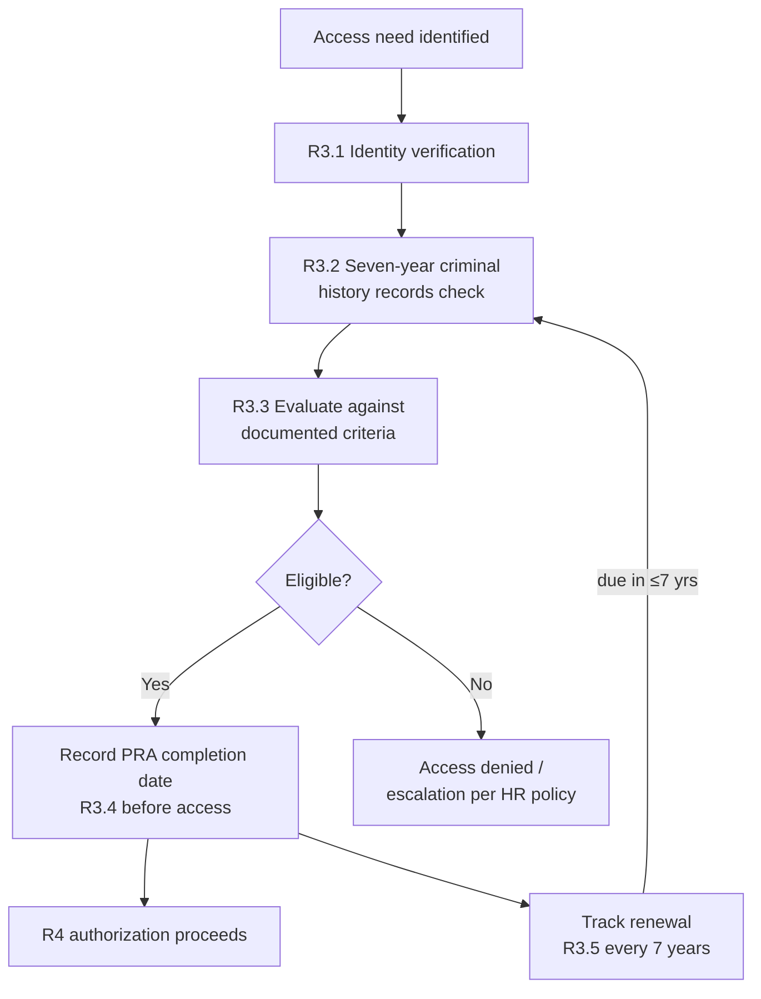

# 03.06 — Personnel Risk Assessment Program (CIP-004 R3)

| Field | Value |
|---|---|
| Document ID | CIP-03.06 |
| Version | 1.0 |
| Date | 2026-03-02 |
| Classification | BES Cyber System Information (BCSI) // Illustrative Portfolio Sample |
| Owner | Sandra Lee (HR / PRA Coordinator) |
| Author | Advisory Team |
| Status | Approved |

## Purpose

This document defines GridPoint Energy, Inc.'s **Personnel Risk Assessment (PRA) Program**, satisfying **CIP-004-7 Requirement R3**. It establishes the two mandatory PRA components — **identity verification** and a **seven-year criminal history records check** — the requirement to complete a PRA **before granting authorized access** and to renew it **at least once every seven years**, the documented criteria used to evaluate results, and the tracking register that maintains current PRAs for all **142 personnel and 18 vendors/contractors**. Replacing manual renewal tracking with a managed register **closes GAP-20**.

## Regulatory Basis — CIP-004-7 R3

| Part | Obligation |
|---|---|
| R3.1 | Process to confirm **identity** |
| R3.2 | Process to perform a **seven-year criminal history records check** (per residence, or as available by jurisdiction) |
| R3.3 | Documented **criteria or process to evaluate** the results of the PRA |
| R3.4 | Complete the PRA **before** granting authorized access (CEC exception) |
| R3.5 | Ensure each individual has a **current PRA completed within the last seven years** |

## PRA Process

| Step | Activity | R3 Basis | Owner |
|---|---|---|---|
| 1 | Confirm identity (government ID / equivalent) | R3.1 | Sandra Lee |
| 2 | Perform seven-year criminal history records check for each location of residence, per jurisdiction availability | R3.2 | Sandra Lee (via screening vendor) |
| 3 | Evaluate results against documented criteria; render access-eligibility determination | R3.3 | Sandra Lee + hiring manager |
| 4 | Record PRA completion date; authorize access to proceed | R3.4 | Sandra Lee |
| 5 | Track renewal due date (completion + 7 years); re-run before expiry | R3.5 | Sandra Lee (register) |

## Before-Access + Seven-Year Renewal

A PRA is completed and evaluated **before** any individual is granted authorized electronic access or authorized unescorted physical access to Medium-impact BES Cyber Systems (and associated EACMS/PACS). Thereafter, each individual must have a PRA completed **within the previous seven calendar years**; the register drives re-screening ahead of the seven-year anniversary so no access-holder lapses. Vendors and contractors are held to the same standard, verified either directly or via attestation of an equivalent vendor program meeting R3.1–R3.3.

## Evaluation Criteria (R3.3)

GridPoint applies a **documented, consistent** set of criteria to evaluate criminal history results — assessing the nature, number, and recency of any findings against the sensitivity of the access requested — rather than an automatic bar. The criteria and the evaluation are recorded so the determination is defensible and non-discriminatory. Adverse-result handling follows HR policy and applicable law.

## Tracking Register — GAP-20 Closure

| Population | PRA Current | Renewal Tracked |
|---|---|---|
| GridPoint personnel | 142 / 142 | Yes — 7-year cycle |
| Vendors / contractors | 18 / 18 | Yes — 7-year cycle |
| **Total** | **160 / 160** | **Managed register** |

> **GAP-20 closure:** PRA renewal tracking was previously manual and error-prone. GridPoint implemented a **PRA tracking register** capturing each individual's identity-verification date, criminal-check completion date, evaluation determination, and seven-year renewal due date — with automated reminders — closing GAP-20 and ensuring every access-holder has a current PRA.

## Vendor & Contractor PRAs

The 18 authorized vendors/contractors are held to an equivalent PRA standard. GridPoint either (a) performs the PRA directly, or (b) accepts a written attestation that the vendor's own program performs identity verification and a seven-year criminal history records check meeting R3.1–R3.3, with the attestation and completion dates recorded in the tracking register. Either path must be current (≤ 7 years) before vendor access is authorized under R4 (03.07).

## Privacy & Data Handling

PRA inputs contain sensitive personal information and are handled under GridPoint's HR privacy controls and applicable law. Only the **minimum CIP-relevant metadata** — completion dates, evaluation determination, and renewal due date — is surfaced for compliance evidence; underlying criminal-history detail is retained by HR/the screening vendor under restricted access. This separation lets GridPoint demonstrate R3 compliance to RF without exposing protected personnel data.

## CIP Exceptional Circumstance Handling

As with training, R3.4's before-access rule may be deferred **only** during a declared CIP Exceptional Circumstance (policy topic 9). Any such deferral is documented, the PRA is completed as soon as practicable, and the return to compliance is recorded.

## Records & Evidence

Retained evidence (protected as sensitive personnel data) includes: identity-verification confirmation, criminal-history-check completion records, the documented evaluation criteria and per-individual determination, before-access completion proof linked to each R4 authorization, and the renewal register. PRA content is handled per privacy/HR controls; only completion status and dates are surfaced for CIP evidence. Retained under `../01-program-foundation/01.13-document-and-evidence-management-plan.md` and presented via the **CIP-004 RSAW**.

## Interface with Access Authorization (R4)

The PRA is one of the two before-access prerequisites (the other is R2 training). The PRA register feeds a **current/expired** status into the R4 authorization decision (03.07): access is not authorized while a PRA is missing or lapsed, and an approaching seven-year renewal date triggers re-screening before expiry so no access-holder's authorization is undermined by a stale PRA.

## Program Assurance

| Assurance Control | Description |
|---|---|
| No-lapse tracking | Register reminders fire ahead of each 7-year due date |
| Prerequisite enforcement | R4 blocks authorization without a current PRA |
| Consistent evaluation | Documented R3.3 criteria applied uniformly |
| Vendor parity | 18 vendors held to equivalent standard |
| Evidence separation | CIP metadata surfaced; source data restricted |

## Roles & Responsibilities

| Role | Person | R3 Responsibility |
|---|---|---|
| HR / PRA Coordinator | Sandra Lee | Owns and runs the PRA process & register |
| Hiring / role managers | Okafor / Ruiz / Bell / Nair | Confirm need; support evaluation |
| NERC Compliance Manager | Karen Whitfield | Program oversight; evidence integration |
| CIP Senior Manager | Daniel Reyes | Accountable authority |

## Cross-References

- `03.03-personnel-and-training-program-overview.md` — CIP-004 program context
- `03.05-cyber-security-training-program.md` — R2 training (co-prerequisite to access)
- `03.07-access-authorization-program.md` — R4 authorization consuming PRA status
- `../02-bes-cyber-system-categorization/02.12-gap-register-and-risk-ranking.md` — GAP-20 origin
- `../01-program-foundation/01.13-document-and-evidence-management-plan.md` — evidence retention

---

[⬅ Previous](03.05-cyber-security-training-program.md) · [🏠 Phase README](03.00-README.md) · [Next ➡](03.07-access-authorization-program.md)
