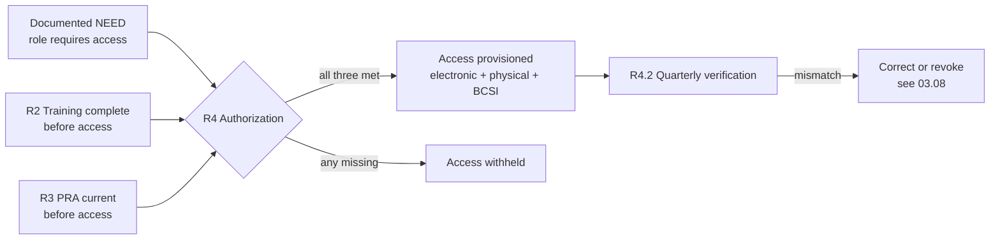

# 03.07 — Access Authorization Program (CIP-004 R4)

| Field | Value |
|---|---|
| Document ID | CIP-03.07 |
| Version | 1.0 |
| Date | 2026-03-02 |
| Classification | BES Cyber System Information (BCSI) // Illustrative Portfolio Sample |
| Owner | Marcus Bell (OT / ICS Security Lead) |
| Author | Advisory Team |
| Status | Approved |

## Purpose

This document defines GridPoint Energy, Inc.'s **Access Management Program**, satisfying **CIP-004-7 Requirement R4**. It establishes how authorized electronic access and authorized unescorted physical access to Medium-impact BES Cyber Systems (and associated **EACMS/PACS**) are granted **based on need and only after training (R2) and PRA (R3) are complete**, how privileges are verified **quarterly**, and how the authorization matrix records who is authorized to what. Together with the revocation program (03.08), this closes the authorization portion of **GAP-05**.

## Regulatory Basis — CIP-004-7 R4

| Part | Obligation |
|---|---|
| R4.1 | Authorize access based on **need**, as determined by the Responsible Entity — for (i) electronic access, (ii) unescorted physical access, and (iii) BCSI access |
| R4.2 | Verify **at least once each calendar quarter** that access privileges are correct and correspond to need |
| R4.3 | Verify **at least once each calendar quarter** that access to designated BCSI storage locations is correct (see also 03.09 / R6) |
| R4.4 | Verify at least once every 15 calendar months that **user accounts, group accounts, and privileges** are authorized and correspond to need |

## Authorization Prerequisites

Access is authorized only when **all three prerequisites** are satisfied, enforcing the R2/R3 → R4 chain:

| Prerequisite | Source | Gate |
|---|---|---|
| **Need** | Role definition / manager request | R4.1 |
| **Training** | Completion register (100%) | R2 → R4 |
| **PRA** | PRA register (current, ≤7 yrs) | R3 → R4 |

No access is granted if any prerequisite is unmet (except during a declared CIP Exceptional Circumstance, documented per policy topic 9).

## The Authorization Matrix

GridPoint maintains an **access authorization matrix** mapping each authorized individual to the specific access they hold, the basis of need, and the approving authority. It is the authoritative record verified each quarter.

| Access Type | Scope | Approving Authority | Provisioned By |
|---|---|---|---|
| Authorized electronic access | Medium BCS + associated EACMS | Marcus Bell (OT) / Priya Nair (IT) | IT/OT admins |
| Authorized unescorted physical access | PSPs at Control Centers & Medium substations (PACS) | Frank Delgado | Physical security |
| BCSI access | Designated BCSI repositories | Priya Nair | IT (see 03.09) |
| Vendor / contractor access (18) | Scoped to engagement need | Sponsoring manager + Marcus Bell | IT/OT admins |

Each matrix row records: individual, role, access granted, need basis, training/PRA status, authorization date, and approver. The matrix covers the full **160-person** population (142 personnel + 18 vendors).

## Quarterly Access Verification (R4.2 / R4.3)

Each calendar quarter, GridPoint verifies that:

- Every provisioned electronic and physical access privilege still corresponds to a documented need.
- No individual retains access beyond their role or after a change that should have removed it.
- BCSI access at designated storage locations remains correct (coordinated with 03.09 / R6).

| Verification | Frequency | Owner | Output |
|---|---|---|---|
| Electronic & physical privilege review | Each calendar **quarter** (R4.2) | Marcus Bell / Priya Nair | Signed quarterly review record |
| BCSI storage-location access review | Each calendar **quarter** (R4.3) | Priya Nair | BCSI access verification |
| Account & privilege authorization review | ≤ 15 calendar months (R4.4) | Priya Nair | Account authorization record |

Mismatches identified during verification are corrected immediately or routed to the revocation process (03.08). Quarterly reviews were **instituted** in Phase 03 as part of the program stand-up.

## GAP-05 (Authorization Portion) Closure

> **GAP-05 closure (authorization):** access authorization records were incomplete for recent staffing changes. GridPoint reconstructed and validated the authorization matrix for all 160 access-holders, tying each grant to need + training + PRA, and instituted quarterly verification. The **revocation** half of GAP-05 is closed in **03.08**.

## Interface with Revocation (R5)

Access authorization and revocation are two ends of the same lifecycle. A quarterly R4.2 verification that surfaces an individual whose need has ended — through termination, reassignment, or completion of a vendor engagement — triggers the R5 revocation process (03.08), which removes the ability to access within **24 hours** of a termination action. The authorization matrix and the revocation log are reconciled so that no privilege outlives its documented need.

## Least-Privilege and Need Basis

GridPoint grants the **minimum** access required for a role's documented need — separate electronic, physical, and BCSI grants are assessed independently rather than bundled. Shared and group accounts are minimized and, where used, individually authorized and reviewed under R4.4. This least-privilege posture limits the blast radius of a compromised or misused credential on the Medium-impact BES Cyber Systems.

## Records & Evidence

Retained evidence includes: the access authorization matrix with per-individual need/training/PRA basis and approval dates, the quarterly verification records (R4.2/R4.3), the ≤15-month account authorization review (R4.4), and correction/revocation actions arising from reviews. Retained under `../01-program-foundation/01.13-document-and-evidence-management-plan.md` and presented via the **CIP-004 RSAW**.

## Roles & Responsibilities

| Role | Person | R4 Responsibility |
|---|---|---|
| OT / ICS Security Lead | Marcus Bell | Owns access management; approves OT access |
| IT Security Manager | Priya Nair | Provisioning; account & BCSI verification |
| Physical Security Manager | Frank Delgado | Unescorted physical access authorization (PACS) |
| NERC Compliance Manager | Karen Whitfield | Program oversight; evidence integration |
| CIP Senior Manager | Daniel Reyes | Accountable authority |

## Cross-References

- `03.03-personnel-and-training-program-overview.md` — CIP-004 program context
- `03.05-cyber-security-training-program.md` — R2 training prerequisite
- `03.06-personnel-risk-assessment-program.md` — R3 PRA prerequisite
- `03.08-access-revocation-program.md` — R5 revocation (GAP-05 second half)
- `03.09-bcsi-access-management.md` — R6 BCSI access
- `../02-bes-cyber-system-categorization/02.12-gap-register-and-risk-ranking.md` — GAP-05 origin

---

[⬅ Previous](03.06-personnel-risk-assessment-program.md) · [🏠 Phase README](03.00-README.md) · [Next ➡](03.08-access-revocation-program.md)
