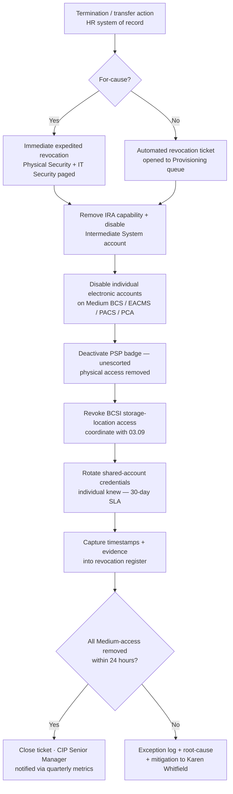

# 03.08 — Access Revocation Program (CIP-004 R5)

| Field | Value |
|---|---|
| Document ID | CIP-004-REVOKE-2026-008 |
| Version | 1.0 |
| Date | 2026-03-02 |
| Classification | BES Cyber System Information (BCSI) // Illustrative Portfolio Sample |
| Owner | Sandra Lee, HR / PRA Coordinator (with Priya Nair, IT Security Manager) |
| Author | Advisory Team (OT GRC / NERC CIP Advisory) |
| Status | Approved |

## Purpose

This document defines GridPoint Energy's **access revocation program** implementing **CIP-004-7 Requirement R5**. It specifies how, upon a termination action, GridPoint **removes an individual's ability for unescorted physical access and Interactive Remote Access to Medium-impact BES Cyber Systems within 24 hours**, and how BCSI access, shared-account credentials, and provisioned access are revoked and evidenced. Together with **03.07 — Access Authorization Program**, it closes **GAP-05 (High)** (CIP-004 R4/R5 authorization/revocation records incomplete) and closes **GAP-26 (Low)** (revocation-timing evidence).

## 1. Regulatory Basis — CIP-004-7 R5

| Part | Obligation | GridPoint Implementation |
|---|---|---|
| R5.1 | Process to initiate removal of an individual's ability for unescorted physical access and Interactive Remote Access upon a termination action, and complete removals within **24 hours** of the termination action | HR-triggered revocation workflow (Section 3); 24-hour clock starts at the termination action |
| R5.2 | Revoke authorized electronic access to individual accounts and unescorted physical access **by the end of the next calendar day** following the effective termination date | Provisioning team disables individual accounts and badges by end of next calendar day |
| R5.3 | For terminations, change or revoke **shared account** passwords the individual knew, within **30 calendar days** of the termination action | Shared-credential rotation task tracked to 30-day SLA (Section 4) |
| R5.4 | Revoke access to designated storage locations for **BCSI** (whether physical or electronic) within **30 calendar days** of the termination action | BCSI de-provisioning coordinated with 03.09 (BCSI Access Management) |
| R5.5 | For reassignments or transfers, revoke access no longer needed by **end of the next calendar day** following the change | Transfer path in the workflow (Section 3) |

**Scope note:** R5 timing obligations above apply to **Medium-impact BES Cyber Systems and their associated EACMS, PACS, and PCA**. Low-impact assets are governed by physical and electronic access controls under **CIP-003-8 Attachment 1** (see 03.02), not by the CIP-004 24-hour revocation clock.

## 2. Definitions & Trigger Events

| Trigger | Definition | Applicable Timing |
|---|---|---|
| Termination action | Voluntary/involuntary separation, retirement, or removal of an employee or contractor | R5.1 24-hour removal; R5.2 next-calendar-day account/badge revocation |
| For-cause termination | Separation involving disciplinary action or security concern | Expedited — target immediate revocation, not to exceed 24 hours |
| Reassignment / transfer | Role change removing the need for previously authorized access | R5.5 end of next calendar day |
| Contractor off-boarding | End of engagement for one of the **18** authorized vendors/contractors | Same 24-hour / next-calendar-day treatment as employees |
| Extended leave | Leave of absence per HR policy | Access suspension per internal policy (not a CIP R5 termination action) |

## 3. Revocation Workflow

## 4. Timing Table (Authoritative SLA Matrix)

| Action | CIP-004-7 Part | Regulatory Deadline | GridPoint Internal Target | Owner |
|---|---|---|---|---|
| Remove unescorted physical access & IRA (termination) | R5.1 | Within **24 hours** of termination action | ≤ 12 hours | Priya Nair / Frank Delgado |
| Revoke individual electronic accounts & physical access | R5.2 | By end of **next calendar day** | Same business day where feasible | Priya Nair |
| Change/revoke shared-account passwords known to individual | R5.3 | Within **30 calendar days** | ≤ 7 calendar days | Marcus Bell |
| Revoke BCSI storage-location access | R5.4 | Within **30 calendar days** | ≤ 7 calendar days | Marcus Bell (with 03.09) |
| Revoke access no longer needed (reassignment) | R5.5 | By end of **next calendar day** | Same business day | Priya Nair |

## 5. Roles & Responsibilities

| Role | Name | Responsibility in Revocation |
|---|---|---|
| HR / PRA Coordinator | Sandra Lee | Owns termination trigger; ensures HR system of record fires the revocation ticket at the termination action |
| IT Security Manager | Priya Nair | Disables individual electronic accounts; removes IRA/Intermediate System access; owns R5.1/R5.2 timing evidence |
| Physical Security Manager | Frank Delgado | Deactivates PSP badges; confirms unescorted physical access removed |
| OT / ICS Security Lead | Marcus Bell | Executes shared-credential rotation (R5.3) and BCSI de-provisioning (R5.4) on OT systems |
| NERC Compliance Manager | Karen Whitfield | Reviews revocation metrics; manages exceptions and root-cause; presents to CIP Senior Manager |
| CIP Senior Manager | Daniel Reyes | Accountable authority (CIP-003 R1); receives quarterly revocation performance metrics |

## 6. Evidence & Records

| Evidence Artifact | Demonstrates | Retention |
|---|---|---|
| Revocation ticket with timestamps (trigger → each removal) | R5.1/R5.2 24-hour and next-day timing | Audit cycle + 3 years |
| Badge deactivation log (PACS) | Unescorted physical access removed | Audit cycle + 3 years |
| Account-disable log (Active Directory / OT domain / EACMS) | Individual electronic access revoked | Audit cycle + 3 years |
| Shared-credential rotation record | R5.3 30-day shared-password change | Audit cycle + 3 years |
| BCSI access-removal confirmation | R5.4 BCSI storage-location revocation | Audit cycle + 3 years |
| Quarterly revocation-timeliness report | Program-level R5 performance to CIP Senior Manager | Program lifetime |

Evidence is filed to the central repository per **01.13 — Document & Evidence Management Plan** and mapped to the RSAW for CIP-004-7 R5.

## 7. Exceptions & CIP Exceptional Circumstances

Where a revocation cannot be completed within the required window (e.g., a system outage), an exception is logged with root cause and compensating measures, and reported to Karen Whitfield. Genuine **CIP Exceptional Circumstances** are declared and handled under the ninth policy of the CIP-003 suite (see 03.01); such circumstances do not waive R5 obligations but govern documented deviation and follow-up.

## 8. Gap Closure

| Gap | Description | Closure in this Program |
|---|---|---|
| GAP-05 (High) | CIP-004 R4/R5 access authorization/revocation records incomplete for recent staffing changes | Closed jointly with 03.07 — authorization records (R4) in 03.07; 24-hour revocation workflow + evidence (R5) here |
| GAP-26 (Low) | CIP-004 R5 revocation-timing evidence missing | Closed — timestamped revocation register and quarterly timeliness report established |

## Cross-References

| Reference | Purpose |
|---|---|
| [03.07 — Access Authorization Program](03.07-access-authorization-program.md) | CIP-004 R4 authorization; joint closure of GAP-05 |
| [03.09 — BCSI Access Management](03.09-bcsi-access-management.md) | R5.4 BCSI de-provisioning coordination |
| [03.06 — Personnel Risk Assessment Program](03.06-personnel-risk-assessment-program.md) | PRA lifecycle tied to access |
| [02.12 — Gap Register & Risk Ranking](../02-bes-cyber-system-categorization/02.12-gap-register-and-risk-ranking.md) | GAP-05 / GAP-26 source |
| [01.13 — Document & Evidence Management Plan](../01-program-foundation/01.13-document-and-evidence-management-plan.md) | Evidence retention standard |

---

[⬅ Previous](03.07-access-authorization-program.md) · [🏠 Phase README](03.00-README.md) · [Next ➡](03.09-bcsi-access-management.md)
