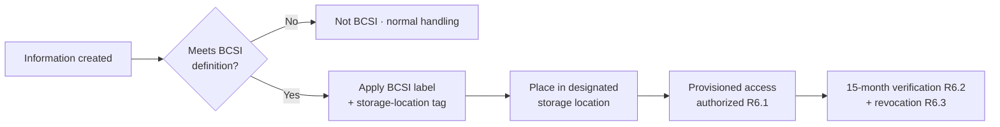

# 03.09 — BCSI Access Management (CIP-004 R6)

| Field | Value |
|---|---|
| Document ID | CIP-004-BCSI-2026-009 |
| Version | 1.0 |
| Date | 2026-03-02 |
| Classification | BES Cyber System Information (BCSI) // Illustrative Portfolio Sample |
| Owner | Marcus Bell, OT / ICS Security Lead (with Priya Nair, IT Security Manager) |
| Author | Advisory Team (OT GRC / NERC CIP Advisory) |
| Status | Approved |

## Purpose

This document establishes GridPoint Energy's program for **managing access to BES Cyber System Information (BCSI)** under **CIP-004-7 Requirement R6**. It defines how GridPoint **authorizes provisioned access to designated BCSI storage locations, verifies that access at least once every 15 calendar months, and revokes provisioned access** when no longer needed. It also introduces the **BCSI labeling standard** used across the program. This document **partially addresses GAP-29 (Low)** by standing up BCSI labeling and access controls; the full CIP-011-3 information-protection program (identification, handling, reuse, and disposal) is delivered in **Phase 04**.

## 1. Regulatory Basis — CIP-004-7 R6

CIP-004-7 R6 applies to **BCSI pertaining to Medium-impact BES Cyber Systems and their associated EACMS and PACS**. R6 focuses on *provisioned access* — the result of granting the ability to obtain and use BCSI at designated storage locations.

| Part | Obligation | GridPoint Implementation |
|---|---|---|
| R6.1 | Prior to provisioning, **authorize** (based on need) provisioned electronic and/or physical access to designated BCSI storage locations | Documented BCSI access authorization record per individual and storage location (Section 4) |
| R6.2 | **Verify** at least once every **15 calendar months** that all individuals with provisioned access are still authorized | 15-month provisioned-access review, buffered to 12 months internally (Section 5) |
| R6.3 | For a termination action, **remove** the individual's ability to use provisioned access (whether by revoking access, or by other means) by end of next calendar day, and revoke access to the storage locations within **30 calendar days** | Coordinated with 03.08 revocation workflow (R5.4) |

## 2. What Counts as BCSI

**BCSI** is information about a BES Cyber System that could be used to gain unauthorized access to, or pose a security threat to, the BES Cyber System — and that is **not** already publicly available. Examples at GridPoint and their handling:

| Information Type | BCSI? | Designated Storage Location |
|---|---|---|
| ESP / network diagrams for Medium BCS | Yes | OT engineering share (restricted), encrypted repository |
| Security-control configuration and baselines (CIP-010) | Yes | Configuration management repository |
| Access-control lists, account inventories, credential vaults | Yes | Privileged access management (PAM) vault |
| Incident response run-books referencing BCS specifics | Yes | Restricted IR SharePoint site |
| Categorization list with asset identifiers (02.06) | Yes | Compliance evidence repository |
| Public one-line diagrams / general facility names | No | Not BCSI (publicly available) |

## 3. BCSI Labeling Standard

All BCSI-designated artifacts carry a standard banner and metadata label. This portfolio itself uses the label in every metadata table.

| Element | Standard |
|---|---|
| Classification banner | `BES Cyber System Information (BCSI)` in header/footer or metadata table |
| Handling caveat | `// Illustrative Portfolio Sample` (production would read handling instruction) |
| Storage marking | Designated storage locations flagged in the BCSI storage-location register |
| Electronic marking | Document property / repository tag = `BCSI`; access restricted to authorized list |
| Physical marking | Cover sheet on printed BCSI; stored in access-controlled cabinet within a PSP |

## 4. Authorization of Provisioned BCSI Access (R6.1)

| Step | Action | Owner |
|---|---|---|
| 1 | Requestor documents business need for a specific BCSI storage location | Requesting manager |
| 2 | Confirm prerequisite CIP-004 R2 training and current R3 PRA (see 03.05, 03.06) | Sandra Lee |
| 3 | CIP Senior Manager delegate authorizes provisioned access based on need | Marcus Bell (delegated) |
| 4 | Provisioning applied to the storage location (share, vault, physical cabinet) | Priya Nair |
| 5 | Record entered into the BCSI provisioned-access register with date and authorizer | Karen Whitfield |

## 5. Provisioned-Access Reviews (R6.2)

| Attribute | Value |
|---|---|
| Regulatory cadence | At least once every **15 calendar months** |
| GridPoint internal cadence | Every **12 months** (3-month buffer) plus quarterly access-privilege verification (per CIP-004 R4, 03.07) |
| Reviewers | Storage-location owners attest each individual's continued need |
| Discrepancy handling | Access removed within the R6.3 windows; discrepancy logged for root cause |
| Evidence | Signed review record per storage location; retained per 01.13 |

## 6. Roles & Responsibilities

| Role | Name | Responsibility |
|---|---|---|
| OT / ICS Security Lead | Marcus Bell | Program owner; authorizes provisioned access (delegated); OT storage-location controls |
| IT Security Manager | Priya Nair | Provisions/de-provisions electronic access; PAM vault and repository controls |
| NERC Compliance Manager | Karen Whitfield | Maintains BCSI provisioned-access register; drives 15-month reviews and evidence |
| HR / PRA Coordinator | Sandra Lee | Confirms training/PRA prerequisites before authorization |
| CIP Senior Manager | Daniel Reyes | Accountable authority; approves BCSI labeling standard |

## 7. Relationship to CIP-011 (Phase 04)

CIP-004-7 R6 covers **who may access** BCSI (provisioned access). **CIP-011-3** covers **how BCSI is protected** across its lifecycle — identification, secure handling in storage/transit/use, and protection during **reuse and disposal** of BCSI-containing assets. This document delivers the access-management half and the labeling standard now; Phase 04 delivers the full CIP-011-3 information-protection program, completing **GAP-06 (High)** (BCSI handling on engineering file shares) and the remainder of **GAP-29**.

## 8. Gap Closure

| Gap | Description | Status |
|---|---|---|
| GAP-29 (Low) | CIP-011 BCSI labeling standard absent | **Partially closed** — labeling standard + R6 provisioned-access controls established; full CIP-011-3 handling in Phase 04 |

## Cross-References

| Reference | Purpose |
|---|---|
| [03.08 — Access Revocation Program](03.08-access-revocation-program.md) | R5.4/R6.3 BCSI de-provisioning coordination |
| [03.07 — Access Authorization Program](03.07-access-authorization-program.md) | R4 authorization and quarterly verification |
| [02.07 — Associated EACMS, PACS & PCA](../02-bes-cyber-system-categorization/02.07-associated-eacms-pacs-pca.md) | Systems whose BCSI is in scope |
| [02.12 — Gap Register & Risk Ranking](../02-bes-cyber-system-categorization/02.12-gap-register-and-risk-ranking.md) | GAP-06 / GAP-29 source |
| [01.13 — Document & Evidence Management Plan](../01-program-foundation/01.13-document-and-evidence-management-plan.md) | BCSI storage and retention |

---

[⬅ Previous](03.08-access-revocation-program.md) · [🏠 Phase README](03.00-README.md) · [Next ➡](03.10-roles-and-training-matrix.md)
