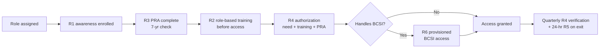

# 03.10 — Roles & Training Matrix

| Field | Value |
|---|---|
| Document ID | CIP-004-RTMX-2026-010 |
| Version | 1.0 |
| Date | 2026-03-02 |
| Classification | BES Cyber System Information (BCSI) // Illustrative Portfolio Sample |
| Owner | Karen Whitfield, NERC Compliance Manager |
| Author | Advisory Team (OT GRC / NERC CIP Advisory) |
| Status | Approved |

## Purpose

This document maps each in-scope **role** at GridPoint Energy to its required **CIP-004-7 personnel obligations** — security **awareness (R1)**, role-based **training (R2)**, **Personnel Risk Assessment (R3)**, and **access authorization (R4/R5/R6)**. It provides a single authoritative matrix used to provision people, drive quarterly reviews, and produce RSAW evidence. It consolidates the training-record picture that previously drove **GAP-11 (Mod)** (dispersed training records — closed via 03.05 and this matrix).

## 1. Scope & Population

| Population | Count | Basis |
|---|---|---|
| Personnel with authorized electronic/physical access to Medium BES Cyber Systems | **142** | CIP-004-7 R4 scope |
| Vendors/contractors with authorized access | **18** | Contractor off-boarding via 03.08 |
| Training completion at phase close | **100%** of in-scope personnel | 03.05 |
| PRAs current | All **142 + 18** | 03.06 |

## 2. CIP-004-7 Requirement Cadences (Reference)

| Requirement | Obligation | Cadence |
|---|---|---|
| R1 Security Awareness | Reinforce awareness | At least once each calendar **quarter** |
| R2 Cyber Security Training | Role-based training | **Before authorized access** and every **15 months** |
| R3 Personnel Risk Assessment | Identity + **7-year criminal history records check** | Before access and every **7 years** |
| R4 Access Management | Authorize (need + training + PRA); verify privileges | Authorize before access; **quarterly** verification |
| R5 Access Revocation | Remove ability to log on | Within **24 hours** of termination action |
| R6 BCSI Access Management | Authorize + verify provisioned BCSI access | Before access; verify every **15 months** |

## 3. Roles & Training Matrix

Legend: ● = required · ○ = required if the role handles BCSI or holds provisioned Medium access · — = not applicable.

| Role | Owner Manager | R1 Awareness (quarterly) | R2 Role-Based Training (pre-access + 15 mo) | R3 PRA (7-yr) | R4 Access Authorization | R5 Revocation (24 hr) | R6 BCSI Access |
|---|---|---|---|---|---|---|---|
| Control-Center Operator | James Okafor | ● | ● (control-center/EMS, ESP, IRA) | ● | ● (Medium BCS, unescorted PSP) | ● | ○ |
| Substation Technician | Elena Ruiz | ● | ● (substation BCS, PSP, TCA/RM) | ● | ● (Medium substation BCS + PCA) | ● | ○ |
| OT Engineer | Marcus Bell | ● | ● (config change CIP-010, baselines, BCSI) | ● | ● (Medium BCS, EACMS) | ● | ● |
| IT Security Analyst | Priya Nair | ● | ● (EACMS, ESP, remote access, monitoring) | ● | ● (EACMS, IRA/Intermediate System) | ● | ● |
| Physical Security Officer | Frank Delgado | ● | ● (PACS, PSP, CIP-006 monitoring) | ● | ● (PACS, PSP) | ● | ○ |
| Contractor / Vendor (18) | Sponsoring manager | ● | ● (scope-limited, pre-access) | ● | ● (least-privilege, time-bound) | ● | ○ |

## 4. Role-Based Training Content Map (R2)

| Role | Core Modules | CIP Emphasis |
|---|---|---|
| Control-Center Operator | EMS/SCADA operations security, ESP boundaries, IRA via Intermediate System, incident reporting | CIP-005, CIP-007, CIP-008 |
| Substation Technician | Physical access at Medium substations, Transient Cyber Asset / Removable Media handling, local device security | CIP-006, CIP-010 R4, CIP-007 |
| OT Engineer | Configuration change management, baseline integrity, vulnerability assessments, BCSI handling | CIP-010, CIP-011 |
| IT Security Analyst | EACMS administration, electronic access controls, logging/monitoring, remote-access security | CIP-005, CIP-007 |
| Physical Security Officer | PACS operation, PSP monitoring, visitor/escort control, alarm response | CIP-006 |
| Contractor / Vendor | Scoped need-to-know, escorting rules, acceptable use, incident reporting obligations | CIP-004, CIP-005, CIP-013 |

## 5. Provisioning Flow (Role to Access)

## 6. Role Owners & Accountable Managers

| Role | Accountable Manager | Reference Doc |
|---|---|---|
| Control-Center Operator | James Okafor (Control Center Operations Manager) | 03.05, 03.07 |
| Substation Technician | Elena Ruiz (Substation & Field Engineering Lead) | 03.05, 03.07 |
| OT Engineer | Marcus Bell (OT / ICS Security Lead) | 03.09 |
| IT Security Analyst | Priya Nair (IT Security Manager) | 03.07, 03.08 |
| Physical Security Officer | Frank Delgado (Physical Security Manager) | 03.08 |
| Contractor / Vendor | Sponsoring manager + Sandra Lee (PRA) | 03.06, 03.08 |
| Program oversight | Karen Whitfield; accountable to Daniel Reyes | 03.11 |

## 7. Evidence Produced

| Artifact | CIP-004-7 Part | Source Doc |
|---|---|---|
| Quarterly awareness reinforcement records | R1 | 03.04 |
| Role-based training completion register (100%) | R2 | 03.05 |
| PRA tracking register (7-year renewals) | R3 | 03.06 |
| Access authorization records + quarterly verification | R4 | 03.07 |
| Revocation timing evidence | R5 | 03.08 |
| BCSI provisioned-access register | R6 | 03.09 |

## Cross-References

| Reference | Purpose |
|---|---|
| [03.03 — Personnel & Training Program Overview](03.03-personnel-and-training-program-overview.md) | Program context |
| [03.05 — Cyber Security Training Program](03.05-cyber-security-training-program.md) | R2 content and records |
| [03.06 — Personnel Risk Assessment Program](03.06-personnel-risk-assessment-program.md) | R3 PRA lifecycle |
| [03.07 — Access Authorization Program](03.07-access-authorization-program.md) | R4 authorization |
| [01.07 — Governance Structure & RACI](../01-program-foundation/01.07-governance-structure-and-raci.md) | Role accountability baseline |

---

[⬅ Previous](03.09-bcsi-access-management.md) · [🏠 Phase README](03.00-README.md) · [Next ➡](03.11-policy-governance-review-approval.md)
