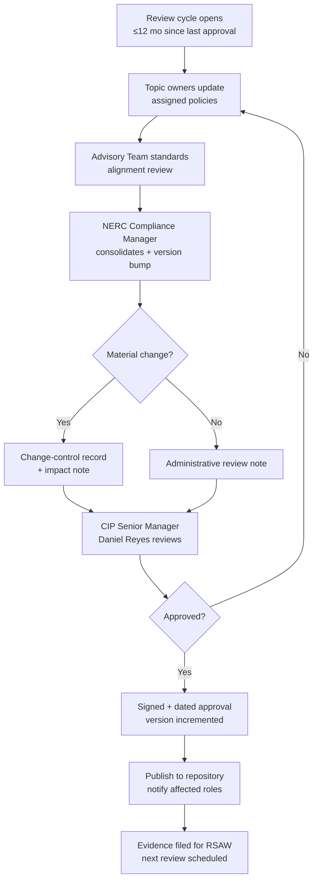

# 03.11 — Policy Governance, Review & Approval

| Field | Value |
|---|---|
| Document ID | CIP-003-GOV-2026-011 |
| Version | 1.0 |
| Date | 2026-03-02 |
| Classification | BES Cyber System Information (BCSI) // Illustrative Portfolio Sample |
| Owner | Karen Whitfield, NERC Compliance Manager |
| Author | Advisory Team (OT GRC / NERC CIP Advisory) |
| Status | Approved |

## Purpose

This document defines the **governance, review, approval, and change-control process** for GridPoint Energy's CIP cyber security policy suite under **CIP-003-8 Requirement R1**. It establishes the **15-month review cycle**, the version-control standard, and the **CIP Senior Manager (Daniel Reyes)** sign-off that is the single accountable approval for all nine policies and the Low-impact security plan (Attachment 1). It underpins closure of **GAP-18 (Mod)** (policy suite completed to nine topics).

## 1. Regulatory Basis — CIP-003-8 R1

| Part | Obligation | GridPoint Implementation |
|---|---|---|
| R1.1 | For High/Medium-impact BCS, document and implement **cyber security policies** collectively addressing nine required topics | The **9-policy suite** (03.01) |
| R1.2 | For Low-impact BES assets, document cyber security policies addressing the **Attachment 1** subject matter | The **Low-impact security plan** (03.02) |
| R1 (review) | Policies **reviewed and approved by the CIP Senior Manager at least once every 15 calendar months** | 15-month cycle (Section 3), internal 12-month buffer |
| R2 | CIP Senior Manager identified by name; **delegations** documented and dated | Per 01.06 (designation & delegations) |

## 2. Governance Roles

| Role | Name | Governance Responsibility |
|---|---|---|
| CIP Senior Manager | **Daniel Reyes** | **Sole approving authority**; signs and dates all policies and the Low-impact plan every ≤15 months |
| NERC Compliance Manager | Karen Whitfield | Owns the review calendar, version control, change log, and evidence |
| Policy topic owners | Marcus Bell, Priya Nair, Frank Delgado, Sandra Lee, James Okafor, Elena Ruiz | Draft and maintain assigned policy topics |
| Advisory Team | Advisory Team | Independent review for standards alignment |
| Delegates (documented) | Per 01.06 | May act for specific CIP-003/004 tasks; **policy approval is not delegated away from the CIP Senior Manager unless a dated delegation exists** |

## 3. 15-Month Review Cycle

| Attribute | Value |
|---|---|
| Regulatory maximum interval | **15 calendar months** between CIP Senior Manager approvals |
| GridPoint internal cadence | **12 months** (3-month buffer to avoid drift) |
| Baseline approval date | **2026-03-02** (this suite) |
| Next scheduled review | By **2027-03** (internal) / no later than **2027-06** (15-month regulatory limit) |
| Interim triggers | Regulatory change, categorization change (02.14), lessons learned from an incident, audit finding |
| Evidence | Signed/dated approval record per review, filed per 01.13 |

## 4. Review & Approval Workflow

## 5. Version Control Standard

| Element | Standard |
|---|---|
| Version scheme | `Major.Minor` — Major on material change approved by CIP Senior Manager; Minor on administrative edits |
| Baseline version | **1.0** at 2026-03-02 |
| Metadata table | Every document carries Document ID, Version, Date, Classification, Owner, Author, Status |
| Status values | `Draft` → `In Review` → `Approved` (READMEs use `Baselined`) |
| Repository | Single controlled repository per 01.13; superseded versions retained, not deleted |
| Traceability | Change log links each version to its change-control record and approval date |

## 6. Change Control

| Change Type | Trigger | Route | Approver |
|---|---|---|---|
| Scheduled review | 12-month internal cycle | Full workflow (Section 4) | Daniel Reyes |
| Regulatory-driven | New/revised CIP standard version | Impact assessment → workflow | Daniel Reyes |
| Categorization-driven | CIP-002 recategorization (02.14) | Scope re-check → workflow | Daniel Reyes |
| Corrective | Audit/self-assessment finding | Expedited workflow + mitigation | Daniel Reyes |
| Administrative | Typo, link, formatting | Minor version bump | Karen Whitfield (noted to CIP SM) |

## 7. Policy Topic Ownership (9 Policies)

Each of the nine CIP-003 R1 policy topics has a named drafting owner who maintains content between reviews; the CIP Senior Manager remains the sole approver.

| # | Policy Topic | Governing Standard | Drafting Owner |
|---|---|---|---|
| 1 | Personnel & Training | CIP-004-7 | Sandra Lee |
| 2 | Electronic Security Perimeters incl. IRA | CIP-005-7 | Priya Nair |
| 3 | Physical Security of BES Cyber Systems | CIP-006-6 | Frank Delgado |
| 4 | System Security Management | CIP-007-6 | Marcus Bell |
| 5 | Incident Reporting & Response | CIP-008-6 | Priya Nair |
| 6 | Recovery Plans | CIP-009-6 | Marcus Bell |
| 7 | Configuration Change Mgmt & Vulnerability Assessments | CIP-010-4 | Marcus Bell |
| 8 | Information Protection (BCSI) | CIP-011-3 | Marcus Bell |
| 9 | Declaring & responding to CIP Exceptional Circumstances | CIP-003-8 | Daniel Reyes |

## 8. Governance Calendar

| Milestone | Target Date |
|---|---|
| Baseline suite approved | 2026-03-02 |
| Interim spot-review (post control implementation) | 2026-Q3 |
| Pre-audit governance review | 2026-Q4 (mock assessment) |
| Internal annual review | By 2027-03 |
| Regulatory 15-month limit | No later than 2027-06 |
| Aligned to RF Compliance Audit | 2027-Q2 |

## 9. Evidence for RSAW (CIP-003 R1)

| Artifact | Demonstrates |
|---|---|
| Signed/dated policy approvals (all 9 + Low-impact plan) | R1 approval within 15 months |
| Review calendar with next-due dates | Ongoing 15-month compliance |
| Version history / change log | Controlled change management |
| CIP Senior Manager designation & delegations (01.06) | R2 accountable authority |
| Change-control records linked to approvals | Traceable, defensible changes |

## Cross-References

| Reference | Purpose |
|---|---|
| [03.01 — Cyber Security Policy Suite](03.01-cyber-security-policy-suite.md) | The 9 policies governed here |
| [03.02 — Low-Impact Security Plan](03.02-low-impact-security-plan.md) | Attachment 1 plan under R1.2 |
| [01.06 — CIP Senior Manager Designation & Delegations](../01-program-foundation/01.06-cip-senior-manager-designation-and-delegations.md) | R2 accountable authority |
| [02.14 — CIP-002 15-Month Review Schedule](../02-bes-cyber-system-categorization/02.14-cip-002-15-month-review-schedule.md) | Aligned review cadence pattern |
| [01.13 — Document & Evidence Management Plan](../01-program-foundation/01.13-document-and-evidence-management-plan.md) | Version control and retention |

---

[⬅ Previous](03.10-roles-and-training-matrix.md) · [🏠 Phase README](03.00-README.md) · [Next ➡](03.12-procedures-index.md)
