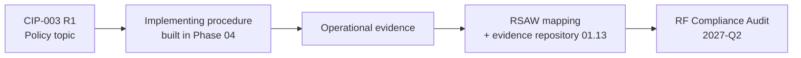

# 03.12 — Procedures Index (Policy → Procedure → Evidence Traceability)

| Field | Value |
|---|---|
| Document ID | CIP-003-PIDX-2026-012 |
| Version | 1.0 |
| Date | 2026-03-02 |
| Classification | BES Cyber System Information (BCSI) // Illustrative Portfolio Sample |
| Owner | Karen Whitfield, NERC Compliance Manager |
| Author | Advisory Team (OT GRC / NERC CIP Advisory) |
| Status | Approved |

## Purpose

This document provides the **traceability index** linking each **CIP-003-8 R1 policy topic** to the **implementing procedures** that operationalize it and the **evidence** those procedures produce. The nine policies and the Low-impact plan are established in Phase 03; the detailed technical and physical **procedures are built and evidenced in Phase 04** (`04-technical-physical-control-implementation`). This index is the map from *what we commit to* (policy) → *how we do it* (procedure) → *how we prove it* (evidence/RSAW).

## 1. Traceability Model

## 2. Policy → Procedure → Evidence Index (9 Policies)

| # | CIP-003 Policy Topic | Governing CIP Standard(s) | Implementing Procedure (Phase 04 target) | Primary Evidence | Owner |
|---|---|---|---|---|---|
| 1 | Personnel & Training | CIP-004-7 | Awareness, training, PRA, access authorization/revocation, BCSI access procedures (**established Phase 03**: 03.04–03.10) | Awareness records, training register, PRA register, access & revocation logs | Sandra Lee / Karen Whitfield |
| 2 | Electronic Security Perimeters incl. Interactive Remote Access | CIP-005-7 | ESP definition, Intermediate System & MFA remote-access procedure | ESP diagrams, IRA session logs, MFA config | Priya Nair |
| 3 | Physical Security of BES Cyber Systems | CIP-006-6 | PSP access-control, monitoring, visitor/escort procedures | PACS logs, PSP monitoring records, visitor logs | Frank Delgado |
| 4 | System Security Management | CIP-007-6 | Ports/services, patch management, malicious-code, logging, account procedures | Patch-eval records, log reviews, account inventories | Marcus Bell |
| 5 | Incident Reporting & Response | CIP-008-6 | Incident classification, response, and 1-hour/attempt reporting procedures | IR plan, test records, reporting evidence | Priya Nair |
| 6 | Recovery Plans | CIP-009-6 | BES Cyber System backup, recovery, and test procedures | Recovery plan, backup logs, test reports | Marcus Bell |
| 7 | Configuration Change Management & Vulnerability Assessments | CIP-010-4 | Baseline management, change authorization, and vulnerability-assessment procedures | Baselines, change records, VA reports | Marcus Bell |
| 8 | Information Protection (BCSI) | CIP-011-3 | BCSI identification, handling, reuse & disposal procedures (labeling + R6 access **started Phase 03**: 03.09) | BCSI register, handling logs, media sanitization records | Marcus Bell |
| 9 | Declaring & Responding to CIP Exceptional Circumstances | CIP-003-8 | CEC declaration and response procedure | CEC declarations, follow-up records | Daniel Reyes |

## 3. Low-Impact Plan → Procedure → Evidence Index (CIP-003 Attachment 1)

| Attachment 1 Section | Subject | Implementing Procedure (Phase 04 target) | Evidence |
|---|---|---|---|
| 1 | Cyber security awareness | Low-impact awareness reinforcement procedure (**documented Phase 03**: 03.02, 03.04) | Awareness materials/records |
| 2 | Physical security controls | Low-impact physical access control procedure | Access records for Low BES assets |
| 3 | Electronic access controls | Low-impact electronic access permission procedure | Access-permission records, LEAP inventory |
| 4 | Cyber Security Incident response | Low-impact incident response procedure | IR plan (Low), test/exercise records |
| 5 | Transient Cyber Assets & Removable Media | TCA/RM malicious-code risk-mitigation procedure | TCA/RM handling logs |
| + | Vendor electronic remote access controls (Lows) | Vendor remote-access control procedure | Vendor access determination/disable records |

## 4. Phase 03 vs Phase 04 Build Status

| Policy Area | Procedure Status at Phase 03 Close | Phase 04 Action |
|---|---|---|
| Personnel & Training (CIP-004) | **Complete** — procedures established (03.03–03.10) | Sustain; feed evidence to RSAW |
| Information Protection (CIP-011) | **Partial** — labeling + R6 access (03.09) | Build full handling/reuse/disposal |
| ESP/IRA, Physical, System Mgmt, Incident, Recovery, Config Mgmt, CEC | **Policy set; procedures pending** | Build and evidence in Phase 04 |
| Low-impact plan (Attachment 1) | **Documented** (03.02); procedures pending | Build Sections 2–5 procedures |

## 5. Evidence-to-RSAW Alignment

Each procedure's evidence is mapped to the corresponding Reliability Standard Audit Worksheet (RSAW) so the audit trail is continuous from policy commitment to demonstrable proof.

| CIP Standard | RSAW Evidence Focus | Repository Location (per 01.13) |
|---|---|---|
| CIP-004-7 | Awareness/training/PRA/access/BCSI records | Personnel program evidence set |
| CIP-005-7 | ESP diagrams, IRA logs, MFA config | Electronic security evidence set |
| CIP-006-6 | PACS logs, PSP monitoring, visitor logs | Physical security evidence set |
| CIP-007-6 | Patch-eval, log review, account inventories | System management evidence set |
| CIP-008-6 | IR plan, test records, reporting evidence | Incident response evidence set |
| CIP-009-6 | Recovery plan, backup logs, test reports | Recovery evidence set |
| CIP-010-4 | Baselines, change records, VA reports | Config/vulnerability evidence set |
| CIP-011-3 | BCSI register, handling/disposal logs | Information protection evidence set |
| CIP-003-8 | Policy approvals, CEC declarations | Governance evidence set |

## 6. Gap-to-Procedure Linkage

| Remaining High Gap | Standard | Procedure That Will Close It (Phase 04) |
|---|---|---|
| GAP-01 | CIP-005 R2 | Intermediate System / MFA remote-access procedure |
| GAP-02 | CIP-007 R2 | Patch-evaluation cycle procedure (≤35 days) |
| GAP-03 | CIP-010 R1 | Configuration baseline management procedure |
| GAP-04 | CIP-006 R1 | PSP monitoring procedure at Medium substation |
| GAP-06 | CIP-011 R1 | BCSI handling procedure for engineering file shares |

## 7. How to Use This Index

1. Start from a CIP-003 policy topic (Section 2) or Attachment 1 section (Section 3).
2. Follow to the implementing procedure — Phase 03 procedures are live; Phase 04 procedures are the build backlog.
3. Confirm the named evidence exists in the repository (01.13) and is mapped to the corresponding RSAW (Section 5).
4. Any gap between policy and procedure/evidence is tracked in the gap register (02.12) and carried into Phase 04 (Section 6).

## 8. Maintenance of This Index

| Attribute | Standard |
|---|---|
| Update trigger | New/revised procedure, gap closure, or CIP standard version change |
| Review cadence | With each 15-month policy governance review (03.11) |
| Owner | Karen Whitfield, NERC Compliance Manager |
| Version control | Per 03.11 version-control standard; re-approved by CIP Senior Manager |
| Cross-check | Reconciled against the applicability matrix (02.10) and gap register (02.12) |

## Cross-References

| Reference | Purpose |
|---|---|
| [03.01 — Cyber Security Policy Suite](03.01-cyber-security-policy-suite.md) | The nine policies indexed here |
| [03.02 — Low-Impact Security Plan](03.02-low-impact-security-plan.md) | Attachment 1 sections |
| [03.11 — Policy Governance, Review & Approval](03.11-policy-governance-review-approval.md) | Governs the policies mapped here |
| [02.10 — Applicability Matrix](../02-bes-cyber-system-categorization/02.10-applicability-matrix.md) | Standard-to-asset applicability |
| [01.13 — Document & Evidence Management Plan](../01-program-foundation/01.13-document-and-evidence-management-plan.md) | Evidence repository and RSAW mapping |

---

[⬅ Previous](03.11-policy-governance-review-approval.md) · [🏠 Phase README](03.00-README.md) · [Next ➡](03.13-phase-summary-and-transition.md)
