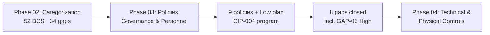

# 03.13 — Phase 03 Summary & Transition

| Field | Value |
|---|---|
| Document ID | CIP-003-PHSUM-2026-013 |
| Version | 1.0 |
| Date | 2026-03-02 |
| Classification | BES Cyber System Information (BCSI) // Illustrative Portfolio Sample |
| Owner | Karen Whitfield, NERC Compliance Manager |
| Author | Advisory Team (OT GRC / NERC CIP Advisory) |
| Status | Approved |

## Purpose

This document closes **Phase 03 — Policies, Governance & Personnel Program (CIP-003, CIP-004)** for GridPoint Energy. It confirms the CIP-003 policy suite and CIP-004 personnel program are established and approved, records the gaps closed, and states readiness to enter **Phase 04 — Technical & Physical Control Implementation**.

## 1. What Phase 03 Delivered

| Outcome | Result |
|---|---|
| CIP-003 policy suite | **9 cyber security policies** approved (03.01) |
| Low-impact security plan | **CIP-003 Attachment 1** plan, 5 sections + vendor remote access (03.02) |
| Personnel & training program | Awareness (R1 quarterly), training (R2 pre-access + 15 mo), PRA (R3 7-year) (03.03–03.06) |
| Access lifecycle | Authorization (R4), **24-hour revocation (R5)**, BCSI access (R6) (03.07–03.09) |
| Roles & training matrix | 6 role types mapped to R1–R6 (03.10) |
| Governance | 15-month review cycle + CIP Senior Manager sign-off (03.11) |
| Traceability | Policy → procedure → evidence index (03.12) |
| Population coverage | **142** personnel + **18** contractors; **100%** training; PRAs current for all |

## 2. Gaps Closed in Phase 03

| Gap | Standard | Description | Status |
|---|---|---|---|
| GAP-05 (High) | CIP-004 R4/R5 | Access authorization/revocation records incomplete | **Closed** (03.07 + 03.08) |
| GAP-11 (Mod) | CIP-004 R2 | Training records dispersed | Closed (03.05, 03.10) |
| GAP-18 (Mod) | CIP-003 R1 | Two policy topics missing | Closed — suite completed to 9 (03.01) |
| GAP-20 (Mod) | CIP-004 R3 | PRA renewal tracking manual | Closed — tracking register (03.06) |
| GAP-22 (Low) | CIP-003 Att.1 | Low-impact awareness undocumented | Closed (03.02, 03.04) |
| GAP-26 (Low) | CIP-004 R5 | Revocation-timing evidence | Closed (03.08) |
| GAP-29 (Low) | CIP-011 | BCSI labeling | **Partially addressed** — labeling + R6 access (03.09); full handling in Phase 04 |
| GAP-30 (Low) | CIP-003 Att.1 | Low-impact electronic access controls documentation | Closed (03.02) |

**Eight gaps addressed** (7 fully closed + GAP-29 partial), including the **GAP-05 High**.

## 3. Gap Posture Entering Phase 04

| Metric | Value |
|---|---|
| Baseline gaps (Phase 02) | 34 (6 High · 15 Mod · 13 Low) |
| Closed/addressed in Phase 03 | 8 (1 High + Mod/Low) |
| **Remaining for Phase 04** | **~26 gaps (5 High + ~21 Mod/Low)** |
| Remaining High gaps | GAP-01 (CIP-005), GAP-02 (CIP-007), GAP-03 (CIP-010), GAP-04 (CIP-006), GAP-06 (CIP-011) |

## 4. Readiness to Enter Phase 04

| Readiness Check | Status |
|---|---|
| CIP-003 policy suite approved by CIP Senior Manager | Complete |
| Low-impact plan (Attachment 1) documented | Complete |
| CIP-004 personnel program operational (R1–R6) | Complete |
| 15-month review/governance cycle in place | Complete |
| Policy→procedure→evidence index published | Complete (03.12) |
| Evidence repository populated for RSAW | Complete (per 01.13) |

## 5. Deliverables Index (Phase 03)

| Doc | Title | Status |
|---|---|---|
| 03.01 | Cyber Security Policy Suite | Approved |
| 03.02 | Low-Impact Security Plan | Approved |
| 03.03 | Personnel & Training Program Overview | Approved |
| 03.04 | Security Awareness Program | Approved |
| 03.05 | Cyber Security Training Program | Approved |
| 03.06 | Personnel Risk Assessment Program | Approved |
| 03.07 | Access Authorization Program | Approved |
| 03.08 | Access Revocation Program | Approved |
| 03.09 | BCSI Access Management | Approved |
| 03.10 | Roles & Training Matrix | Approved |
| 03.11 | Policy Governance, Review & Approval | Approved |
| 03.12 | Procedures Index | Approved |
| 03.13 | Phase 03 Summary & Transition | Approved |

## 6. Open Items Carried Into Phase 04

- Full **CIP-011-3** BCSI handling, reuse, and disposal (completes GAP-06 and remainder of GAP-29).
- The five remaining High gaps (GAP-01…04, GAP-06) with active interim mitigations.
- Technical/physical procedures for policy topics 2–8 and Low-impact Attachment 1 Sections 2–5.
- Sustained CIP-004 operations: quarterly awareness, quarterly access verification, 24-hour revocation performance.

## 7. Handoff to Phase 04

Phase 04 builds the **technical and physical control procedures** that implement policy topics 2–8 and Low-impact Attachment 1 Sections 2–5: ESP/IRA (CIP-005), physical security (CIP-006), system security management (CIP-007), incident response (CIP-008), recovery (CIP-009), configuration/vulnerability management (CIP-010), and full BCSI information protection (CIP-011). The five remaining High gaps begin immediately with High-first sequencing (per 02.13).

## 6. Sign-Off

| Role | Name | Acceptance |
|---|---|---|
| CIP Senior Manager | Daniel Reyes | Policy suite and Low-impact plan approved |
| NERC Compliance Manager | Karen Whitfield | Personnel program and gap closures accepted |
| OT / ICS Security Lead | Marcus Bell | BCSI access controls confirmed |
| HR / PRA Coordinator | Sandra Lee | PRA and training coverage confirmed |
| Advisory Team | Advisory Team | Phase 03 deliverables complete |

## Cross-References

| Reference | Purpose |
|---|---|
| [03.01 — Cyber Security Policy Suite](03.01-cyber-security-policy-suite.md) | Approved 9-policy suite |
| [03.12 — Procedures Index](03.12-procedures-index.md) | Policy→procedure→evidence map into Phase 04 |
| [02.12 — Gap Register & Risk Ranking](../02-bes-cyber-system-categorization/02.12-gap-register-and-risk-ranking.md) | Gap backlog carried forward |
| [02.13 — Pre-Implementation Remediation Roadmap](../02-bes-cyber-system-categorization/02.13-pre-implementation-remediation-roadmap.md) | Phase 04–06 sequencing |

---

[⬅ Previous](03.12-procedures-index.md) · [🏠 Phase README](03.00-README.md) · [Next ➡](../04-technical-physical-control-implementation/04.00-README.md)
