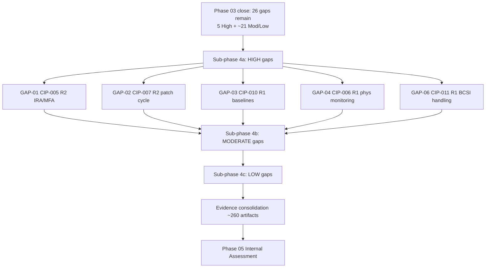

# 04.01 — Control Implementation Plan & Sequencing

| Field | Value |
|---|---|
| Document ID | CIP-04.01 |
| Version | 1.0 |
| Date | 2026-03-02 |
| Classification | BES Cyber System Information (BCSI) // Illustrative Portfolio Sample |
| Owner | Karen Whitfield (NERC Compliance Manager) |
| Author | Advisory Team |
| Status | Approved |

## Purpose

This document defines how GridPoint Energy sequences, resources, and evidences the technical and physical control implementation for its **14 Medium-impact BES Cyber Systems** and associated **26 EACMS**, **18 PACS**, and **60 PCA**. Phase 04 converts the categorization results (CIP-002) and the policy/personnel foundation (CIP-003/CIP-004) into deployed, auditable controls under CIP-005, CIP-006, CIP-007, CIP-008, CIP-009, CIP-010, CIP-011, CIP-013, and CIP-014. It establishes the workstream structure, the "High-gaps-first" sequencing logic, accountable owners, and the evidence approach that yields the **~260 evidence artifacts** mapped to applicable CIP requirement parts ahead of the ReliabilityFirst Compliance Audit (2027-Q2).

## Scope & Objectives

- Implement and document all applicable Medium-impact technical/physical controls across the 2 Control Centers (Millbrook Primary, Easton Backup) and 8 Medium 345 kV substations.
- Close the **5 remaining High gaps** (GAP-01, GAP-02, GAP-03, GAP-04, GAP-06) and the majority of the **26 gaps** carried out of Phase 03.
- Stand up the enduring boundary and hardening posture: **3 ESPs / 6 EAPs**, **10 PSPs**, **14 configuration baselines**, and a **35-day** patch-evaluation cadence.
- Produce defensible, requirement-part-mapped evidence for each control (RSAW-ready).

## Workstream Structure

| WS | Workstream | Primary Standard(s) | Owner | Key Deliverables |
|---|---|---|---|---|
| WS-1 | Electronic Security Perimeter & Remote Access | CIP-005-7 R1/R2/R3 | Marcus Bell (OT/ICS Security Lead) | 3 ESPs, 6 EAPs, Intermediate System, IRA MFA/encryption |
| WS-2 | Physical Security | CIP-006-6 R1/R2 | Frank Delgado (Physical Security Manager) | 10 PSPs, PACS, monitoring, ≥90-day logs |
| WS-3 | System Security Management | CIP-007-6 R1–R5 | Priya Nair (IT Security Mgr) / Marcus Bell | Ports/services, 35-day patching, malware prevention, logging, access control |
| WS-4 | Configuration & Vulnerability | CIP-010-4 R1–R4 | Marcus Bell | 14 baselines, change mgmt, 15-month paper VA, TCA/RM controls |
| WS-5 | Incident Response & Recovery | CIP-008-6 / CIP-009-6 | Karen Whitfield / James Okafor | IR plan (1-hour E-ISAC/CISA), recovery & backup tests |
| WS-6 | Information Protection & Supply Chain | CIP-011-3 / CIP-013-2 | Priya Nair / Karen Whitfield | BCSI program, SCRM plan, vendor clauses |
| WS-7 | Critical-Station Physical Security | CIP-014-3 | Frank Delgado | Northgate applicability, risk assessment, third-party review |
| WS-8 | Evidence & Status Tracking | All | Karen Whitfield | ~260 artifact repository, status tracker |

## Sequencing Logic — High Gaps First

Implementation is risk-ranked: the 5 remaining High-risk gaps are scheduled in the earliest sub-phase so residual OT cyber risk falls fastest, followed by Moderate then Low gaps. Controls with technical dependencies (e.g., the Intermediate System must exist before vendor IRA can be constrained) are ordered accordingly.

## Gaps Closing in Phase 04 (from the 26 remaining)

Phase 04 closes **20 of the 26** carried gaps, leaving **6 in progress** (2 Moderate + 4 Low) for validation in Phase 05 and mitigation in Phase 06.

| Sub-phase | Gaps | Standard | Result |
|---|---|---|---|
| 4a (High) | GAP-01, GAP-02, GAP-03, GAP-04, GAP-06 | CIP-005/007/010/006/011 | All 5 High **Closed** |
| 4b (Moderate) | GAP-07, GAP-08, GAP-09, GAP-10, GAP-13, GAP-14, GAP-15, GAP-16, GAP-17, GAP-19 | Various | 10 of 12 **Closed** |
| 4b (Moderate) | GAP-12 (recovery plan), GAP-21 (IRA session logging) | CIP-009 / CIP-005 | **In progress** |
| 4c (Low) | GAP-23, GAP-24, GAP-25, GAP-31, GAP-33 | Various | 5 of 9 **Closed** |
| 4c (Low) | GAP-27, GAP-28, GAP-32, GAP-29 | CIP-008/009/013/011 | **In progress** |

Cumulative program posture: **28 of 34 gaps closed** (Phase 03 closed 8; Phase 04 closes 20). The controls documented in the sibling files 04.02–04.08 map directly to the High-gap closures noted above.

## Owners & Accountability

The CIP Senior Manager (**Daniel Reyes**) holds overall accountability for the Phase 04 control posture under CIP-003 R1. Workstream owners are accountable for delivery and evidence within their standards; the NERC Compliance Manager (**Karen Whitfield**) owns cross-workstream integration, the evidence repository, and audit readiness.

| Role | Person | Phase 04 accountability |
|---|---|---|
| CIP Senior Manager | Daniel Reyes | Approves implemented controls; single accountable authority |
| NERC Compliance Manager | Karen Whitfield | Sequencing, evidence, status tracker, RSAW readiness |
| OT/ICS Security Lead | Marcus Bell | CIP-005 ESP/IRA, CIP-007 hardening, CIP-010 config |
| IT Security Manager | Priya Nair | CIP-007 patching & malware, jump-host security |
| Physical Security Manager | Frank Delgado | CIP-006 PSPs & monitoring, CIP-014 Northgate |
| Control Center Operations Manager | James Okafor | CIP-008/009 operational readiness |
| Substation & Field Engineering Lead | Elena Ruiz | Substation BCS baselines & firmware |

## Milestones & Timeline

Phase 04 executes within the program's **2026-Q3 control-implementation-complete** milestone, feeding the internal (mock) assessment in 2026-Q4 and the ReliabilityFirst Compliance Audit in 2027-Q2.

| Milestone | Target | Dependency |
|---|---|---|
| Sub-phase 4a (5 High gaps closed) | Early 2026-Q3 | Intermediate System, PACS monitoring, baselines |
| Sub-phase 4b (Moderate gaps) | Mid 2026-Q3 | 4a completion |
| Sub-phase 4c (Low gaps) | Late 2026-Q3 | 4b completion |
| Evidence consolidation (~260 artifacts) | End 2026-Q3 | All workstreams |
| Internal (mock) assessment | 2026-Q4 | Evidence complete |

## Risks & Dependencies

| Risk | Impact | Mitigation |
|---|---|---|
| Real-time operational constraints on OT changes | Delayed patching/baseline changes | Maintenance windows; test-before-deploy; mitigation plans |
| Vendor availability for remote-access remediation | GAP-01 slippage | Early scheduling; contractual clauses (CIP-013) |
| Evidence gaps at sampling | Audit finding | Continuous evidence capture per WS-8 |
| Residual in-progress gaps (6) | Carry to Phase 05/06 | Tracked in status tracker; validated Phase 05 |

## Evidence Approach

Every implemented control is evidenced against its specific CIP requirement part and filed in the WS-8 repository per the Phase 01 document & evidence management plan. Evidence types include configuration exports, firewall rule sets and EAP access-permission documentation, PACS access reports and logs, patch-evaluation records, malware definition update logs, screenshots, signed procedures, and change tickets. Target: **~260 artifacts** cross-referenced in `04.20-implemented-control-evidence-collection.md` and status-tracked in `04.21-control-implementation-status-tracker.md`.

| Evidence discipline | Standard | Owner |
|---|---|---|
| Dated + versioned artifacts | All | Karen Whitfield |
| Requirement-part mapping | All | Advisory Team |
| Sampling readiness (per-BCS) | CIP-005/006/007/010 | WS owners |
| Chain-of-custody for BCSI | CIP-011 | Priya Nair |

## Cross-References

- `../02-bes-cyber-system-categorization/02.12-gap-register-and-risk-ranking.md` — source gap register & risk ranking.
- `../02-bes-cyber-system-categorization/02.13-pre-implementation-remediation-roadmap.md` — remediation roadmap.
- `../03-policies-governance-personnel/03.13-phase-summary-and-transition.md` — Phase 03 close (8 gaps closed).
- `../01-program-foundation/01.13-document-and-evidence-management-plan.md` — evidence management standard.
- `04.02-electronic-security-perimeter-cip-005-r1.md` … `04.21-control-implementation-status-tracker.md` — control implementation files.

---

[⬅ Previous](04.00-README.md) · [🏠 Phase README](04.00-README.md) · [Next ➡](04.02-electronic-security-perimeter-cip-005-r1.md)
