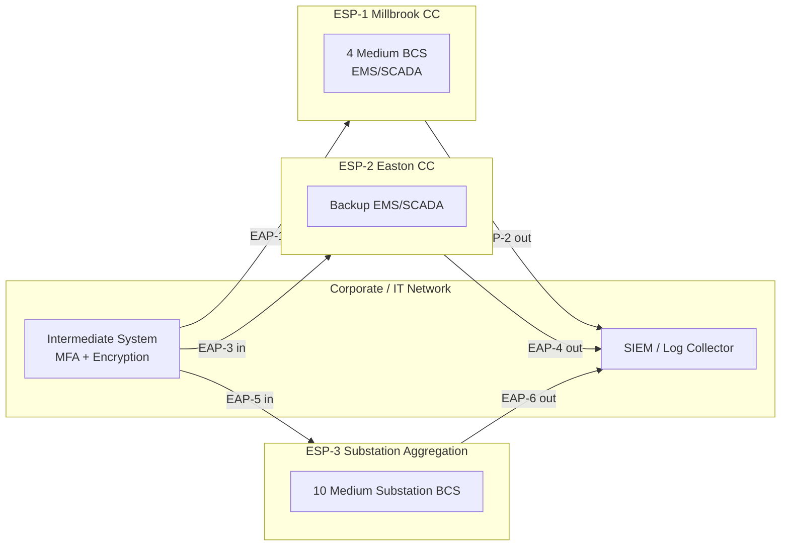

# 04.02 — Electronic Security Perimeter (CIP-005-7 R1)

| Field | Value |
|---|---|
| Document ID | CIP-04.02 |
| Version | 1.0 |
| Date | 2026-03-02 |
| Classification | BES Cyber System Information (BCSI) // Illustrative Portfolio Sample |
| Owner | Marcus Bell (OT/ICS Security Lead) |
| Author | Advisory Team |
| Status | Approved |

## Purpose

This document defines and evidences GridPoint Energy's **Electronic Security Perimeter(s)** for its **14 Medium-impact BES Cyber Systems** under **CIP-005-7 Requirement R1**. It establishes the **3 ESPs** and **6 Electronic Access Points (EAPs)** that logically enclose all applicable BES Cyber Assets, documents External Routable Connectivity (ERC), and specifies inbound and outbound access permissions with per-rule justification. Implementation of this control **closes GAP-10** (Moderate — ESP documentation/enforcement completeness).

## Applicability

CIP-005-7 R1 applies to Medium-impact BES Cyber Systems **with External Routable Connectivity** and their associated EACMS and PCA. GridPoint has **no High-impact** assets. All 14 Medium BCS reside within a defined ESP; associated EACMS (firewalls/EAPs, remote-access infrastructure) and PCA are protected commensurately.

## ESP Architecture — 3 ESPs / 6 EAPs

| ESP | Location | BCS enclosed | EAPs | ERC |
|---|---|---|---|---|
| ESP-1 | Millbrook Primary Control Center | 4 Medium BCS (EMS/SCADA, historian, front-end) | EAP-1 (inbound), EAP-2 (outbound) | Yes |
| ESP-2 | Easton Backup Control Center | (backup EMS/SCADA within the 4 CC BCS footprint) | EAP-3 (inbound), EAP-4 (outbound) | Yes |
| ESP-3 | Substation aggregation (8 Medium 345 kV substations, 10 BCS) | 10 Medium substation BCS | EAP-5 (inbound), EAP-6 (outbound) | Yes |

Each EAP is an identified EACMS firewall interface. All routable communication into or out of an ESP transits an EAP; there are no undocumented routable paths. Serial (non-routable) connections, where present, are documented as such and are outside the routable ESP boundary.

## R1 Requirement-Part Coverage

| Part | Requirement | GridPoint Implementation |
|---|---|---|
| R1.1 | All applicable Cyber Assets connected to a network via a routable protocol reside within a defined ESP | All 14 Medium BCS + associated PCA reside within ESP-1/2/3; verified against the BCA inventory |
| R1.2 | All External Routable Connectivity through an identified EAP | Every routable ingress/egress transits one of the 6 EAPs; no bypass paths |
| R1.3 | Inbound and outbound access permissions, including the reason for granting access, and deny all other access by default | Firewall rule sets enforce default-deny; each permit rule carries a documented business/operational reason |
| R1.4 | Where technically feasible, deny communications with a Dynamic Host Configuration Protocol / detect malicious communications (per CIP-005-7 wording for applicable comms) | Malicious-communications detection at EAPs; see 04.03 §CIP-005 R3 |
| R1.5 | Have one or more methods for detecting known or suspected malicious communications for both inbound and outbound communications | IDS/IPS inspection at each EAP with alerting to SIEM (detailed in 04.03) |

## Access Permission Model (R1.3)

All EAP rule sets are configured **default-deny**. Each permitted flow is documented with source, destination, port/service, direction, and the reason for granting access. Representative permission classes:

| Rule class | Direction | Example justification |
|---|---|---|
| ICCP / TASE.2 inter-control-center | Inbound/Outbound | Real-time telemetry exchange between Millbrook and Easton |
| Intermediate System → BCS management | Inbound | Interactive Remote Access sessions only via the jump host (CIP-005 R2) |
| BCS → SIEM log forwarding | Outbound | Security event monitoring (CIP-007 R4) |
| Patch source → BCS (staged) | Inbound | Controlled patch delivery (CIP-007 R2) |
| Time synchronization (NTP) | Outbound | Accurate event time-stamping |

Rule-set reviews are performed and evidenced; changes flow through configuration change management (CIP-010 R1) and are logged.

## External Routable Connectivity (ERC) Determination

Each Medium BCS is assessed for External Routable Connectivity — the ability to be accessed from outside its ESP via a bi-directional routable protocol. All 14 Medium BCS have ERC (they are reachable through an EAP), which is what makes CIP-005-7 R1.2–R1.5 and R2 applicable. The determination is documented per BCS and reconciled against the BCA inventory so that no routable asset is omitted from an ESP.

| Determination | Count | Consequence |
|---|---|---|
| Medium BCS with ERC | 14 | In scope for R1.2–R1.5, R2 (IRA) |
| Associated EACMS (incl. EAPs) | 26 | Protected commensurately; EAPs enforce boundary |
| Associated PCA within ESPs | 60 | Reside inside ESP; protected as BCS-adjacent |
| Non-routable / serial connections | Documented | Outside routable ESP boundary |

## Boundary Governance

ESP boundaries and EAP rule sets are change-controlled under CIP-010 R1 and monitored under CIP-010 R2. Firewall rule-set reviews are performed on a defined cadence to remove stale permits and confirm default-deny remains intact. Any new routable path requires an authorized change, an updated ESP diagram, and a documented access-permission reason before it is enabled at an EAP. This governance prevents perimeter drift between the ESP baseline and the deployed configuration.

## Evidence (RSAW-ready)

- ESP boundary diagrams and BCA-to-ESP mapping (14 BCS reconciled).
- EAP firewall configuration exports for all 6 EAPs showing default-deny and per-rule reasons.
- ERC determination worksheets per BCS.
- Rule-set review records and associated change tickets.

## Gap Closure

| Gap | Description | Status |
|---|---|---|
| GAP-10 (Moderate) | ESP documentation/enforcement completeness for Medium BCS | **Closed** — 3 ESPs / 6 EAPs documented, default-deny enforced, per-rule justification evidenced |

## Cross-References

- `../02-bes-cyber-system-categorization/02.08-electronic-and-physical-boundary-overview.md` — boundary overview.
- `../02-bes-cyber-system-categorization/02.07-associated-eacms-pacs-pca.md` — EACMS/PCA inventory.
- `04.03-interactive-remote-access-cip-005-r2.md` — IRA, Intermediate System, malicious-communications detection.
- `04.06-ports-and-services-baseline-cip-007-r1.md` — logical ports enabled at EAPs and BCS.
- `../02-bes-cyber-system-categorization/02.12-gap-register-and-risk-ranking.md` — gap register (GAP-10).

---

[⬅ Previous](04.01-control-implementation-plan-and-sequencing.md) · [🏠 Phase README](04.00-README.md) · [Next ➡](04.03-interactive-remote-access-cip-005-r2.md)
