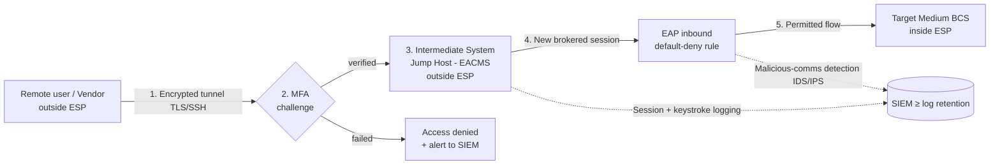

# 04.03 — Interactive Remote Access (CIP-005-7 R2)

| Field | Value |
|---|---|
| Document ID | CIP-04.03 |
| Version | 1.0 |
| Date | 2026-03-02 |
| Classification | BES Cyber System Information (BCSI) // Illustrative Portfolio Sample |
| Owner | Marcus Bell (OT/ICS Security Lead) |
| Author | Advisory Team |
| Status | Approved |

## Purpose

This is a **keystone control document**. It defines and evidences GridPoint Energy's **Interactive Remote Access (IRA)** and **vendor remote access** program for the **14 Medium-impact BES Cyber Systems** under **CIP-005-7 Requirement R2**, together with the **malicious-communications detection** obligations at Electronic Access Points (the CIP-005-7 R3 / R1.5 detection function). It establishes the **Intermediate System (jump host)** through which all IRA is brokered, the **multi-factor authentication (MFA)** and **encryption** requirements, and the controls to **disable and log** vendor remote access. Implementation **closes GAP-01 (High)** — vendor IRA lacked an Intermediate System / MFA at 2 substations — and advances **GAP-21 (Moderate, in progress)** — IRA session logging completeness.

## Definitions & Scope

- **Interactive Remote Access (IRA):** user-initiated access by a person employing a remote-access client or protocol to a Cyber Asset inside an ESP, originating from a Cyber Asset **not** located within an ESP or an associated Physical Security Perimeter, that is **not** system-to-system.
- **Intermediate System:** a Cyber Asset (or collection) that **brokers** all IRA; the actual remote session terminates on the Intermediate System, and a separate, controlled session is established onward to the target BCS. The Intermediate System **must not be located inside** the ESP it protects.
- **Scope:** all IRA to the 4 Control-Center BCS (ESP-1/ESP-2) and the 10 substation BCS (ESP-3), by both GridPoint personnel and the **18** authorized vendors/contractors identified in the CIP-004 program.

CIP-005-7 R2 applies to Medium-impact BES Cyber Systems **with External Routable Connectivity** and their associated EACMS and PCA. All 14 Medium BCS meet this condition.

## R2 Requirement-Part Coverage

| Part | Requirement | GridPoint Implementation |
|---|---|---|
| R2.1 | Utilize an **Intermediate System** such that the Cyber Asset initiating IRA does not directly access an applicable Cyber Asset | Single hardened jump-host cluster; no direct routable path from client to any BCS; enforced at EAPs |
| R2.2 | For all IRA sessions, utilize **encryption** that terminates at the Intermediate System | TLS/SSH-based encrypted tunnels terminate on the Intermediate System; no clear-text remote sessions permitted |
| R2.3 | Require **multi-factor authentication** for all IRA sessions | MFA (something you know + something you have) enforced at the Intermediate System for every user, including vendors |
| R2.4 | Have one or more methods for **determining active vendor remote access sessions** (including IRA and system-to-system) | Session dashboard/monitoring identifies active vendor sessions in real time |
| R2.5 | Have one or more methods to **disable active vendor remote access** (including IRA and system-to-system) | Documented ability to terminate vendor sessions and revoke accounts on demand at the Intermediate System and EAP |

## Interactive Remote Access Flow

The design guarantees that no IRA client ever holds a routable path directly to a BCS: the encrypted session terminates at the Intermediate System (R2.2), MFA is enforced there (R2.3), and only the Intermediate System is permitted through the EAP into the ESP (R2.1).

## Intermediate System (Jump Host) Controls

| Control | Detail |
|---|---|
| Placement | Located outside every ESP; reachable from corporate/remote networks, brokers inbound to ESP-1/2/3 via EAP-1/EAP-3/EAP-5 |
| Hardening | Ports/services minimized per CIP-007 R1; baseline under CIP-010 R1; malware prevention per CIP-007 R3 |
| Authentication | MFA mandatory; individual (non-shared) accounts; least privilege |
| Encryption | All sessions encrypted end-to-end to the jump host; approved cipher suites only |
| Session recording | Session metadata and keystroke/command logging forwarded to SIEM |
| Patch/config | In-scope for the 35-day patch cycle (CIP-007 R2) and configuration monitoring (CIP-010 R2) |

## Vendor Remote Access Control & Logging (R2.4 / R2.5)

Vendor remote access is a primary OT risk driver and a CIP-013 supply-chain touchpoint. GridPoint applies the following lifecycle:

1. **Authorization** — vendor accounts provisioned only after CIP-004 access authorization (need, training, PRA) for the 18 in-scope vendors; time-bounded where possible.
2. **Just-in-time enablement** — vendor accounts remain disabled by default and are enabled only for an approved maintenance window.
3. **Active-session determination (R2.4)** — a monitoring dashboard identifies every active vendor IRA and system-to-system session in real time.
4. **On-demand disablement (R2.5)** — operators can terminate any active vendor session and disable the account immediately at the Intermediate System and EAP.
5. **Logging** — all vendor session start/stop, authentication events, and commands are logged to the SIEM and retained per the security-event-monitoring standard.

## Malicious-Communications Detection (CIP-005-7 R1.5 / R3 detection function)

Each of the **6 EAPs** enforces inbound and outbound inspection for known or suspected malicious communications:

| Control | Implementation |
|---|---|
| Detection method | IDS/IPS signatures + protocol anomaly inspection at every EAP |
| Coverage | Both inbound and outbound routable communications |
| Alerting | Detections alert to the SIEM and trigger the CIP-008 incident-response workflow |
| Tuning | Signatures updated on a managed cadence; baseline of expected OT protocols (ICCP, DNP3, etc.) maintained to reduce false negatives |
| Evidence | IDS/IPS configuration exports, alert samples, and update logs |

## Encryption Design (R2.2)

Encryption for every IRA session terminates at the Intermediate System, meaning no clear-text remote session ever reaches an EAP or a BCS. GridPoint enforces this through approved cipher suites and by permitting, at each inbound EAP, only the encrypted broker session from the Intermediate System.

| Attribute | Implementation |
|---|---|
| Termination point | Intermediate System (jump host), outside the ESP |
| Protocols | TLS / SSH with approved cipher suites |
| Clear-text remote access | Prohibited; blocked at EAP default-deny |
| Key/certificate management | Managed lifecycle; rotation and revocation supported |

## MFA Design (R2.3)

Multi-factor authentication is required for **all** IRA sessions — GridPoint personnel and the 18 authorized vendors alike. MFA combines at least two independent factors and is enforced at the Intermediate System before any onward session to a BCS is brokered.

| Factor | Example |
|---|---|
| Something you know | Individual password / passphrase |
| Something you have | Hardware/soft token or push authenticator |
| Enforcement point | Intermediate System (pre-brokering) |
| Account model | Individual, non-shared, least-privilege |

Failed MFA attempts are denied and alerted to the SIEM, and repeated failures feed the CIP-008 monitoring workflow.

## Roles & Responsibilities

| Role | Person | Responsibility |
|---|---|---|
| OT/ICS Security Lead | Marcus Bell | Owns ESP/IRA architecture, Intermediate System, EAP detection |
| IT Security Manager | Priya Nair | MFA platform, jump-host hardening/patching |
| NERC Compliance Manager | Karen Whitfield | Vendor authorization records, evidence, RSAW readiness |
| CIP Senior Manager | Daniel Reyes | Approves the remote-access control posture |

## Operational Scenarios

| Scenario | Control response |
|---|---|
| GridPoint engineer performs remote maintenance on EMS/SCADA | Encrypted session → MFA → Intermediate System → EAP → BCS; session logged |
| Vendor requests emergency access to a substation BCS | JIT account enable → MFA → brokered session; active session visible; disable-capable |
| Suspected compromised vendor credential | Session terminated (R2.5), account disabled, alert to CIP-008 |
| Malicious command pattern over IRA | EAP IDS/IPS detection → SIEM alert → IR assessment |

## Evidence (RSAW-ready)

- Intermediate System architecture diagram and placement evidence (outside ESP).
- MFA configuration and enrollment records for all users and the 18 vendors.
- Encryption configuration (cipher/policy) showing termination at the Intermediate System.
- Vendor active-session monitoring screenshots and disablement procedure with test evidence.
- Session/keystroke logs forwarded to SIEM; IDS/IPS signature and alert samples at EAPs.
- Remediation records demonstrating the 2 substations now broker IRA via the Intermediate System with MFA.

## Gap Closure

| Gap | Description | Status |
|---|---|---|
| GAP-01 (High) | Vendor IRA lacked Intermediate System / MFA at 2 substations | **Closed** — all IRA (including the 2 substations) brokered through the Intermediate System with MFA and encryption; vendor sessions monitored and disable-capable |
| GAP-21 (Moderate) | IRA session logging completeness | **In progress** — session/keystroke logging deployed; full log-coverage validation carries to Phase 05 |

## Cross-References

- `04.02-electronic-security-perimeter-cip-005-r1.md` — ESPs / EAPs the Intermediate System traverses.
- `04.07-patch-management-cip-007-r2.md` — 35-day patching of the Intermediate System.
- `04.08-malicious-code-prevention-cip-007-r3.md` — malware prevention on the jump host.
- `../03-policies-governance-personnel/03.07-access-authorization-program.md` — vendor access authorization (18 vendors).
- `../03-policies-governance-personnel/03.08-access-revocation-program.md` — 24-hour revocation.
- `04.18-supply-chain-risk-management-cip-013.md` — vendor remote access & notification (SCRM).
- `../02-bes-cyber-system-categorization/02.12-gap-register-and-risk-ranking.md` — GAP-01, GAP-21.

---

[⬅ Previous](04.02-electronic-security-perimeter-cip-005-r1.md) · [🏠 Phase README](04.00-README.md) · [Next ➡](04.04-physical-security-plan-cip-006-r1.md)
