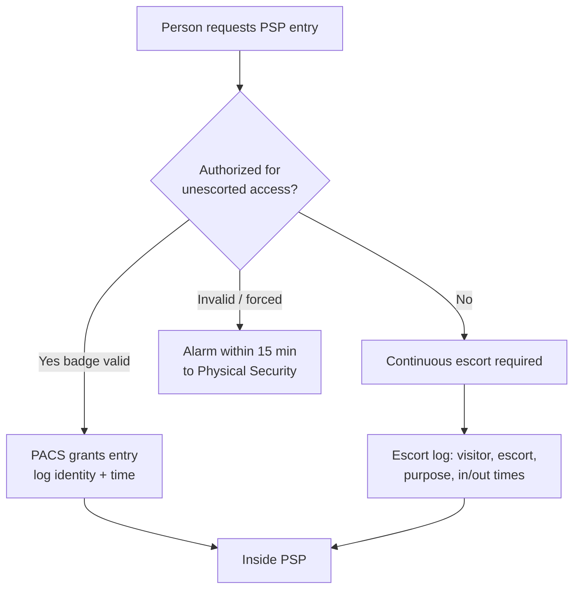

# 04.04 — Physical Security Plan (CIP-006-6 R1)

| Field | Value |
|---|---|
| Document ID | CIP-04.04 |
| Version | 1.0 |
| Date | 2026-03-02 |
| Classification | BES Cyber System Information (BCSI) // Illustrative Portfolio Sample |
| Owner | Frank Delgado (Physical Security Manager) |
| Author | Advisory Team |
| Status | Approved |

## Purpose

This document defines and evidences GridPoint Energy's **physical security plan** for its **14 Medium-impact BES Cyber Systems** and associated EACMS/PACS/PCA under **CIP-006-6 Requirement R1**. It establishes the **10 Physical Security Perimeters (PSPs)** — one at each of the 2 Control Centers plus the 8 Medium 345 kV substations — the physical access controls at each PSP, the Physical Access Control System (**PACS**), and escorting requirements for unauthorized individuals. Implementation **closes GAP-04 (High)** — physical access controls at 1 Medium substation not fully monitored.

## Applicability & Scope

CIP-006-6 R1 applies to Medium-impact BES Cyber Systems and their associated EACMS and PCA. GridPoint defines a PSP around each location housing Medium BCS. All BCA, EACMS, and PCA at these locations are contained within a defined six-wall (or otherwise complete) physical boundary.

## The 10 Physical Security Perimeters

| PSP | Location | BCS protected | Access control method |
|---|---|---|---|
| PSP-1 | Millbrook Primary Control Center | 4 CC Medium BCS | Card + PIN, monitored |
| PSP-2 | Easton Backup Control Center | Backup EMS/SCADA | Card + PIN, monitored |
| PSP-3 | Medium Substation 1 (345 kV) | Substation BCS | Card reader, monitored |
| PSP-4 | Medium Substation 2 (345 kV) | Substation BCS | Card reader, monitored |
| PSP-5 | Medium Substation 3 (345 kV) | Substation BCS | Card reader, monitored |
| PSP-6 | Medium Substation 4 (345 kV) | Substation BCS | Card reader, monitored |
| PSP-7 | Medium Substation 5 (345 kV) | Substation BCS | Card reader, monitored |
| PSP-8 | Medium Substation 6 (345 kV) | Substation BCS | Card reader, monitored |
| PSP-9 | Medium Substation 7 (345 kV) | Substation BCS | Card reader, monitored |
| PSP-10 | Medium Substation 8 (Northgate, 345 kV) | Substation BCS | Card reader, monitored (also CIP-014 candidate) |

## R1 Requirement-Part Coverage

| Part | Requirement | GridPoint Implementation |
|---|---|---|
| R1.1 | Define operational or procedural controls to restrict physical access | Documented PSP definitions and access procedures for all 10 PSPs |
| R1.2 | Utilize at least one physical access control to allow unescorted physical access only to authorized individuals | Card/badge (and PIN at Control Centers) enforced via PACS; authorization tied to CIP-004 |
| R1.3 | Where technically feasible, utilize two or more different physical access controls (defense in depth) to collectively allow unescorted access | Control Centers use card **+** PIN; substations layer perimeter fence/gate with door card reader |
| R1.4 | Monitor for unauthorized access through a physical access point into a PSP | PACS door-position and forced/held-open alarms at every PSP (see 04.05) |
| R1.5 | Issue an alarm or alert in response to detected unauthorized access to the personnel identified in the plan, within 15 minutes of detection | Alarms routed to monitoring within 15 minutes to Physical Security / Control Center operators |
| R1.6 | Monitor each Physical Access Control System for unauthorized physical access to a PACS | PACS controllers themselves reside in monitored/secured locations with tamper monitoring |
| R1.7 | Issue an alarm or alert in response to detected unauthorized access to a PACS within 15 minutes | PACS tamper/unauthorized-access alarms within 15 minutes |
| R1.8 | Log (through automated means or by personnel) physical entry, with information to identify the individual and date/time | PACS logs each badge event with identity + timestamp; retained ≥90 days (see 04.05) |
| R1.9 | Retain physical access logs for at least ninety calendar days | ≥90-day retention (detailed in 04.05) |
| R1.10 | Restrict physical access to cabling and nonprogrammable comm components (or use encryption / monitoring alternatives) | Cabling within PSPs; out-of-PSP runs protected/monitored per plan |

## Physical Access Control System (PACS)

The **18 PACS** components govern badge authorization, door control, alarm generation, and logging across the 10 PSPs. PACS access rights are provisioned exclusively from CIP-004 authorization records (need + training + PRA) and are reviewed quarterly. Revocation of physical access is executed within 24 hours of a termination action, consistent with CIP-004 R5.

## Escorting

Individuals without authorized unescorted access (e.g., visitors, unvetted vendors) are permitted into a PSP only under **continuous escort** by an authorized individual. Escort logs capture the visitor identity, escort identity, purpose, and entry/exit times, and are retained with the physical access logs.

## Defense-in-Depth by Location Type

| Location type | Layer 1 | Layer 2 | R1.3 two-factor? |
|---|---|---|---|
| Control Centers (PSP-1, PSP-2) | Card badge | PIN keypad | Yes — card + PIN |
| Medium substations (PSP-3…PSP-10) | Perimeter fence/gate | Door card reader on BCS enclosure | Layered physical controls |

At the Control Centers, two different physical access controls collectively allow unescorted access, satisfying the R1.3 defense-in-depth objective where technically feasible. At substations, the layered fence/gate plus door card reader on the control-house/BCS enclosure provides equivalent perimeter and access-point protection, with monitoring and alarming closing the loop.

## Interfaces with Personnel & Cyber Controls

| Interface | Purpose |
|---|---|
| CIP-004 R4 authorization | PACS rights derive solely from authorized-access records (need + training + PRA) |
| CIP-004 R5 revocation | Physical access removed within 24 hours of a termination action |
| CIP-004 quarterly review | Badge holders reconciled to the authorized list each quarter |
| CIP-006 R2 monitoring | Alarms, logging, and ≥90-day retention (see 04.05) |
| CIP-014 | Northgate (PSP-10) enhanced physical security assessment |

## Evidence (RSAW-ready)

- PSP definitions and floor/site diagrams for all 10 PSPs.
- PACS configuration showing two-factor at Control Centers and access-point controls at substations.
- Badge-authorization records reconciled to CIP-004 authorized personnel (142) and vendors (18).
- Alarm-routing configuration demonstrating the 15-minute alert requirement.
- Escort log samples.

## Gap Closure

| Gap | Description | Status |
|---|---|---|
| GAP-04 (High) | Physical access controls at 1 Medium substation not fully monitored | **Closed** — PSP monitoring, PACS alarms, and 15-minute alerting deployed at all 10 PSPs including the previously deficient substation |

## Cross-References

- `04.05-physical-access-monitoring-cip-006-r2.md` — monitoring, alarms, ≥90-day retention.
- `04.19-critical-station-physical-security-cip-014.md` — Northgate (PSP-10) critical-station assessment.
- `../03-policies-governance-personnel/03.07-access-authorization-program.md` — physical access authorization.
- `../02-bes-cyber-system-categorization/02.07-associated-eacms-pacs-pca.md` — 18 PACS inventory.
- `../02-bes-cyber-system-categorization/02.12-gap-register-and-risk-ranking.md` — GAP-04.

---

[⬅ Previous](04.03-interactive-remote-access-cip-005-r2.md) · [🏠 Phase README](04.00-README.md) · [Next ➡](04.05-physical-access-monitoring-cip-006-r2.md)
