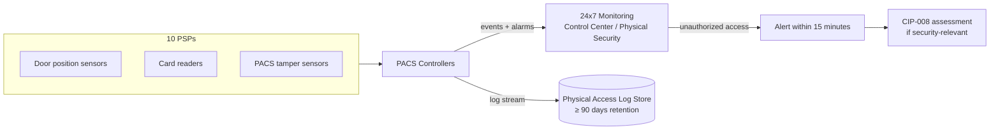

# 04.05 — Physical Access Monitoring & Logging (CIP-006-6 R2)

| Field | Value |
|---|---|
| Document ID | CIP-04.05 |
| Version | 1.0 |
| Date | 2026-03-02 |
| Classification | BES Cyber System Information (BCSI) // Illustrative Portfolio Sample |
| Owner | Frank Delgado (Physical Security Manager) |
| Author | Advisory Team |
| Status | Approved |

## Purpose

This document defines and evidences the **physical access monitoring, alarming, and logging** controls that operate the **10 Physical Security Perimeters (PSPs)** established under CIP-006-6 R1. It addresses the CIP-006-6 monitoring and log-retention obligations — continuous monitoring of PSP access points, alarm/alert generation, and **physical access logs retained ≥90 calendar days**. Note: CIP-006-6 R2 is titled *Visitor Control Program*; GridPoint documents the full monitoring/alarm/retention stack here alongside visitor control for a complete R1.4–R1.9 + R2 picture. Implementation **closes GAP-15 and GAP-25**.

## Scope

Applies to all 10 PSPs (2 Control Centers + 8 Medium 345 kV substations), the **18 PACS** components, and associated monitoring infrastructure. Monitoring is continuous; alarms route to the Physical Security Manager and Control Center operators (Primary Millbrook / Backup Easton).

## Monitoring & Alarm Architecture

## Requirement-Part Coverage (Monitoring, Alarming, Logging, Visitor Control)

| Part | Requirement | GridPoint Implementation |
|---|---|---|
| CIP-006 R1.4 | Monitor for unauthorized access into a PSP | Door-position, forced-open, and held-open detection at every PSP access point |
| CIP-006 R1.5 | Alarm/alert on detected unauthorized access within 15 minutes | Automated alarms to monitoring within 15 minutes; escalation procedure documented |
| CIP-006 R1.8 | Log physical entry with identity and date/time | PACS records every badge event with individual identity + timestamp |
| CIP-006 R1.9 | Retain physical access logs ≥ 90 calendar days | Log store configured for ≥90-day retention with integrity protection |
| CIP-006 R2.1 | Require continuous escorted access of visitors within a PSP | Continuous escort enforced; escort assignment logged |
| CIP-006 R2.2 | Require manual or automated logging of visitor entry/exit (name + date/time) and point of contact | Visitor log captures visitor name, in/out times, and GridPoint point of contact |
| CIP-006 R2.3 | Retain visitor logs ≥ 90 calendar days | Visitor logs retained ≥90 days alongside access logs |

## Alarm Response

| Alarm type | Detection | Response |
|---|---|---|
| Forced/held-open door | Door-position sensor | Alert to monitoring ≤15 min; dispatch/verify; log |
| Invalid badge / access-denied | Card reader | Logged; repeated attempts escalate to alarm |
| PACS tamper | Tamper sensor (R1.6/R1.7) | Alert ≤15 min; investigate PACS integrity |
| After-hours access | Schedule anomaly | Verify authorization; log |

Alarms determined to be security-relevant are handed to the CIP-008 incident-response process for assessment.

## Log Retention & Integrity

| Attribute | Value |
|---|---|
| Retention period | ≥ 90 calendar days (physical access + visitor logs) |
| Contents | Individual identity, PSP/door, date/time, event type |
| Integrity | Restricted access, time-synchronized, tamper-evident storage |
| Availability | Retrievable for RSAW sampling and internal assessment |

## Visitor Control Program (CIP-006 R2)

Visitors and any individual lacking authorized unescorted access are managed under the visitor control program, which operates continuously across all 10 PSPs:

| Element | Implementation |
|---|---|
| Continuous escort | An authorized individual escorts the visitor for the entire time inside the PSP |
| Visitor log | Captures visitor name, date/time of entry and exit, and the GridPoint point of contact |
| Retention | Visitor logs retained ≥90 calendar days with the physical access logs |
| Reconciliation | Visitor and escort records reconciled during internal assessment |

## Monitoring Coverage Matrix

| PSP | Access-point monitoring | PACS tamper monitoring | Log retention |
|---|---|---|---|
| PSP-1 Millbrook CC | Yes | Yes | ≥90 days |
| PSP-2 Easton CC | Yes | Yes | ≥90 days |
| PSP-3…PSP-10 (8 Medium substations) | Yes | Yes | ≥90 days |

All 10 PSPs report to the 24×7 monitoring function; there are no unmonitored access points, which is the specific condition that closed GAP-15. The ≥90-day retention setting, evidenced across access and visitor logs, closed GAP-25.

## Evidence (RSAW-ready)

- PACS monitoring configuration and alarm-routing screenshots for all 10 PSPs.
- Sample physical access log extract demonstrating identity + timestamp capture.
- Retention configuration evidence showing ≥90-day setting.
- Visitor log and escort log samples.
- Alarm test records confirming ≤15-minute alerting.

## Gap Closure

| Gap | Description | Status |
|---|---|---|
| GAP-15 (Moderate) | Physical access monitoring/alarm coverage incomplete at PSPs | **Closed** — continuous monitoring + 15-minute alerting deployed across all 10 PSPs |
| GAP-25 (Low) | Physical access log retention not evidenced to ≥90 days | **Closed** — ≥90-day retention configured and evidenced for access and visitor logs |

## Cross-References

- `04.04-physical-security-plan-cip-006-r1.md` — PSP definitions and access controls.
- `04.15-incident-response-plan-cip-008.md` — escalation of security-relevant physical alarms.
- `04.19-critical-station-physical-security-cip-014.md` — Northgate enhanced monitoring.
- `../02-bes-cyber-system-categorization/02.12-gap-register-and-risk-ranking.md` — GAP-15, GAP-25.

---

[⬅ Previous](04.04-physical-security-plan-cip-006-r1.md) · [🏠 Phase README](04.00-README.md) · [Next ➡](04.06-ports-and-services-baseline-cip-007-r1.md)
